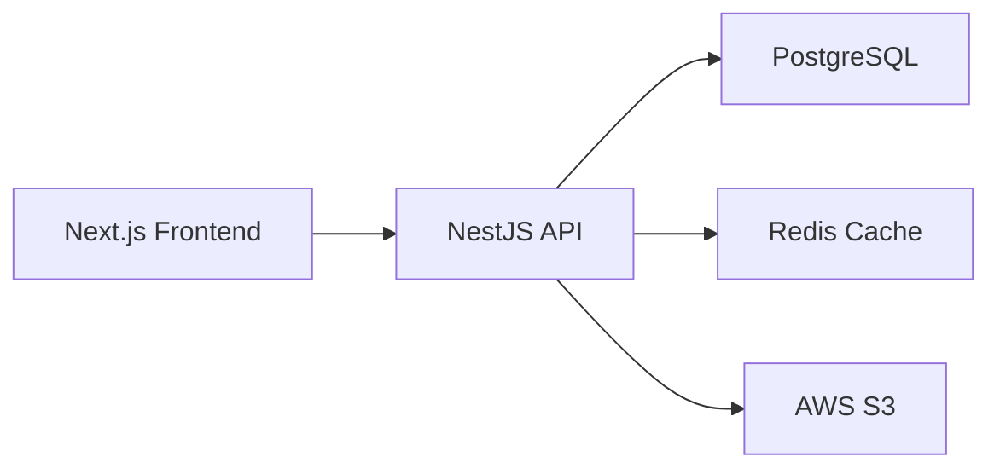
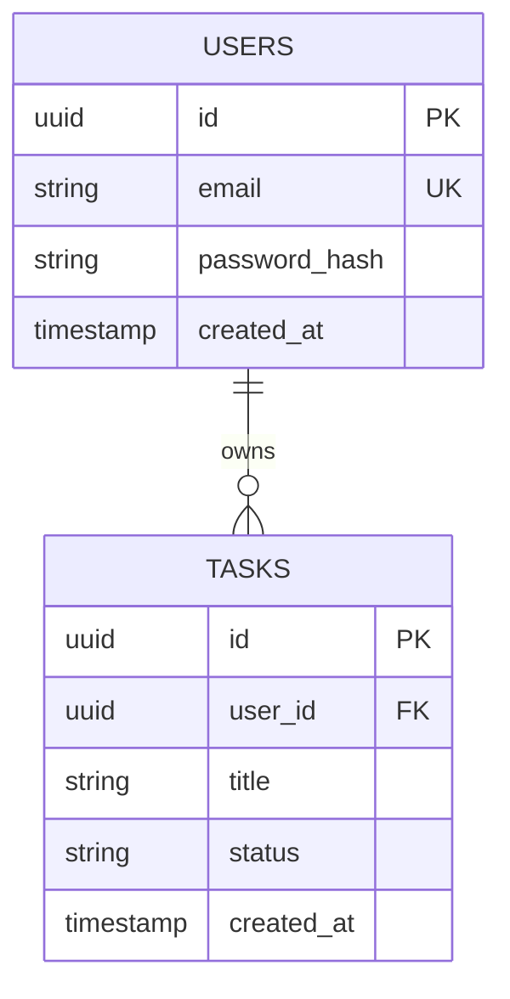
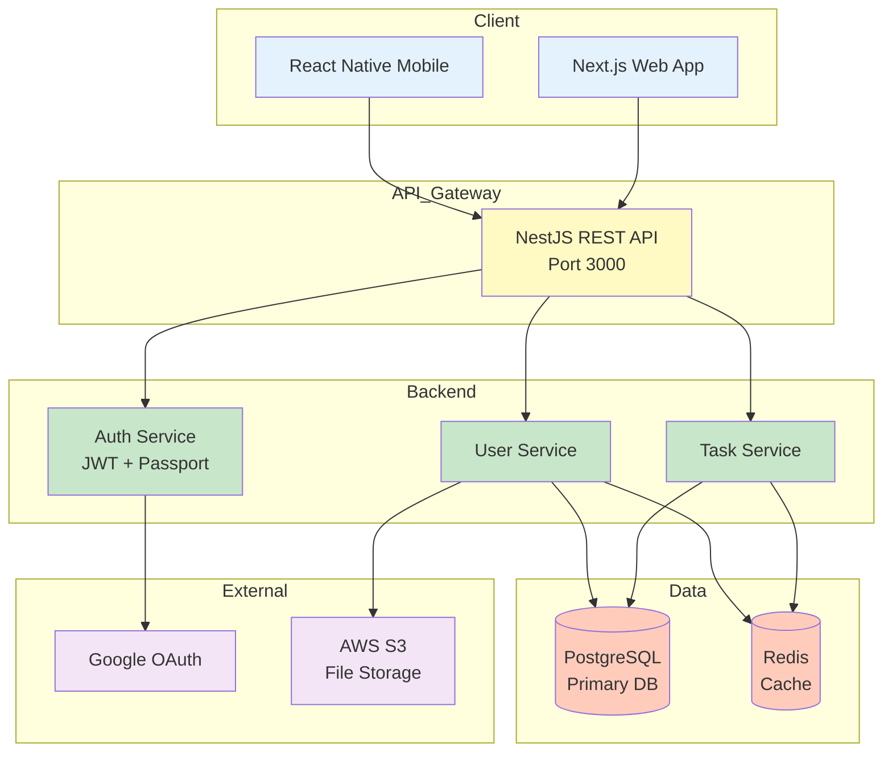
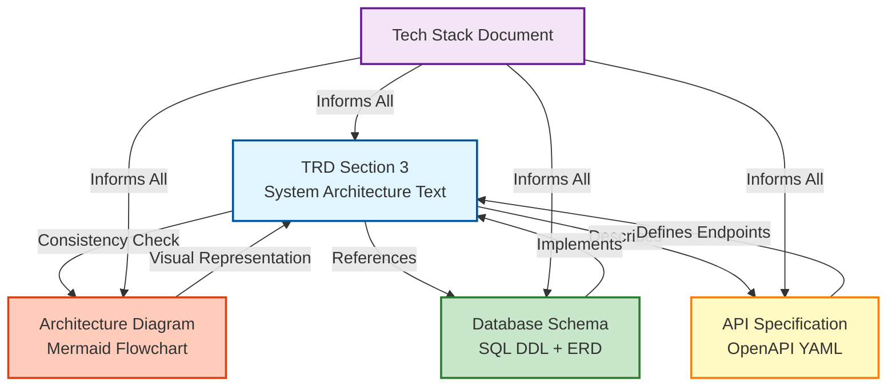
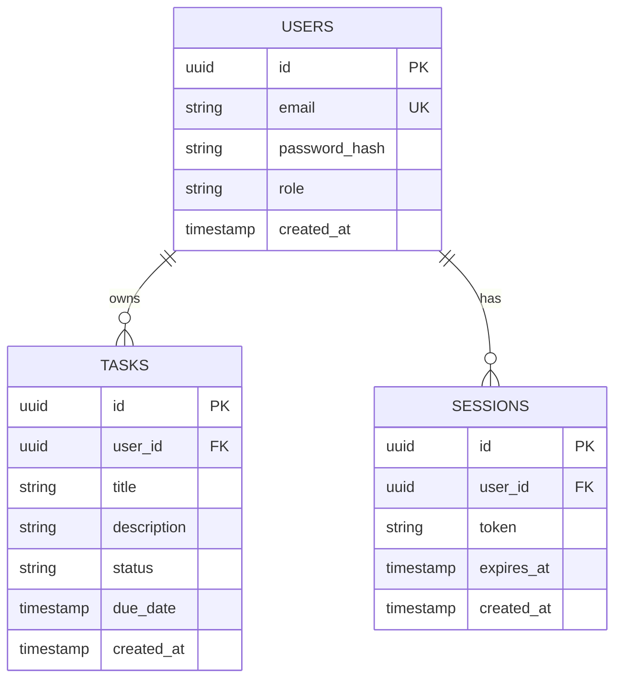
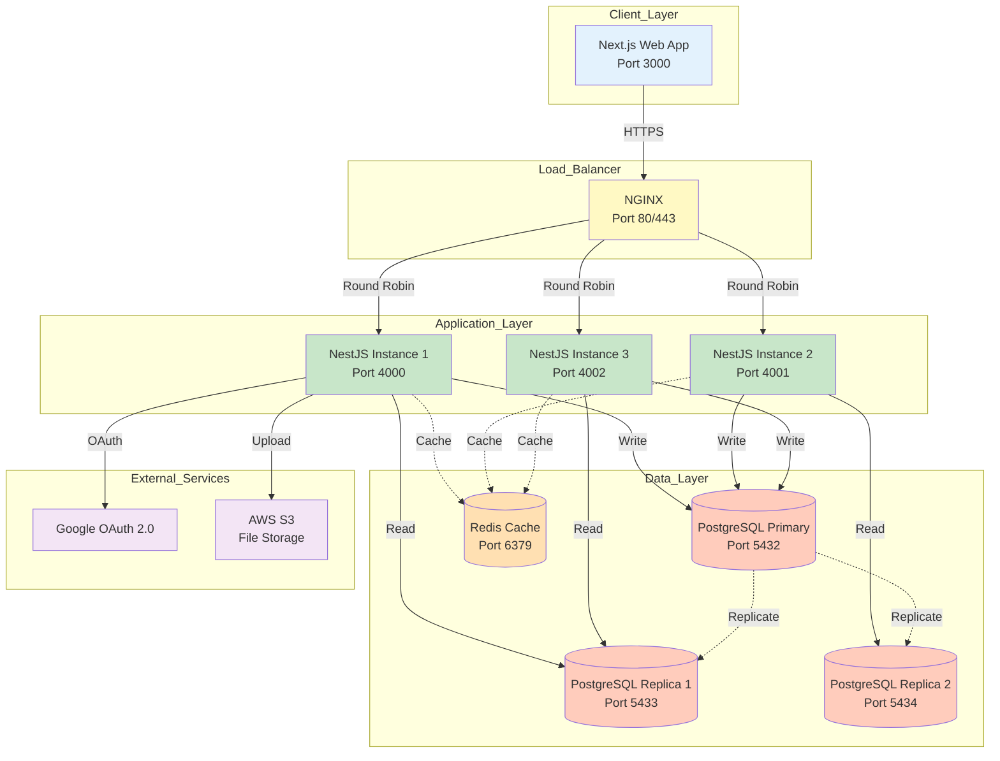

# Architecture Generation Process - Tech Spec Agent

**Last Updated**: 2025-01-16
**Status**: ✅ FULLY IMPLEMENTED

This document provides a comprehensive visual guide to how Tech Spec Agent generates technical architecture documentation alongside the Technical Requirements Document (TRD).

---

## Executive Summary

The Tech Spec Agent generates **THREE types of architecture documentation**:

1. **System Architecture Diagram** (Mermaid flowchart) - Generated at 90% completion
2. **Database ERD** (Mermaid + SQL DDL) - Generated at 85% completion
3. **TRD Section 3: System Architecture** (Textual description) - Generated at 70% completion

All architecture documents are **quality-validated**, **stored in PostgreSQL**, and **delivered to the next agent** (Backlog Agent) upon completion.

---

## Complete 19-Node Workflow with Architecture Highlights

```mermaid
flowchart TD
    Start([Design Agent Completed]) --> LoadInputs[1. load_inputs<br/>Load PRD & Design Docs<br/>0-5%]

    LoadInputs --> AnalyzeCompleteness[2. analyze_completeness<br/>Score PRD Quality<br/>5-10%]

    AnalyzeCompleteness --> CheckCompleteness{Completeness<br/>Score >= 80?}

    CheckCompleteness -->|No| AskClarification[3. ask_user_clarification<br/>Ask Missing Info<br/>10-15%]
    AskClarification --> AnalyzeCompleteness

    CheckCompleteness -->|Yes| IdentifyGaps[4. identify_tech_gaps<br/>Find Undecided Tech<br/>15-25%]

    IdentifyGaps --> CheckGaps{Tech Gaps<br/>Exist?}

    CheckGaps -->|Yes| ResearchTech[5. research_technologies<br/>Web Search for Options<br/>25-35%]

    ResearchTech --> PresentOptions[6. present_options<br/>Show 3 Options + Pros/Cons<br/>35-40%]

    PresentOptions --> WaitDecision[7. wait_user_decision<br/>Pause for User Selection<br/>40-45%]

    WaitDecision --> ValidateDecision[8. validate_decision<br/>Check Conflicts<br/>45-48%]

    ValidateDecision --> CheckConflicts{Conflicts<br/>Detected?}

    CheckConflicts -->|Yes| WarnUser[9. warn_user<br/>Show Warning<br/>48-50%]
    WarnUser --> WaitDecision

    CheckConflicts -->|No| CheckPendingDecisions{More<br/>Decisions<br/>Pending?}

    CheckPendingDecisions -->|Yes| ResearchTech
    CheckPendingDecisions -->|No| ParseCode[10. parse_ai_studio_code<br/>Parse Google AI Studio ZIP<br/>50-55%]

    CheckGaps -->|No| ParseCode

    ParseCode --> InferAPI[11. infer_api_spec<br/>Infer API Endpoints<br/>55-65%]

    InferAPI --> GenerateTRD[12. generate_trd<br/>📝 CREATE TRD<br/>Section 3: System Architecture Text<br/>65-70%]

    style GenerateTRD fill:#e1f5ff,stroke:#01579b,stroke-width:3px

    GenerateTRD --> ValidateTRD[13. validate_trd<br/>✅ VALIDATE ARCHITECTURE<br/>Structure + Multi-Agent Review<br/>70-75%]

    style ValidateTRD fill:#fff9c4,stroke:#f57f17,stroke-width:3px

    ValidateTRD --> CheckTRDQuality{TRD Score<br/>>= 90?}

    CheckTRDQuality -->|No & Retries < 3| GenerateTRD
    CheckTRDQuality -->|Yes or Retries = 3| GenerateAPI[14. generate_api_spec<br/>Generate OpenAPI YAML<br/>75-80%]

    GenerateAPI --> GenerateDBSchema[15. generate_db_schema<br/>🗂️ GENERATE DB ERD<br/>SQL DDL + Mermaid ERD<br/>80-85%]

    style GenerateDBSchema fill:#c8e6c9,stroke:#2e7d32,stroke-width:3px

    GenerateDBSchema --> GenerateArchitecture[16. generate_architecture<br/>🏗️ GENERATE SYSTEM DIAGRAM<br/>Mermaid Flowchart<br/>85-90%]

    style GenerateArchitecture fill:#ffccbc,stroke:#d84315,stroke-width:4px

    GenerateArchitecture --> GenerateTechStack[17. generate_tech_stack_doc<br/>Generate Tech Stack Doc<br/>90-95%]

    GenerateTechStack --> SaveToDB[18. save_to_db<br/>💾 SAVE ALL 5 DOCUMENTS<br/>95-100%]

    style SaveToDB fill:#f3e5f5,stroke:#6a1b9a,stroke-width:3px

    SaveToDB --> NotifyNextAgent[19. notify_next_agent<br/>Trigger Backlog Agent<br/>100%]

    NotifyNextAgent --> End([Complete])

    style Start fill:#4caf50,color:#fff
    style End fill:#4caf50,color:#fff
```



---

## Architecture Generation Timeline

### Phase 4: Document Generation (65-100%)

| Progress | Node | Architecture Output | Storage Location |
|----------|------|---------------------|------------------|
| **70%** | `generate_trd` | **Section 3: System Architecture** (Textual)<br/>- Architecture pattern<br/>- Components & responsibilities<br/>- Data flow<br/>- Integration points<br/>- Scalability | `trd_content` column<br/>(Embedded in markdown) |
| **75%** | `validate_trd` | **Architecture Validation**<br/>- Structure check (Section 3 exists)<br/>- Multi-agent review<br/>- Architecture agent scoring | `validation_report` column<br/>(JSONB) |
| **85%** | `generate_db_schema` | **Database ERD** (Mermaid)<br/>- Entity relationships<br/>- Foreign keys<br/>- Indexes<br/>+ SQL DDL statements | `database_schema` column<br/>(JSONB with DDL + ERD) |
| **90%** | `generate_architecture` | **System Architecture Diagram** (Mermaid)<br/>- Client layer<br/>- API gateway<br/>- Backend services<br/>- Databases<br/>- Caching<br/>- External services | `architecture_diagram` column<br/>(Text, Mermaid syntax) |
| **100%** | `save_to_db` | **All Documents Persisted**<br/>- TRD (with arch text)<br/>- Architecture diagram<br/>- DB ERD<br/>- API spec<br/>- Tech stack | `generated_trd_documents` table |

---

## Detailed Architecture Generation Process

### 1. TRD Generation with Architecture Section (70%)

**Node**: `generate_trd_node()`
**File**: `src/langgraph/nodes/generation_nodes.py:18-98`

**What Happens**:
- Claude Sonnet 4.5 generates complete TRD with 10 required sections
- **Section 3: System Architecture** includes:
  - Architecture pattern (3-tier, microservices, serverless, etc.)
  - Component breakdown and responsibilities
  - Data flow between components
  - Integration points with third-party services
  - Scalability and fault tolerance strategies
  - Optional: Embedded Mermaid diagrams

**Example TRD Section 3**:
````markdown
## 3. System Architecture

### 3.1 Architecture Pattern
This system follows a **3-tier architecture** pattern:
- **Presentation Layer**: Next.js 14 frontend (SSR + Client components)
- **Application Layer**: NestJS REST API backend
- **Data Layer**: PostgreSQL database with Redis caching

### 3.2 Component Breakdown



### 3.3 Data Flow
1. User interacts with Next.js UI
2. API requests sent to NestJS backend via `/api/*` endpoints
3. NestJS validates JWT, checks Redis cache
4. On cache miss: Query PostgreSQL, cache result
5. Return JSON response to frontend

### 3.4 Scalability
- Horizontal scaling: Deploy multiple NestJS instances behind load balancer
- Database scaling: Read replicas for queries, master for writes
- Caching: Redis reduces database load by 70%
````

**Storage**:
```python
state["trd_draft"] = generated_trd_markdown  # Full TRD including Section 3
```

---

### 2. TRD Validation with Architecture Review (75%)

**Node**: `validate_trd_node()`
**File**: `src/langgraph/nodes/generation_nodes.py:101-244`

**What Happens**:
- **Structure Validation**: Checks Section 3 exists and has >= 300 characters (15 points)
- **Multi-Agent Review**: Specialized "Architecture Agent" reviews Section 3

**Architecture Agent Criteria** (Lines 607-617):
```python
{
    "agent_name": "Architecture Agent",
    "focus": "System Architecture section",
    "criteria": [
        "Is the architecture clearly described (3-tier, microservices, etc.)?",
        "Are all components and their responsibilities defined?",
        "Is data flow between components explained?",
        "Are integration points with third-party services documented?",
        "Are scalability and fault tolerance addressed?"
    ]
}
```

**Scoring**:
- Structure: 15 points (Section 3 exists + min length)
- Architecture Agent: 0-100 score (weighted into final score)
- **Pass Threshold**: >= 90/100 overall

**Retry Logic**:
- If score < 90 and iteration < 3: Regenerate TRD
- If iteration = 3: Force pass with warning

**Storage**:
```python
state["trd_validation_result"] = {
    "score": 92.5,
    "gaps": [],
    "recommendations": [],
    "structure_score": 15,
    "architecture_agent_score": 88
}
```

---

### 3. Database ERD Generation (85%)

**Node**: `generate_db_schema_node()`
**File**: `src/langgraph/nodes/generation_nodes.py:448-499`

**What Happens**:
- Generates SQL DDL statements for all tables
- Creates Mermaid ERD showing entity relationships
- Includes indexes, foreign keys, constraints

**Example Output**:
````markdown
**SQL DDL:**
```sql
CREATE TABLE users (
    id UUID PRIMARY KEY DEFAULT gen_random_uuid(),
    email VARCHAR(255) UNIQUE NOT NULL,
    password_hash VARCHAR(255) NOT NULL,
    created_at TIMESTAMP DEFAULT NOW()
);

CREATE TABLE tasks (
    id UUID PRIMARY KEY DEFAULT gen_random_uuid(),
    user_id UUID REFERENCES users(id) ON DELETE CASCADE,
    title VARCHAR(255) NOT NULL,
    status VARCHAR(20) DEFAULT 'pending',
    created_at TIMESTAMP DEFAULT NOW()
);

CREATE INDEX idx_tasks_user_id ON tasks(user_id);
CREATE INDEX idx_tasks_status ON tasks(status);
```

**Entity Relationship Diagram:**

````

**Storage**:
```python
state["database_schema"] = {
    "ddl": "CREATE TABLE users...",
    "erd": "erDiagram\n    USERS ||--o{ TASKS...",
    "tables": ["users", "tasks"],
    "relationships": [...]
}
```

---

### 4. System Architecture Diagram Generation (90%)

**Node**: `generate_architecture_node()`
**File**: `src/langgraph/nodes/generation_nodes.py:502-548`

**What Happens**:
- Uses validated TRD (first 5000 chars) as context
- Generates Mermaid flowchart showing system components
- Ensures consistency with TRD Section 3

**LLM Prompt** (Lines 509-527):
```python
prompt = f"""
Generate a system architecture diagram in Mermaid format.

**TRD:**
{state['trd_draft'][:5000]}

**Selected Technologies:**
{user_technology_decisions}

Create a Mermaid flowchart showing:
- Client applications (web, mobile)
- API layer
- Backend services
- Databases
- External services (OAuth, payment gateways, etc.)
- Caching layer (Redis, if selected)
- File storage (S3, if selected)

Use proper Mermaid syntax for flowchart.
"""
```

**Example Output**:


**Storage**:
```python
state["architecture_diagram"] = mermaid_flowchart_text
```

---

## Database Storage Structure

**Table**: `generated_trd_documents`

```sql
CREATE TABLE generated_trd_documents (
    id UUID PRIMARY KEY DEFAULT gen_random_uuid(),
    session_id UUID REFERENCES tech_spec_sessions(id) ON DELETE CASCADE,

    -- Five separate documents
    trd_content TEXT,                    -- Full TRD markdown (includes Section 3)
    api_specification JSONB,             -- OpenAPI/Swagger spec
    database_schema JSONB,               -- SQL DDL + Mermaid ERD
    architecture_diagram TEXT,           -- Mermaid system flowchart
    tech_stack_document JSONB,           -- Technology stack details

    -- Quality tracking
    quality_score FLOAT,                 -- TRD validation score (0-100)
    validation_report JSONB,             -- Detailed validation results
    version INTEGER DEFAULT 1,           -- Version tracking

    created_at TIMESTAMP DEFAULT NOW()
);
```

**Example Row**:
```json
{
  "session_id": "e0adab7c-770d-43ae-b83c-75ddf2dfee89",
  "trd_content": "# Technical Requirements Document\n\n## 1. Project Overview\n...\n## 3. System Architecture\n...",
  "api_specification": {
    "openapi": "3.0.0",
    "paths": {...}
  },
  "database_schema": {
    "ddl": "CREATE TABLE users...",
    "erd": "erDiagram\n    USERS ||--o{ TASKS..."
  },
  "architecture_diagram": "flowchart TB\n    A[Next.js] --> B[NestJS]...",
  "tech_stack_document": {
    "frontend": "Next.js 14",
    "backend": "NestJS 10",
    "database": "PostgreSQL 14"
  },
  "quality_score": 92.5,
  "validation_report": {
    "structure_score": 15,
    "architecture_agent_score": 88,
    "api_agent_score": 90,
    "database_agent_score": 95
  },
  "version": 1
}
```

---

## Architecture Document Relationships



---

## Quality Validation for Architecture

### Structure Validation (`_validate_trd_structure()`)

**Checks for Section 3**:
```python
{
    "section": "System Architecture",
    "required": True,
    "min_length": 300,
    "points": 15,
    "checks": [
        "Section heading exists",
        "Content >= 300 characters",
        "Contains architecture pattern description",
        "Contains component breakdown"
    ]
}
```

### Multi-Agent Review (`_multi_agent_trd_review()`)

**Architecture Agent**:
- **Focus**: System Architecture section (Section 3)
- **Scoring**: 0-100
- **Criteria**:
  - Architecture pattern clarity (3-tier, microservices, etc.)
  - Component definitions and responsibilities
  - Data flow explanations
  - Integration point documentation
  - Scalability and fault tolerance

**Scoring Formula**:
```python
final_score = (
    structure_score +  # 15 points max
    (architecture_agent_score * 0.20) +  # 20 points max
    (api_agent_score * 0.25) +  # 25 points max
    (database_agent_score * 0.25) +  # 25 points max
    (security_agent_score * 0.15)  # 15 points max
)
```

**Pass Threshold**: >= 90/100

---

## API Endpoints for Architecture Retrieval

### Download TRD and Architecture

**Endpoint**: `GET /api/tech-spec/sessions/{session_id}/trd`

**Response** (Lines 408-421):
```json
{
  "session_id": "e0adab7c-770d-43ae-b83c-75ddf2dfee89",
  "document": {
    "trd_content": "# Technical Requirements Document\n...",
    "api_specification": {...},
    "database_schema": {...},
    "architecture_diagram": "flowchart TB\n    A[Next.js] --> B[NestJS]...",
    "tech_stack_document": {...},
    "quality_score": 92.5,
    "validation_report": {...}
  },
  "version": 1,
  "created_at": "2025-01-16T12:44:52.893469"
}
```

---

## Example: Complete Architecture Output

### 1. TRD Section 3 (Text)
```markdown
## 3. System Architecture

### 3.1 Architecture Pattern
**3-Tier Architecture**:
- Presentation: Next.js 14 (SSR + Client Components)
- Application: NestJS 10 REST API
- Data: PostgreSQL 14 + Redis 7 caching

### 3.2 Component Responsibilities
- **Next.js Frontend**: User interface, form validation, state management (Zustand)
- **NestJS API**: Business logic, authentication (JWT), authorization (RBAC)
- **PostgreSQL**: Primary data store, ACID transactions
- **Redis**: Session storage, API response caching (TTL: 5min)

### 3.3 Data Flow
1. User submits form → Next.js validates client-side
2. POST request to `/api/tasks` with JWT in Authorization header
3. NestJS validates JWT, checks user permissions
4. Cache lookup in Redis (key: `task:${userId}`)
5. On miss: Query PostgreSQL, cache result
6. Return JSON response

### 3.4 Scalability
- **Horizontal**: Deploy 3+ NestJS instances behind NGINX load balancer
- **Database**: Primary-replica setup (1 master, 2 read replicas)
- **Caching**: Reduces DB queries by 70%
```

### 2. Database ERD (Mermaid)


### 3. System Architecture Diagram (Mermaid)


---

## Verification Checklist

Use this to verify architecture generation is working correctly:

### ✅ Pre-Execution Checks
- [ ] PostgreSQL database running
- [ ] `shared` schema exists with Design Agent tables
- [ ] Design Job has `status = 'completed'`
- [ ] Design Outputs table has PRD + 3 design docs

### ✅ During Execution (Monitor Logs)
- [ ] **70%**: `generate_trd` node completes
- [ ] **75%**: `validate_trd` shows architecture_agent_score
- [ ] **85%**: `generate_db_schema` node completes
- [ ] **90%**: `generate_architecture` node completes
- [ ] **95%**: `generate_tech_stack_doc` node completes
- [ ] **100%**: `save_to_db` persists all 5 documents

### ✅ Post-Execution Verification
```sql
-- Check session was created
SELECT id, status, progress_percentage, current_stage
FROM tech_spec_sessions
WHERE id = '<session_id>';

-- Check all documents were generated
SELECT
    LENGTH(trd_content) as trd_length,
    LENGTH(architecture_diagram) as arch_diagram_length,
    database_schema->>'ddl' as has_ddl,
    database_schema->>'erd' as has_erd,
    quality_score,
    version
FROM generated_trd_documents
WHERE session_id = '<session_id>';
```

### ✅ Architecture Quality Checks
- [ ] `trd_content` contains "## 3. System Architecture" section
- [ ] `architecture_diagram` contains valid Mermaid `flowchart` syntax
- [ ] `database_schema` contains both SQL DDL and Mermaid ERD
- [ ] `quality_score` >= 90.0
- [ ] `validation_report`->'architecture_agent_score' exists

---

## Common Issues and Solutions

### Issue 1: Architecture Section Missing from TRD
**Symptom**: TRD validation fails with "Missing required section: System Architecture"

**Solution**:
1. Check TRD generation prompt (Lines 903-1149 in `generation_nodes.py`)
2. Verify Section 3 is in the prompt template
3. Check LLM temperature (should be 0.5, not too high)
4. Review TRD validation structure checks (Lines 772-900)

### Issue 2: Architecture Diagram Empty
**Symptom**: `architecture_diagram` column is NULL or empty

**Solution**:
1. Check `generate_architecture_node()` execution logs
2. Verify TRD draft exists and has content
3. Check LLM response parsing (Lines 536-547)
4. Ensure Mermaid syntax is valid

### Issue 3: ERD Not Generated
**Symptom**: `database_schema` has DDL but no ERD

**Solution**:
1. Check `generate_db_schema_node()` logs
2. Verify database technology was selected in Phase 2
3. Check LLM prompt includes ERD request
4. Ensure JSONB parsing handles both DDL and ERD

### Issue 4: Validation Score Too Low
**Symptom**: TRD validation score < 90, regenerates 3 times

**Solution**:
1. Check architecture_agent_score in validation_report
2. Review TRD Section 3 content quality
3. Ensure all required elements are present:
   - Architecture pattern description
   - Component breakdown
   - Data flow explanation
   - Integration points
   - Scalability considerations

---

## Related Files

**Implementation**:
- `src/langgraph/nodes/generation_nodes.py` - TRD, architecture, DB schema generation
- `src/langgraph/workflow.py` - Workflow definition with node ordering
- `src/database/models.py` - Database schema for storing architecture docs
- `src/langgraph/nodes/persistence_nodes.py` - Saving documents to PostgreSQL

**Documentation**:
- `CLAUDE.md` - Project overview and architecture context
- `README.md` - Setup and usage instructions
- `Tech_Spec_Agent_LangGraph_Detailed.md` - Detailed workflow documentation
- `INTEGRATION_CONFIGURATION_GUIDE.md` - Integration setup

**Tests**:
- `tests/unit/test_trd_generation.py` - TRD generation tests
- `tests/integration/test_architecture_flow.py` - Full architecture flow tests

---

## Summary

**Architecture Generation Status**: ✅ **FULLY IMPLEMENTED**

The Tech Spec Agent generates comprehensive architecture documentation:
- **Textual**: TRD Section 3 describes architecture in detail
- **Visual**: Mermaid diagrams show system and database architecture
- **Validated**: Multi-agent review ensures quality >= 90/100
- **Stored**: PostgreSQL preserves all documents for downstream agents

All architecture documents are created **automatically** during Phase 4 of the workflow, with proper quality checks and consistency validation.
