# Example Architecture Diagram

This is an example of the **System Architecture Diagram** that Tech Spec Agent generates for projects.

## Sample Project: Task Management Platform

Below is the Mermaid architecture flowchart that would be generated for a task management application with Next.js frontend, NestJS backend, PostgreSQL database, and Redis caching.

---

## System Architecture Diagram (Mermaid)

```mermaid
flowchart TB
    subgraph Clients["Client Layer"]
        WebApp["Next.js Web Application<br/>(React 18, TypeScript)"]
        MobileApp["React Native Mobile App<br/>(iOS & Android)"]
    end

    subgraph Gateway["API Gateway Layer"]
        NGINX["NGINX Load Balancer<br/>(SSL Termination, Rate Limiting)"]
    end

    subgraph Application["Application Layer"]
        API1["NestJS API Server 1<br/>(Port 3001)"]
        API2["NestJS API Server 2<br/>(Port 3002)"]
        API3["NestJS API Server 3<br/>(Port 3003)"]

        subgraph Services["Business Services"]
            AuthService["Authentication Service<br/>(JWT, OAuth 2.0)"]
            TaskService["Task Management Service<br/>(CRUD, Assignments)"]
            NotificationService["Notification Service<br/>(WebSocket, Push)"]
            FileService["File Upload Service<br/>(S3 Integration)"]
        end
    end

    subgraph DataLayer["Data Layer"]
        subgraph Primary["Primary Database"]
            PostgresMain["PostgreSQL Primary<br/>(Port 5432)<br/>Read/Write"]
        end

        subgraph Replicas["Read Replicas"]
            PostgresReplica1["PostgreSQL Replica 1<br/>(Port 5433)<br/>Read Only"]
            PostgresReplica2["PostgreSQL Replica 2<br/>(Port 5434)<br/>Read Only"]
        end

        Redis["Redis Cache<br/>(Port 6379)<br/>Session, Query Cache"]
    end

    subgraph External["External Services"]
        GoogleOAuth["Google OAuth 2.0<br/>(User Authentication)"]
        AWSS3["AWS S3<br/>(File Storage)"]
        SendGrid["SendGrid<br/>(Email Notifications)"]
        FCM["Firebase Cloud Messaging<br/>(Push Notifications)"]
    end

    subgraph Monitoring["Monitoring & Logging"]
        Prometheus["Prometheus<br/>(Metrics Collection)"]
        Grafana["Grafana<br/>(Dashboards)"]
        Sentry["Sentry<br/>(Error Tracking)"]
    end

    %% Client to Gateway
    WebApp -->|HTTPS| NGINX
    MobileApp -->|HTTPS| NGINX

    %% Gateway to API Servers
    NGINX -->|Round Robin| API1
    NGINX -->|Round Robin| API2
    NGINX -->|Round Robin| API3

    %% API Servers to Services
    API1 --> AuthService
    API1 --> TaskService
    API1 --> NotificationService
    API1 --> FileService

    API2 --> AuthService
    API2 --> TaskService
    API2 --> NotificationService
    API2 --> FileService

    API3 --> AuthService
    API3 --> TaskService
    API3 --> NotificationService
    API3 --> FileService

    %% Services to Data Layer
    AuthService -->|Write| PostgresMain
    TaskService -->|Write| PostgresMain
    NotificationService -->|Write| PostgresMain

    AuthService -->|Read| PostgresReplica1
    TaskService -->|Read| PostgresReplica1
    TaskService -->|Read| PostgresReplica2
    NotificationService -->|Read| PostgresReplica2

    AuthService -->|Cache| Redis
    TaskService -->|Cache| Redis

    %% Replication
    PostgresMain -.->|Streaming Replication| PostgresReplica1
    PostgresMain -.->|Streaming Replication| PostgresReplica2

    %% Services to External
    AuthService -->|OAuth Flow| GoogleOAuth
    FileService -->|Upload/Download| AWSS3
    NotificationService -->|Send Email| SendGrid
    NotificationService -->|Push Notifications| FCM

    %% Monitoring
    API1 -->|Metrics| Prometheus
    API2 -->|Metrics| Prometheus
    API3 -->|Metrics| Prometheus
    Prometheus -->|Visualize| Grafana

    API1 -->|Errors| Sentry
    API2 -->|Errors| Sentry
    API3 -->|Errors| Sentry

    %% Styling
    classDef clientStyle fill:#4A90E2,stroke:#2E5C8A,stroke-width:2px,color:#fff
    classDef gatewayStyle fill:#50C878,stroke:#2E7D4E,stroke-width:2px,color:#fff
    classDef apiStyle fill:#F39C12,stroke:#C87F0A,stroke-width:2px,color:#fff
    classDef serviceStyle fill:#9B59B6,stroke:#6C3483,stroke-width:2px,color:#fff
    classDef dataStyle fill:#E74C3C,stroke:#A93226,stroke-width:2px,color:#fff
    classDef externalStyle fill:#95A5A6,stroke:#5D6D7E,stroke-width:2px,color:#fff
    classDef monitoringStyle fill:#1ABC9C,stroke:#117A65,stroke-width:2px,color:#fff

    class WebApp,MobileApp clientStyle
    class NGINX gatewayStyle
    class API1,API2,API3 apiStyle
    class AuthService,TaskService,NotificationService,FileService serviceStyle
    class PostgresMain,PostgresReplica1,PostgresReplica2,Redis dataStyle
    class GoogleOAuth,AWSS3,SendGrid,FCM externalStyle
    class Prometheus,Grafana,Sentry monitoringStyle
```



---

## Architecture Description

### Client Layer
- **Next.js Web Application**: Server-side rendered React application with TypeScript
- **React Native Mobile App**: Cross-platform mobile application for iOS and Android

### API Gateway Layer
- **NGINX Load Balancer**:
  - SSL/TLS termination
  - Rate limiting (100 req/min per IP)
  - Round-robin load balancing across API servers

### Application Layer
- **3 NestJS API Servers**:
  - Horizontal scaling for high availability
  - Each server runs identical business services
  - Auto-scaling based on CPU/Memory metrics

**Business Services:**
- **Authentication Service**: JWT token management, OAuth 2.0 integration
- **Task Management Service**: CRUD operations, task assignments, status updates
- **Notification Service**: Real-time WebSocket notifications, push notifications
- **File Upload Service**: Handles file uploads to AWS S3

### Data Layer

**Primary Database:**
- **PostgreSQL Primary**: Handles all write operations and critical reads
  - Tables: users, tasks, projects, comments, attachments
  - Connection pooling (max 100 connections)

**Read Replicas:**
- **PostgreSQL Replica 1 & 2**: Handle read-heavy operations
  - Streaming replication from primary
  - Automatic failover configuration

**Caching:**
- **Redis**: Session storage, query result caching (15-minute TTL)
  - Keys: `session:{userId}`, `tasks:{projectId}`, `user:{userId}`

### External Services
- **Google OAuth 2.0**: User authentication and authorization
- **AWS S3**: File storage for task attachments
- **SendGrid**: Transactional email notifications
- **Firebase Cloud Messaging**: Mobile push notifications

### Monitoring & Logging
- **Prometheus**: Metrics collection (API response times, error rates, DB queries)
- **Grafana**: Real-time dashboards and alerts
- **Sentry**: Error tracking and performance monitoring

---

## Data Flow Examples

### 1. User Creates a Task
```
Web App → NGINX → API Server 2 → TaskService
→ PostgreSQL Primary (INSERT) → Redis (INVALIDATE cache)
→ NotificationService → WebSocket (Real-time update)
```

### 2. User Views Task List
```
Web App → NGINX → API Server 1 → TaskService
→ Redis (CHECK cache) → PostgreSQL Replica 1 (if cache miss)
→ Redis (SET cache) → Return to client
```

### 3. User Uploads Attachment
```
Web App → NGINX → API Server 3 → FileService
→ AWS S3 (Upload) → PostgreSQL Primary (INSERT attachment record)
→ Return S3 URL to client
```

---

## Scalability & High Availability

- **Horizontal Scaling**: API servers can scale from 3 to 10 instances based on load
- **Database Replication**: 2 read replicas reduce load on primary database
- **Caching Strategy**: 70% cache hit rate reduces database queries
- **Load Balancing**: NGINX distributes traffic evenly across API servers
- **Failover**: If primary database fails, replica can be promoted to primary

---

## Security Measures

- **SSL/TLS Encryption**: All client-server communication encrypted
- **JWT Authentication**: Stateless authentication with 1-hour token expiry
- **Rate Limiting**: 100 requests/minute per IP to prevent abuse
- **OAuth 2.0**: Secure third-party authentication
- **S3 Signed URLs**: Temporary access to uploaded files (15-minute expiry)

---

**This architecture diagram would be generated by Tech Spec Agent at 90% workflow completion and stored in the `generated_trd_documents` table.**
