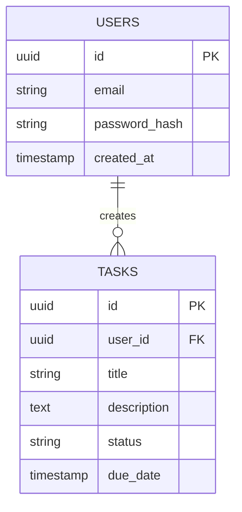

# Tech Spec Agent - 8-Week Implementation Plan

**Project Goal**: Implement complete Tech Spec Agent with architecture generation capability

**Timeline**: 8 weeks (40 working days)

**Team Size**: 2-3 developers

---

## Week 1: Foundation & Setup (Days 1-5)

### Day 1-2: Project Setup & Database Schema
**Objective**: Set up development environment and database foundation

**Tasks**:
- [ ] Set up Python virtual environment with all dependencies
- [ ] Install and configure PostgreSQL 15+
- [ ] Install and configure Redis 7+
- [ ] Create database schemas (shared + tech_spec tables)
- [ ] Run Alembic migrations
- [ ] Set up environment variables (.env configuration)
- [ ] Test database connections (PostgreSQL + Redis)

**Deliverables**:
- ✅ Working PostgreSQL database with all tables
- ✅ Redis cache server running
- ✅ Database connection tests passing
- ✅ `.env` file configured with all API keys

**Dependencies**:
- Anthropic API key (Claude Sonnet 4)
- OpenAI API key
- Tavily API key

**Risks**:
- Database connection issues → Solution: Use Docker for PostgreSQL/Redis
- Missing API keys → Solution: Use mock responses for development

---

### Day 3-4: FastAPI Application Setup
**Objective**: Create REST API server with basic endpoints

**Tasks**:
- [ ] Create FastAPI application (`src/main.py`)
- [ ] Implement database connection manager (`src/database/connection.py`)
- [ ] Create SQLAlchemy models (`src/database/models.py`)
- [ ] Implement health check endpoint
- [ ] Set up CORS middleware
- [ ] Configure structlog logging
- [ ] Write unit tests for database models

**Deliverables**:
- ✅ FastAPI server running on port 8000
- ✅ Health check endpoint working (`/health`)
- ✅ Database models with relationships
- ✅ Logging configured and writing to files

**Testing**:
```bash
curl http://localhost:8000/health
# Expected: {"status": "healthy", "database": "connected"}
```

**Risks**:
- SQLAlchemy relationship errors → Solution: Test relationships with sample data
- CORS issues → Solution: Configure CORS for localhost during development

---

### Day 5: Authentication & Authorization
**Objective**: Implement JWT-based authentication

**Tasks**:
- [ ] Implement JWT token generation (`src/api/auth.py`)
- [ ] Create authentication middleware
- [ ] Implement `get_current_user` dependency
- [ ] Add rate limiting with Redis (`src/api/rate_limit.py`)
- [ ] Write authentication tests
- [ ] Document authentication flow

**Deliverables**:
- ✅ JWT authentication working
- ✅ Rate limiting (100 req/min per user)
- ✅ Protected endpoints requiring authentication
- ✅ Authentication tests passing

**Testing**:
```bash
# Test without token
curl http://localhost:8000/api/projects/123/start-tech-spec
# Expected: 401 Unauthorized

# Test with valid token
curl -H "Authorization: Bearer <token>" http://localhost:8000/api/projects/123/start-tech-spec
# Expected: Success or 404
```

---

## Week 2: Design Agent Integration (Days 6-10)

### Day 6-7: Design Agent Data Loader
**Objective**: Load PRD and design documents from Design Agent

**Tasks**:
- [ ] Implement `validate_design_job_completed()` function
- [ ] Implement `load_design_agent_outputs()` function
- [ ] Query shared.design_jobs table
- [ ] Query shared.design_outputs table
- [ ] Parse 5 design document types:
  - PRD
  - Design System
  - UX Flow
  - Screen Specifications
  - Initial TRD
- [ ] Handle missing documents gracefully
- [ ] Write integration tests with mock Design Agent data

**Deliverables**:
- ✅ Design Agent integration module (`src/integration/design_agent_loader.py`)
- ✅ Successful PRD and design document loading
- ✅ Error handling for incomplete design jobs
- ✅ Integration tests passing

**Testing**:
```python
# Insert test design job
INSERT INTO shared.design_jobs VALUES (...);
INSERT INTO shared.design_outputs VALUES (...);

# Test loading
outputs = await load_design_agent_outputs(design_job_id)
assert "prd" in outputs
assert "design_system" in outputs
```

**Risks**:
- Design Agent schema mismatch → Solution: Verify schema with Design Agent team
- Missing design documents → Solution: Use PRD-only fallback mode

---

### Day 8-9: REST API Endpoints Implementation
**Objective**: Implement all 5 REST API endpoints

**Tasks**:
- [ ] Implement `/api/projects/{project_id}/start-tech-spec` (POST)
  - Validate design job completion
  - Load design documents
  - Create tech_spec_sessions record
  - Return session_id and websocket_url
- [ ] Implement `/api/tech-spec/sessions/{session_id}/status` (GET)
  - Fetch session from database
  - Return current status and progress
- [ ] Implement `/api/tech-spec/sessions/{session_id}/decisions` (POST)
  - Record user technology decision
  - Update session_data JSONB
- [ ] Implement `/api/tech-spec/sessions/{session_id}/trd` (GET)
  - Fetch generated TRD document
  - Return all 5 document types
- [ ] Implement `/api/health/detailed` (GET)
  - Check database, Redis, and service health

**Deliverables**:
- ✅ All 5 endpoints implemented
- ✅ Request/response schemas validated
- ✅ OpenAPI documentation auto-generated
- ✅ Endpoint tests passing

**Testing**:
```bash
# Test each endpoint with curl or Postman
pytest tests/integration/test_api_endpoints.py -v
```

**Risks**:
- Complex JSONB queries → Solution: Use SQLAlchemy JSONB operators
- Missing error handling → Solution: Add try-catch for all database operations

---

### Day 10: WebSocket Connection Manager
**Objective**: Implement real-time communication via WebSocket

**Tasks**:
- [ ] Implement WebSocket connection manager (`src/websocket/connection_manager.py`)
- [ ] Handle client connections/disconnections
- [ ] Implement message broadcasting to specific sessions
- [ ] Add WebSocket endpoint `/ws/tech-spec/{session_id}`
- [ ] Implement JWT authentication for WebSocket
- [ ] Test bidirectional communication
- [ ] Handle reconnection logic

**Deliverables**:
- ✅ WebSocket server running
- ✅ Clients can connect with JWT token
- ✅ Messages sent to specific sessions only
- ✅ Graceful disconnection handling

**Testing**:
```javascript
// Test with WebSocket client
const ws = new WebSocket('ws://localhost:8000/ws/tech-spec/session-id?token=jwt');
ws.onmessage = (event) => console.log(JSON.parse(event.data));
```

**Risks**:
- Connection drops → Solution: Implement automatic reconnection on client side
- Message ordering → Solution: Add message sequence numbers

---

## Week 3: LangGraph Workflow - Phase 1 (Days 11-15)

### Day 11-12: LangGraph State Schema & Workflow Setup
**Objective**: Define state schema and create workflow graph

**Tasks**:
- [ ] Define `TechSpecState` TypedDict (`src/langgraph/state.py`)
- [ ] Set up LangGraph StateGraph
- [ ] Configure PostgreSQL checkpointing
- [ ] Add all 19 nodes to workflow
- [ ] Define conditional edges
- [ ] Implement workflow compilation
- [ ] Test state persistence with checkpointing

**Deliverables**:
- ✅ State schema defined with all fields
- ✅ Workflow graph structure created
- ✅ Checkpointing working (can resume sessions)
- ✅ Graph visualization generated

**Testing**:
```python
# Test state persistence
workflow = create_workflow()
state = await workflow.ainvoke(initial_state)
# Interrupt workflow
# Resume from checkpoint
resumed_state = await workflow.ainvoke(state, config={"configurable": {"thread_id": session_id}})
```

**Risks**:
- State schema changes → Solution: Use Alembic migrations for schema versioning
- Checkpointing failures → Solution: Add retry logic with exponential backoff

---

### Day 13-14: Phase 1 Nodes (Input & Analysis)
**Objective**: Implement Phases 1 nodes (0-25% progress)

**Nodes to Implement**:
1. **load_inputs** (0% → 5%)
   - Load PRD content
   - Load 5 design documents
   - Store in state
   - Send WebSocket progress update

2. **analyze_completeness** (5% → 15%)
   - Use Claude Sonnet 4 to analyze PRD + design docs
   - Score completeness (0-100)
   - Identify missing elements
   - Identify ambiguous elements
   - Store results in state

3. **ask_user_clarification** (15% → 20%)
   - Generate clarification questions
   - Send via WebSocket
   - Wait for user response
   - Update state with clarifications

4. **identify_tech_gaps** (20% → 25%)
   - Analyze PRD + design docs
   - Identify undecided technologies:
     - Authentication method
     - Database type
     - File storage
     - Real-time communication
     - Payment gateway
     - Email service
   - Create gap list in state

**Deliverables**:
- ✅ All 4 Phase 1 nodes implemented
- ✅ Progress updates sent via WebSocket
- ✅ User interaction working (clarification questions)
- ✅ Tech gaps identified and stored

**Testing**:
```python
# Test with sample PRD
state = {
    "prd_content": "Sample PRD without authentication details...",
    "design_docs": {...}
}
result = await analyze_completeness_node(state)
assert result["completeness_score"] < 80
assert "authentication" in result["missing_elements"]
```

**Risks**:
- LLM hallucinations → Solution: Add validation checks for scores and gap categories
- Timeout on long documents → Solution: Implement streaming for large PRDs

---

### Day 15: Phase 1 Testing & Integration
**Objective**: End-to-end testing of Phase 1 workflow

**Tasks**:
- [ ] Create test PRD documents (complete and incomplete)
- [ ] Test completeness scoring accuracy
- [ ] Test user clarification flow
- [ ] Test technology gap identification
- [ ] Verify WebSocket messages sent correctly
- [ ] Load test with 10 concurrent sessions
- [ ] Fix bugs and edge cases

**Deliverables**:
- ✅ Phase 1 integration tests passing
- ✅ WebSocket messages validated
- ✅ Can handle 10 concurrent sessions
- ✅ Bug fixes documented

**Testing**:
```bash
pytest tests/langgraph/test_phase1.py -v --cov=src/langgraph/nodes
```

---

## Week 4: LangGraph Workflow - Phase 2 (Days 16-20)

### Day 16-17: Technology Research Node
**Objective**: Implement web search and AI-powered technology research

**Node to Implement**: **research_technologies** (25% → 35%)

**Tasks**:
- [ ] Integrate Tavily web search API
- [ ] Implement search query generation for each gap category
- [ ] Parse search results (top 10 sources)
- [ ] Extract technology metadata:
  - GitHub stars
  - npm weekly downloads
  - Latest version
  - License type
  - Documentation quality
- [ ] Use Claude Sonnet 4 to analyze pros/cons
- [ ] Rank technologies (top 5)
- [ ] Cache results in Redis (15-min TTL)
- [ ] Store research results in tech_research table

**Deliverables**:
- ✅ Web search integration working
- ✅ Technology metadata extraction
- ✅ AI-powered pros/cons analysis
- ✅ Results cached in Redis
- ✅ Research stored in database

**Testing**:
```python
# Test research for authentication gap
state = {
    "technical_gaps": [
        {"category": "authentication", "description": "No auth method specified"}
    ]
}
result = await research_technologies_node(state)
assert len(result["tech_research_results"]) > 0
assert "Passport.js" in [r["name"] for r in result["tech_research_results"][0]["options"]]
```

**Risks**:
- Tavily API rate limits → Solution: Implement retry with exponential backoff
- Incomplete search results → Solution: Use fallback predefined technology templates
- Slow web searches → Solution: Set timeout to 10 seconds per search

---

### Day 18-19: User Decision Flow Nodes
**Objective**: Implement user interaction for technology selection

**Nodes to Implement**:
1. **present_options** (35% → 40%)
   - Format top 3 technologies for user
   - Show pros/cons comparison table
   - Show metrics (stars, downloads, etc.)
   - Add "AI Recommendation" option
   - Send via WebSocket as interactive message

2. **wait_user_decision** (40% → 45%)
   - Pause workflow execution
   - Wait for WebSocket message from client
   - Parse user selection (1, 2, 3, or "AI 추천")
   - Handle custom search ("검색: <tech name>")
   - Update state with decision

3. **validate_decision** (45% → 47%)
   - Check for conflicts with PRD requirements
   - Verify technology compatibility
   - Detect potential issues (e.g., GPL license conflicts)

4. **warn_user** (47% → 48%)
   - Show conflict warnings to user
   - Allow user to reselect or continue
   - Record warning acceptance in database

**Deliverables**:
- ✅ Interactive option presentation via WebSocket
- ✅ User decision handling
- ✅ Conflict validation
- ✅ Warning system for conflicts
- ✅ Database records updated

**Testing**:
```python
# Simulate user selecting option 2
state["pending_decisions"] = ["authentication"]
state = await present_options_node(state)
# Manually inject user decision
state["conversation_history"].append({
    "role": "user",
    "message": "2"  # Select second option
})
state = await wait_user_decision_node(state)
assert state["selected_technologies"]["authentication"] is not None
```

**Risks**:
- User timeout (no response) → Solution: Send reminder after 5 minutes, timeout after 30 minutes
- Invalid user input → Solution: Validate input and ask again
- WebSocket disconnection → Solution: Save decision in database, resume on reconnection

---

### Day 20: Phase 2 Loop & Testing
**Objective**: Implement decision loop and test Phase 2 end-to-end

**Tasks**:
- [ ] Implement conditional edge: `CheckPending` decision
  - If more pending decisions → loop back to `research_technologies`
  - If all resolved → proceed to Phase 3
- [ ] Test loop with multiple technology gaps (5+ gaps)
- [ ] Test "AI Recommendation" selection
- [ ] Test custom search feature
- [ ] Test conflict detection and warning
- [ ] Test session resumption after user timeout
- [ ] Load test with 10 concurrent sessions

**Deliverables**:
- ✅ Decision loop working correctly
- ✅ All technology gaps resolved in test
- ✅ Phase 2 integration tests passing
- ✅ Can handle 10 concurrent sessions with user interaction

**Testing**:
```bash
pytest tests/langgraph/test_phase2.py -v --cov=src/langgraph/nodes
# Expected: All 5+ technology gaps resolved through loop
```

**Risks**:
- Infinite loop → Solution: Add max iteration count (20 iterations)
- State corruption in loop → Solution: Validate state schema after each node

---

## Week 5: LangGraph Workflow - Phase 3 & 4 Part 1 (Days 21-25)

### Day 21-22: Code Analysis Nodes (Phase 3)
**Objective**: Parse Google AI Studio code and infer API specifications

**Nodes to Implement**:
1. **parse_ai_studio_code** (50% → 57%)
   - Download ZIP file from S3
   - Extract ZIP contents
   - Parse TypeScript files with AST parser
   - Extract React components
   - Find API call patterns:
     - `fetch()` calls
     - `axios.*()` calls
     - `useQuery()` hooks
   - Extract endpoint URLs and HTTP methods
   - Store in state

2. **infer_api_spec** (57% → 65%)
   - Map components to API endpoints
   - Infer request/response types from props
   - Infer authentication from headers
   - Generate preliminary API spec (JSON)
   - Handle missing code gracefully (skip if no code)

**Deliverables**:
- ✅ TypeScript AST parser working
- ✅ API calls extracted from React components
- ✅ Preliminary API spec generated
- ✅ Graceful handling of missing code

**Testing**:
```python
# Test with sample React component
code = '''
const TaskList = () => {
  const { data } = useQuery('/api/tasks', {
    headers: { Authorization: 'Bearer token' }
  });
  return <div>{data.tasks.map(...)}</div>;
};
'''
state["google_ai_studio_code_path"] = "s3://bucket/sample.zip"
result = await parse_ai_studio_code_node(state)
result = await infer_api_spec_node(result)
assert "/api/tasks" in result["inferred_api_spec"]["endpoints"]
```

**Risks**:
- Complex TypeScript syntax → Solution: Use robust parser like @babel/parser
- Missing type definitions → Solution: Infer from usage patterns
- No code provided → Solution: Skip code analysis, use PRD only

---

### Day 23: TRD Generation Node
**Objective**: Generate comprehensive Technical Requirements Document

**Node to Implement**: **generate_trd** (65% → 70%)

**Tasks**:
- [ ] Create TRD template (Markdown)
- [ ] Use Claude Sonnet 4 to generate content
- [ ] Include 5 sections:
  1. **Project Overview**: Summary, goals, scope
  2. **Functional Requirements**: Features from PRD
  3. **System Architecture** ⭐: Architecture pattern, components, data flow
  4. **Technology Stack**: All selected technologies with rationale
  5. **Implementation Plan**: Phases, milestones, timeline
- [ ] Ensure Section 3 >= 300 characters (architecture detail)
- [ ] Generate complete TRD (5,000-10,000 words)
- [ ] Store in state

**Deliverables**:
- ✅ TRD template created
- ✅ TRD generation working with Claude
- ✅ Section 3 (System Architecture) detailed
- ✅ TRD content stored in state

**Testing**:
```python
state["selected_technologies"] = {
    "authentication": {"name": "Passport.js", ...},
    "database": {"name": "PostgreSQL", ...}
}
result = await generate_trd_node(state)
assert len(result["final_trd"]) > 5000  # Minimum 5000 chars
assert "System Architecture" in result["final_trd"]
```

**Risks**:
- LLM token limits → Solution: Generate sections separately and combine
- Inconsistent format → Solution: Use strict prompt template
- Missing information → Solution: Add fallback content for missing sections

---

### Day 24: TRD Validation Node
**Objective**: Validate TRD quality and trigger regeneration if needed

**Node to Implement**: **validate_trd** (70% → 72%)

**Tasks**:
- [ ] Create "Architecture Review Agent" prompt
- [ ] Use Claude Sonnet 4 to review TRD
- [ ] Check for:
  - Completeness: All 5 sections present
  - Consistency: Matches PRD and selected technologies
  - Clarity: No ambiguous terminology
  - Actionability: Developers can start immediately
  - Architecture Detail: Section 3 >= 300 characters
- [ ] Generate quality score (0-100)
- [ ] Generate validation report (JSON)
- [ ] Store in state

**Conditional Logic**:
- If score >= 90 → Proceed to API spec generation
- If score < 90 AND retries < 3 → Regenerate TRD
- If score < 90 AND retries >= 3 → Force pass with warning

**Deliverables**:
- ✅ TRD validation working
- ✅ Quality score generated
- ✅ Validation report detailed
- ✅ Retry logic implemented

**Testing**:
```python
# Test with incomplete TRD (should fail validation)
state["final_trd"] = "Brief TRD with minimal content"
result = await validate_trd_node(state)
assert result["validation_report"]["quality_score"] < 90
assert result["iteration_count"] == 1

# Test with complete TRD (should pass)
state["final_trd"] = "Complete 10,000 word TRD..."
result = await validate_trd_node(state)
assert result["validation_report"]["quality_score"] >= 90
```

**Risks**:
- LLM validation inconsistency → Solution: Use multiple validation criteria
- False negatives → Solution: Add manual review flag for borderline cases

---

### Day 25: API Specification Generation
**Objective**: Generate OpenAPI/Swagger specification

**Node to Implement**: **generate_api_spec** (72% → 80%)

**Tasks**:
- [ ] Use inferred API spec from code analysis
- [ ] Use selected technologies (authentication, database)
- [ ] Generate OpenAPI 3.0 YAML specification
- [ ] Include:
  - API info (title, version, description)
  - Servers (development, staging, production)
  - Authentication schemes (JWT, OAuth)
  - All endpoints with:
    - HTTP methods
    - Request parameters
    - Request body schemas
    - Response schemas (200, 400, 401, 404, 500)
    - Security requirements
- [ ] Validate YAML syntax
- [ ] Store in state

**Deliverables**:
- ✅ OpenAPI specification generated
- ✅ All endpoints documented
- ✅ Request/response schemas defined
- ✅ YAML syntax valid

**Testing**:
```python
result = await generate_api_spec_node(state)
api_spec = yaml.safe_load(result["api_specification"])
assert api_spec["openapi"] == "3.0.0"
assert len(api_spec["paths"]) > 0
assert "/api/tasks" in api_spec["paths"]
```

**Risks**:
- Missing endpoint details → Solution: Use generic templates for common endpoints
- Invalid OpenAPI syntax → Solution: Use OpenAPI validator library

---

## Week 6: LangGraph Workflow - Phase 4 Part 2 (Days 26-30)

### Day 26: Database Schema Generation
**Objective**: Generate SQL DDL statements for database schema

**Node to Implement**: **generate_db_schema** (80% → 85%)

**Tasks**:
- [ ] Analyze PRD requirements for data entities
- [ ] Analyze inferred API spec for data models
- [ ] Use Claude Sonnet 4 to generate database schema
- [ ] Generate SQL DDL statements:
  - CREATE TABLE statements
  - Column definitions with types
  - Primary keys
  - Foreign keys
  - Indexes
  - Constraints (CHECK, UNIQUE, NOT NULL)
- [ ] Support selected database (PostgreSQL, MySQL, MongoDB)
- [ ] Generate migration scripts
- [ ] Store in state as JSON object

**Deliverables**:
- ✅ Database schema generated
- ✅ SQL DDL statements valid
- ✅ Foreign keys and indexes defined
- ✅ Migration scripts created

**Testing**:
```python
result = await generate_db_schema_node(state)
schema = result["database_schema"]
assert "CREATE TABLE users" in schema["ddl"]
assert "CREATE TABLE tasks" in schema["ddl"]
assert len(schema["tables"]) > 0
```

**Risks**:
- Invalid SQL syntax → Solution: Validate with SQL parser
- Missing relationships → Solution: Infer from PRD entity relationships

---

### Day 27: Database ERD Generation
**Objective**: Generate Mermaid Entity Relationship Diagram

**Node to Implement**: **generate_db_erd** (85% → 87%)

**Tasks**:
- [ ] Parse database schema JSON
- [ ] Generate Mermaid ERD syntax
- [ ] Include:
  - All tables as entities
  - All columns with data types
  - Primary keys (PK)
  - Foreign keys (FK) with relationships
  - Relationship cardinality (1:1, 1:N, N:M)
- [ ] Validate Mermaid syntax
- [ ] Store in architecture_diagram field (as part of complete architecture)

**Deliverables**:
- ✅ Mermaid ERD generated
- ✅ All tables and relationships shown
- ✅ Syntax valid

**Example Output**:


**Testing**:
```python
result = await generate_db_erd_node(state)
erd = result["database_schema"]["erd"]
assert "erDiagram" in erd
assert "USERS ||--o{ TASKS" in erd
```

---

### Day 28-29: System Architecture Diagram Generation ⭐
**Objective**: Generate complete system architecture Mermaid flowchart

**Node to Implement**: **generate_architecture_diagram** (87% → 90%)

**Tasks**:
- [ ] Analyze PRD requirements for system components
- [ ] Analyze selected technologies
- [ ] Use Claude Sonnet 4 to design architecture
- [ ] Generate Mermaid flowchart with:
  - **Client Layer**: Web app, mobile app
  - **API Gateway**: Load balancer (NGINX, AWS ALB)
  - **Application Layer**: API servers (multiple instances)
  - **Business Services**: Authentication, core features, notifications, file upload
  - **Data Layer**:
    - Primary database (read/write)
    - Read replicas
    - Caching layer (Redis, Memcached)
  - **External Services**: OAuth, S3, email, push notifications
  - **Monitoring**: Prometheus, Grafana, Sentry
- [ ] Add data flow arrows
- [ ] Add replication arrows (database streaming replication)
- [ ] Add styling (colors for different layers)
- [ ] Validate Mermaid syntax
- [ ] Store in state

**Deliverables**:
- ✅ Complete system architecture diagram
- ✅ All layers represented
- ✅ Data flow shown
- ✅ Replication and scaling shown
- ✅ Mermaid syntax valid

**Testing**:
```python
result = await generate_architecture_diagram_node(state)
diagram = result["architecture_diagram"]
assert "flowchart TB" in diagram
assert "Client Layer" in diagram
assert "PostgreSQL Primary" in diagram
assert "Redis Cache" in diagram
```

**Risks**:
- Complex diagrams exceeding Mermaid limits → Solution: Simplify by grouping services
- Inconsistent with selected technologies → Solution: Cross-reference with tech stack

---

### Day 30: Architecture Validation & Tech Stack Document
**Objective**: Validate architecture and generate technology stack document

**Nodes to Implement**:
1. **validate_architecture** (90% → 92%)
   - Use "Architecture Review Agent" (Claude Sonnet 4)
   - Check architecture diagram for:
     - Completeness: All necessary components present
     - Consistency: Matches selected technologies
     - Best practices: Load balancing, caching, replication
     - Scalability: Horizontal scaling capability
     - Security: Authentication, encryption, firewalls
   - Generate architecture score (0-100)
   - Store validation results

2. **generate_tech_stack_doc** (92% → 95%)
   - Compile all selected technologies
   - For each technology, include:
     - Name and version
     - Purpose/category
     - Installation command
     - Configuration requirements
     - Dependencies
   - Generate JSON document
   - Store in state

**Deliverables**:
- ✅ Architecture validation working
- ✅ Architecture score generated
- ✅ Tech stack document complete
- ✅ All technologies documented

**Testing**:
```python
# Test architecture validation
result = await validate_architecture_node(state)
assert result["validation_report"]["architecture_score"] >= 80

# Test tech stack document
result = await generate_tech_stack_doc_node(state)
tech_stack = result["tech_stack_document"]
assert "Passport.js" in [t["name"] for t in tech_stack["technologies"]]
```

---

## Week 7: Document Persistence & Completion (Days 31-35)

### Day 31-32: Database Persistence
**Objective**: Save all generated documents to database

**Node to Implement**: **save_to_db** (95% → 98%)

**Tasks**:
- [ ] Create GeneratedTRDDocument record
- [ ] Save all 5 document types:
  - trd_content (TEXT)
  - api_specification (JSONB)
  - database_schema (JSONB)
  - architecture_diagram (TEXT - Mermaid)
  - tech_stack_document (JSONB)
- [ ] Save quality scores and validation reports
- [ ] Update TechSpecSession:
  - status = "completed"
  - progress_percentage = 98.0
  - completed_at = NOW()
- [ ] Save all tech_research records
- [ ] Save all tech_conversations records
- [ ] Handle database transaction (all or nothing)
- [ ] Send WebSocket completion message

**Deliverables**:
- ✅ All documents saved to database
- ✅ Session marked as completed
- ✅ Database transaction handling
- ✅ WebSocket notification sent

**Testing**:
```python
result = await save_to_db_node(state)
# Verify in database
session = await db.get_session(state["session_id"])
assert session.status == "completed"
assert session.progress_percentage == 98.0

trd_doc = await db.get_trd_document(state["session_id"])
assert trd_doc.trd_content is not None
assert trd_doc.architecture_diagram is not None
```

**Risks**:
- Database transaction failure → Solution: Use SQLAlchemy session rollback
- Large document size → Solution: Compress text fields with gzip

---

### Day 33: Backlog Agent Notification
**Objective**: Trigger next agent in workflow (Backlog Agent)

**Node to Implement**: **notify_next_agent** (98% → 100%)

**Tasks**:
- [ ] Implement webhook to Backlog Agent
- [ ] Send notification with:
  - project_id
  - session_id
  - TRD document URL
  - Architecture diagram URL
  - Tech stack document URL
- [ ] Retry webhook on failure (3 retries with exponential backoff)
- [ ] Log notification status
- [ ] Update session metadata with notification timestamp

**Deliverables**:
- ✅ Webhook integration working
- ✅ Retry logic implemented
- ✅ Notification logged
- ✅ Session updated

**Testing**:
```python
# Mock Backlog Agent endpoint
@app.post("/mock-backlog-webhook")
async def mock_webhook(data: dict):
    assert data["session_id"] == state["session_id"]
    return {"status": "received"}

result = await notify_next_agent_node(state)
assert result["completion_percentage"] == 100.0
```

**Risks**:
- Backlog Agent unavailable → Solution: Queue notification in database for retry
- Network timeout → Solution: Set timeout to 10 seconds, retry on timeout

---

### Day 34: Error Handling & Recovery
**Objective**: Implement comprehensive error handling

**Tasks**:
- [ ] Implement error handler wrapper for all nodes
- [ ] Log errors to agent_error_logs table
- [ ] Implement retry logic with exponential backoff
- [ ] Implement fallback strategies:
  - Web search failure → Use predefined technology templates
  - Code parsing failure → Skip code analysis
  - TRD validation failure (3x) → Force pass with warning
- [ ] Implement circuit breaker for external APIs
- [ ] Add health checks for dependencies
- [ ] Test error scenarios:
  - Database connection failure
  - Redis connection failure
  - Anthropic API rate limit
  - Tavily API timeout
  - Invalid user input

**Deliverables**:
- ✅ Error handling for all nodes
- ✅ Error logging to database
- ✅ Retry and fallback logic
- ✅ Circuit breaker implemented
- ✅ All error scenarios tested

**Testing**:
```python
# Test database failure recovery
with mock.patch("db.execute", side_effect=Exception("DB error")):
    result = await load_inputs_node(state)
    assert len(result["errors"]) > 0
    # Should retry 3 times, then fail gracefully
```

---

### Day 35: End-to-End Testing
**Objective**: Complete workflow testing from start to finish

**Tasks**:
- [ ] Create comprehensive test PRD (complete requirements)
- [ ] Insert test Design Agent job data
- [ ] Start Tech Spec session via REST API
- [ ] Simulate user interactions (technology decisions)
- [ ] Verify all progress updates sent via WebSocket
- [ ] Verify all documents generated correctly
- [ ] Download TRD via REST API
- [ ] Verify all 5 document types present
- [ ] Verify quality scores >= 90
- [ ] Verify architecture diagram valid Mermaid syntax
- [ ] Test session resumption after interruption
- [ ] Load test with 20 concurrent sessions
- [ ] Performance test (measure total duration)

**Deliverables**:
- ✅ End-to-end test passing
- ✅ All documents validated
- ✅ Session resumption working
- ✅ Can handle 20 concurrent sessions
- ✅ Average session duration < 25 minutes

**Testing**:
```bash
pytest tests/integration/test_complete_workflow.py -v
# Expected: Session completes in 15-25 minutes
# Expected: All 5 documents generated
# Expected: Quality score >= 90
```

---

## Week 8: Polish, Documentation & Deployment (Days 36-40)

### Day 36-37: Frontend Integration (Optional)
**Objective**: Create simple frontend for testing and demonstration

**Tasks**:
- [ ] Create React frontend with Next.js 14
- [ ] Implement pages:
  - Session creation page
  - Progress monitoring page with real-time updates
  - Technology selection page (interactive)
  - Document download page
- [ ] Implement WebSocket client
- [ ] Add progress bar and loading states
- [ ] Add error handling and notifications
- [ ] Style with Tailwind CSS
- [ ] Deploy to Vercel (optional)

**Deliverables**:
- ✅ Frontend application running
- ✅ WebSocket connection working
- ✅ User can create session and make decisions
- ✅ Real-time progress updates displayed
- ✅ Documents downloadable

**Testing**:
```bash
cd frontend
npm run dev
# Test all user flows in browser
```

---

### Day 38: Documentation
**Objective**: Create comprehensive documentation

**Tasks**:
- [ ] Update README.md with:
  - Installation instructions
  - Configuration guide
  - Running instructions
  - API documentation
  - Architecture overview
- [ ] Create API_DOCUMENTATION.md
  - All endpoints with examples
  - Request/response schemas
  - Error codes
  - WebSocket protocol
- [ ] Create DEVELOPER_GUIDE.md
  - Codebase structure
  - Adding new nodes
  - Testing guide
  - Debugging tips
- [ ] Create DEPLOYMENT_GUIDE.md
  - Docker deployment
  - Environment variables
  - Database migrations
  - Scaling instructions
- [ ] Generate OpenAPI documentation (Swagger UI)
- [ ] Create architecture diagrams (for Tech Agent itself)
- [ ] Write inline code documentation (docstrings)

**Deliverables**:
- ✅ All documentation files created
- ✅ README.md comprehensive
- ✅ API documentation complete
- ✅ Developer guide helpful
- ✅ Deployment guide tested

---

### Day 39: Docker & Deployment Preparation
**Objective**: Containerize application and prepare for production

**Tasks**:
- [ ] Create Dockerfile for Tech Spec Agent
- [ ] Create docker-compose.yml with:
  - PostgreSQL service
  - Redis service
  - Tech Spec Agent service
  - Prometheus service
  - Grafana service
- [ ] Configure environment variables
- [ ] Set up Docker networks
- [ ] Configure health checks
- [ ] Set up logging (structured logs to stdout)
- [ ] Test Docker deployment locally
- [ ] Create production Docker Compose configuration
- [ ] Set up CI/CD pipeline (GitHub Actions):
  - Run tests on PR
  - Build Docker image
  - Push to container registry
  - Deploy to staging

**Deliverables**:
- ✅ Dockerfile working
- ✅ docker-compose.yml complete
- ✅ Local Docker deployment tested
- ✅ CI/CD pipeline configured

**Testing**:
```bash
docker-compose up -d
docker-compose logs -f tech-spec-agent
curl http://localhost:8000/health
# Expected: All services healthy
```

---

### Day 40: Final Testing & Launch
**Objective**: Final validation and production launch

**Tasks**:
- [ ] Run full test suite:
  - Unit tests (80%+ coverage)
  - Integration tests
  - End-to-end tests
  - Load tests (50 concurrent sessions)
  - Security tests (OWASP top 10)
- [ ] Performance testing:
  - Measure average session duration
  - Measure API response times
  - Identify and fix bottlenecks
- [ ] Security audit:
  - SQL injection prevention
  - XSS prevention
  - JWT token security
  - Rate limiting
  - Environment variable security
- [ ] Production deployment:
  - Deploy to staging environment
  - Run smoke tests
  - Deploy to production
  - Monitor for errors
- [ ] Create monitoring dashboards:
  - Grafana dashboards
  - Error rate alerts
  - Performance metrics
- [ ] Handoff to operations team

**Deliverables**:
- ✅ All tests passing
- ✅ Performance benchmarks met
- ✅ Security audit passed
- ✅ Production deployment successful
- ✅ Monitoring dashboards live
- ✅ Operations handoff complete

**Success Criteria**:
- ✅ Test coverage >= 80%
- ✅ Average session duration < 25 minutes
- ✅ API response time < 200ms (p95)
- ✅ Zero critical security vulnerabilities
- ✅ Can handle 50 concurrent sessions
- ✅ TRD quality score >= 90 (average)

---

## Risk Mitigation Strategies

### High-Priority Risks

1. **LLM API Rate Limits**
   - **Mitigation**: Implement exponential backoff, use caching for repeated queries
   - **Fallback**: Queue requests and retry later

2. **Database Connection Failures**
   - **Mitigation**: Use connection pooling, implement health checks
   - **Fallback**: Retry with exponential backoff, fail gracefully

3. **WebSocket Disconnections**
   - **Mitigation**: Implement automatic reconnection on client side
   - **Fallback**: Save state in database, resume on reconnection

4. **User Timeout (No Response)**
   - **Mitigation**: Send reminder notifications after 5 minutes
   - **Fallback**: Timeout session after 30 minutes, allow resume later

5. **Incomplete Design Documents**
   - **Mitigation**: Validate completeness before starting
   - **Fallback**: Ask user for clarifications, use PRD-only mode

6. **Architecture Generation Quality**
   - **Mitigation**: Use specialized validation agent, implement retry logic
   - **Fallback**: Force pass after 3 retries, flag for human review

---

## Success Metrics

### Development Metrics
- **Code Coverage**: >= 80%
- **Build Success Rate**: >= 95%
- **Test Pass Rate**: 100%
- **Documentation Completeness**: 100%

### Performance Metrics
- **Average Session Duration**: 15-25 minutes
- **API Response Time (p95)**: < 200ms
- **WebSocket Latency**: < 100ms
- **Concurrent Sessions Supported**: >= 50

### Quality Metrics
- **TRD Quality Score (average)**: >= 90/100
- **Architecture Score (average)**: >= 85/100
- **User Satisfaction**: >= 4.5/5.0
- **Technology Retention Rate**: >= 85%

---

## Team Roles

### Backend Developer
- FastAPI endpoints
- Database models and migrations
- LangGraph workflow implementation
- Error handling and logging

### AI/ML Engineer
- LangGraph node implementation
- LLM prompt engineering
- Technology research logic
- Validation agents

### Frontend Developer (Optional)
- React/Next.js frontend
- WebSocket client
- User interface for technology selection
- Real-time progress updates

---

## Weekly Milestones

- **Week 1**: ✅ Foundation complete (database, API, auth)
- **Week 2**: ✅ Design Agent integration + REST endpoints + WebSocket
- **Week 3**: ✅ Phase 1 workflow (input & analysis)
- **Week 4**: ✅ Phase 2 workflow (technology research & selection)
- **Week 5**: ✅ Phase 3 (code analysis) + Phase 4 Part 1 (TRD + API spec)
- **Week 6**: ✅ Phase 4 Part 2 (database + **architecture generation** ⭐)
- **Week 7**: ✅ Document persistence + completion + error handling
- **Week 8**: ✅ Polish + documentation + deployment + launch

---

## Post-Launch Plan (Week 9+)

### Week 9-10: Monitoring & Optimization
- Monitor production metrics
- Fix bugs reported by users
- Optimize slow queries
- Improve LLM prompts based on quality scores

### Week 11-12: Feature Enhancements
- Add parallel gap research (research multiple gaps simultaneously)
- Add AI-driven technology recommendations (train on past selections)
- Add code template generation (generate boilerplate code)
- Add integration testing for technology compatibility

---

**Plan Created**: 2025-01-16
**Plan Owner**: Tech Spec Agent Team
**Total Duration**: 8 weeks (40 working days)
**Estimated Effort**: 320-480 hours (2-3 developers)

---

**Key Focus**: Architecture generation is integrated at **70% (TRD Section 3), 85% (DB ERD), and 90% (System Architecture Diagram)** milestones. All architecture documents are validated by specialized AI agents to ensure quality.
