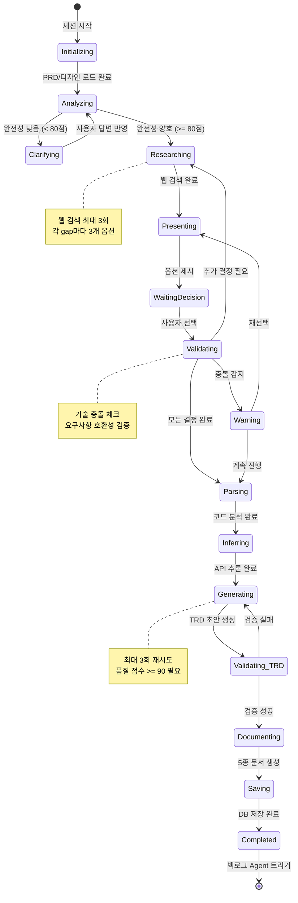
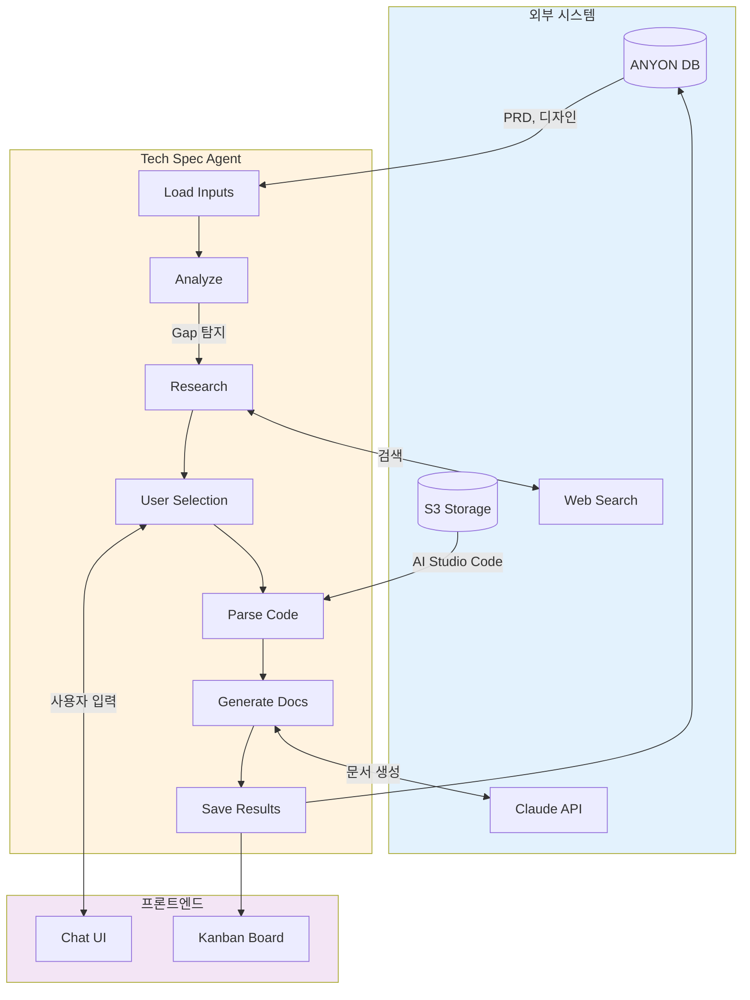

# Tech Spec Agent LangGraph 상세 설계 및 시각화

## 📋 목차
1. [전체 워크플로우 시각화](#1-전체-워크플로우-시각화)
2. [LangGraph 노드 상세 설계](#2-langgraph-노드-상세-설계)
3. [상태 관리 스키마](#3-상태-관리-스키마)
4. [조건부 분기 로직](#4-조건부-분기-로직)
5. [구현 코드](#5-구현-코드)
6. [데이터 흐름 다이어그램](#6-데이터-흐름-다이어그램)
7. [에러 처리 및 복구](#7-에러-처리-및-복구)
8. [성능 최적화](#8-성능-최적화)

---

## 1. 전체 워크플로우 시각화

### 1.1 메인 플로우 다이어그램

```mermaid
graph TB
    START([시작: 디자인 완료]) --> LOAD[1. load_inputs<br/>PRD/디자인 로드]
    
    LOAD --> ANALYZE[2. analyze_completeness<br/>기획 완전성 분석]
    
    ANALYZE --> CHECK_SCORE{완전성 점수<br/> >= 80?}
    
    CHECK_SCORE -->|Yes| IDENTIFY[3. identify_tech_gaps<br/>기술 gap 탐지]
    CHECK_SCORE -->|No| ASK_USER[3-1. ask_user_clarification<br/>사용자 질문]
    
    ASK_USER --> IDENTIFY
    
    IDENTIFY --> HAS_GAPS{기술 gap<br/>존재?}
    
    HAS_GAPS -->|Yes| RESEARCH[4. research_technologies<br/>오픈소스 웹 검색]
    HAS_GAPS -->|No| PARSE_CODE
    
    RESEARCH --> PRESENT[5. present_options<br/>선택지 제시]
    
    PRESENT --> WAIT[6. wait_user_decision<br/>사용자 선택 대기]
    
    WAIT --> VALIDATE_DECISION[7. validate_decision<br/>선택 검증]
    
    VALIDATE_DECISION --> HAS_CONFLICT{충돌<br/>있음?}
    
    HAS_CONFLICT -->|Yes| WARN[7-1. warn_user<br/>경고 표시]
    HAS_CONFLICT -->|No| MORE_GAPS
    
    WARN --> USER_CONFIRM{사용자<br/>확인?}
    USER_CONFIRM -->|재선택| PRESENT
    USER_CONFIRM -->|계속| MORE_GAPS
    
    MORE_GAPS{남은 결정<br/>있음?}
    
    MORE_GAPS -->|Yes| RESEARCH
    MORE_GAPS -->|No| PARSE_CODE[8. parse_ai_studio_code<br/>Google AI Studio 코드 분석]
    
    PARSE_CODE --> INFER_API[9. infer_api_spec<br/>API 명세 추론]
    
    INFER_API --> GEN_TRD[10. generate_trd<br/>TRD 생성]
    
    GEN_TRD --> VALIDATE_TRD[11. validate_trd<br/>TRD 검증]
    
    VALIDATE_TRD --> TRD_VALID{TRD<br/>유효?}
    
    TRD_VALID -->|No| GEN_TRD
    TRD_VALID -->|Yes| GEN_API[12. generate_api_spec<br/>API 명세 생성]
    
    GEN_API --> GEN_DB[13. generate_db_schema<br/>DB 스키마 생성]
    
    GEN_DB --> GEN_ARCH[14. generate_architecture<br/>아키텍처 다이어그램]
    
    GEN_ARCH --> GEN_TECH_STACK[15. generate_tech_stack_doc<br/>기술 스택 문서]
    
    GEN_TECH_STACK --> SAVE[16. save_to_db<br/>DB 저장]
    
    SAVE --> NOTIFY[17. notify_next_agent<br/>백로그 Agent 트리거]
    
    NOTIFY --> END([완료: 백로그 단계로])
    
    style START fill:#e1f5e1
    style END fill:#e1f5e1
    style CHECK_SCORE fill:#fff3cd
    style HAS_GAPS fill:#fff3cd
    style HAS_CONFLICT fill:#fff3cd
    style MORE_GAPS fill:#fff3cd
    style TRD_VALID fill:#fff3cd
    style USER_CONFIRM fill:#fff3cd
    style RESEARCH fill:#cfe2ff
    style PARSE_CODE fill:#cfe2ff
    style GEN_TRD fill:#d1e7dd
    style GEN_API fill:#d1e7dd
    style GEN_DB fill:#d1e7dd
    style GEN_ARCH fill:#d1e7dd
    style SAVE fill:#f8d7da
```



### 1.2 4단계 Phase 구조

```mermaid
graph LR
    subgraph Phase1[Phase 1: 입력 및 분석]
        N1[load_inputs]
        N2[analyze_completeness]
        N3[identify_tech_gaps]
    end
    
    subgraph Phase2[Phase 2: 기술 조사 및 선택]
        N4[research_technologies]
        N5[present_options]
        N6[wait_user_decision]
        N7[validate_decision]
    end
    
    subgraph Phase3[Phase 3: 코드 분석 및 추론]
        N8[parse_ai_studio_code]
        N9[infer_api_spec]
    end
    
    subgraph Phase4[Phase 4: 문서 생성]
        N10[generate_trd]
        N11[validate_trd]
        N12[generate_api_spec]
        N13[generate_db_schema]
        N14[generate_architecture]
        N15[generate_tech_stack_doc]
        N16[save_to_db]
    end
    
    Phase1 --> Phase2
    Phase2 --> Phase3
    Phase3 --> Phase4
    
    style Phase1 fill:#e3f2fd
    style Phase2 fill:#fff3e0
    style Phase3 fill:#f3e5f5
    style Phase4 fill:#e8f5e9
```



### 1.3 상태 흐름 다이어그램



---

## 2. LangGraph 노드 상세 설계

### 2.1 Node 1: load_inputs

**목적**: 프로젝트 데이터를 DB에서 로드하고 초기화

```python
async def load_inputs_node(state: TechSpecState) -> TechSpecState:
    """
    입력 데이터 로드 노드
    
    - DB에서 PRD, 디자인 문서 가져오기
    - Google AI Studio 코드 경로 확인
    - 세션 초기화
    """
    project_id = state["project_id"]
    
    # 1. PRD 로드
    prd = await db.fetch_one("""
        SELECT content 
        FROM documents 
        WHERE project_id = $1 AND document_type = 'prd'
    """, project_id)
    
    # 2. 디자인 문서 5종 로드
    design_docs = await db.fetch_all("""
        SELECT document_type, content
        FROM documents
        WHERE project_id = $1 
        AND document_type LIKE 'design_%'
    """, project_id)
    
    # 3. 초기 TRD (후-기획에서 생성한 것)
    initial_trd = await db.fetch_one("""
        SELECT content
        FROM documents
        WHERE project_id = $1 AND document_type = 'initial_trd'
    """, project_id)
    
    # 4. Google AI Studio 코드 경로
    google_code_path = await db.fetch_one("""
        SELECT file_path
        FROM design_artifacts
        WHERE project_id = $1 AND artifact_type = 'google_ai_studio_code'
    """, project_id)
    
    # 상태 업데이트
    state.update({
        "prd_content": prd["content"] if prd else "",
        "design_docs": {doc["document_type"]: doc["content"] for doc in design_docs},
        "initial_trd": initial_trd["content"] if initial_trd else "",
        "google_ai_studio_code_path": google_code_path["file_path"] if google_code_path else None,
        "current_stage": "loaded",
        "completion_percentage": 5.0
    })
    
    # 대화 시작 메시지
    welcome_message = """
    안녕하세요! Tech Spec Agent입니다. 🤖
    
    PRD와 디자인 문서를 불러왔습니다.
    이제 기술 스펙을 상세하게 작성하기 위해 몇 가지 기술적 결정이 필요합니다.
    
    함께 최적의 기술 스택을 선택해보시죠!
    """
    
    state["conversation_history"].append({
        "role": "agent",
        "message": welcome_message,
        "timestamp": datetime.now()
    })
    
    return state

# 다음 노드: analyze_completeness (무조건)
```

**입력 상태**:
- `project_id`: UUID

**출력 상태**:
- `prd_content`: str
- `design_docs`: Dict[str, str]
- `initial_trd`: str
- `google_ai_studio_code_path`: str | None
- `current_stage`: "loaded"
- `completion_percentage`: 5.0

**다음 노드**: `analyze_completeness` (무조건)

---

### 2.2 Node 2: analyze_completeness

**목적**: PRD와 디자인 문서의 완전성 평가

```python
async def analyze_completeness_node(state: TechSpecState) -> TechSpecState:
    """
    기획 완전성 분석 노드
    
    - PRD와 디자인 문서를 종합 분석
    - 8개 카테고리별 점수 산정
    - 누락/모호한 요소 식별
    """
    
    # Claude에게 분석 요청
    analysis_prompt = f"""
    다음 PRD와 디자인 문서를 분석하여 기술 스펙 작성에 필요한 완전성을 평가하세요.
    
    <prd>
    {state["prd_content"]}
    </prd>
    
    <design_docs>
    {json.dumps(state["design_docs"], indent=2, ensure_ascii=False)}
    </design_docs>
    
    다음 8개 카테고리에 대해 각각 0-100점으로 평가하고, 총점을 계산하세요:
    
    1. **인증 시스템** (0-15점)
       - 사용자 인증 방식이 명시되었는가?
       - 소셜 로그인 요구사항이 있는가?
       - 권한 관리 정책이 정의되었는가?
    
    2. **API 구조** (0-15점)
       - 필요한 API 엔드포인트가 식별되었는가?
       - 요청/응답 데이터 구조가 명확한가?
    
    3. **데이터 모델** (0-15점)
       - 주요 엔티티가 정의되었는가?
       - 엔티티 간 관계가 명확한가?
    
    4. **파일 처리** (0-10점)
       - 파일 업로드/다운로드 요구사항이 있는가?
       - 저장 방식이 명시되었는가?
    
    5. **실시간 기능** (0-10점)
       - 실시간 통신이 필요한가?
       - 어떤 데이터를 실시간으로 동기화하는가?
    
    6. **외부 연동** (0-15점)
       - 결제, 이메일, SMS 등 외부 서비스 필요한가?
       - 연동 방식이 명시되었는가?
    
    7. **에러 처리** (0-10점)
       - 주요 에러 시나리오가 정의되었는가?
    
    8. **보안 및 성능** (0-10점)
       - 보안 요구사항이 명시되었는가?
       - 성능 목표가 정의되었는가?
    
    JSON 형식으로 답변하세요:
    {{
      "scores": {{
        "authentication": 0-15,
        "api_structure": 0-15,
        "data_model": 0-15,
        "file_handling": 0-10,
        "realtime": 0-10,
        "external_integration": 0-15,
        "error_handling": 0-10,
        "security_performance": 0-10
      }},
      "total_score": 0-100,
      "missing_elements": [
        "인증 시스템 명시 필요",
        "파일 저장 방식 미정",
        ...
      ],
      "ambiguous_elements": [
        "실시간 알림 범위 불명확",
        ...
      ]
    }}
    """
    
    result = await call_claude(analysis_prompt, model="claude-sonnet-4-20250514")
    analysis = json.loads(result.content[0].text)
    
    # 상태 업데이트
    state.update({
        "completeness_score": analysis["total_score"],
        "missing_elements": analysis["missing_elements"],
        "ambiguous_elements": analysis["ambiguous_elements"],
        "current_stage": "analyzed",
        "completion_percentage": 15.0
    })
    
    # 사용자에게 피드백
    if analysis["total_score"] < 80:
        message = f"""
        기획 문서 분석 결과, 완전성 점수가 **{analysis["total_score"]}/100**입니다.
        
        몇 가지 추가 정보가 필요합니다:
        
        **누락된 요소**:
        {format_list(analysis["missing_elements"])}
        
        **모호한 요소**:
        {format_list(analysis["ambiguous_elements"])}
        
        이제 누락된 부분에 대해 질문드리겠습니다.
        """
    else:
        message = f"""
        기획 문서 분석 완료! 완전성 점수: **{analysis["total_score"]}/100** ✅
        
        이제 기술 스택 선택 단계로 넘어가겠습니다.
        """
    
    state["conversation_history"].append({
        "role": "agent",
        "message": message,
        "timestamp": datetime.now()
    })
    
    return state

# 조건부 분기:
# - score >= 80: identify_tech_gaps로
# - score < 80: ask_user_clarification으로
```

**입력 상태**:
- `prd_content`
- `design_docs`

**출력 상태**:
- `completeness_score`: float (0-100)
- `missing_elements`: List[str]
- `ambiguous_elements`: List[str]

**다음 노드**: 
- `completeness_score >= 80` → `identify_tech_gaps`
- `completeness_score < 80` → `ask_user_clarification`

---

### 2.3 Node 2-1: ask_user_clarification (조건부)

**목적**: 완전성이 낮을 때 사용자에게 추가 정보 요청

```python
async def ask_user_clarification_node(state: TechSpecState) -> TechSpecState:
    """
    사용자 명확화 질문 노드
    
    - 누락된 요소에 대해 순차적으로 질문
    - 객관식 또는 주관식 질문 생성
    """
    
    missing = state["missing_elements"]
    ambiguous = state["ambiguous_elements"]
    
    # 아직 질문하지 않은 첫 번째 항목
    clarification_queue = state.get("clarification_queue", missing + ambiguous)
    
    if not clarification_queue:
        # 모든 질문 완료
        state["current_stage"] = "clarified"
        return state
    
    current_item = clarification_queue[0]
    
    # 항목 유형에 따라 질문 생성
    question = generate_clarification_question(current_item, state["prd_content"])
    
    state["current_question"] = question
    state["clarification_queue"] = clarification_queue[1:]  # 큐에서 제거
    
    state["conversation_history"].append({
        "role": "agent",
        "message": question,
        "timestamp": datetime.now(),
        "expecting_user_input": True
    })
    
    return state

# 다음 노드: wait_for_user_input (시스템이 사용자 입력을 기다림)
# 사용자 입력 후: 다시 analyze_completeness로 (업데이트된 정보로 재분석)
```

---

### 2.4 Node 3: identify_tech_gaps

**목적**: 기술적으로 미정인 부분 식별

```python
async def identify_tech_gaps_node(state: TechSpecState) -> TechSpecState:
    """
    기술 gap 탐지 노드
    
    - PRD에서 기능은 명시되었지만 구현 기술이 미정인 부분 찾기
    - 카테고리별로 분류
    """
    
    gap_detection_prompt = f"""
    다음 PRD를 분석하여, **기능은 명시되어 있지만 구체적인 구현 기술이 결정되지 않은 부분**을 찾으세요.
    
    <prd>
    {state["prd_content"]}
    </prd>
    
    <initial_trd>
    {state["initial_trd"]}
    </initial_trd>
    
    다음 카테고리에서 gap을 찾으세요:
    
    1. **authentication**: 사용자 인증 시스템
    2. **database**: 데이터베이스 선택
    3. **file_storage**: 파일 저장소
    4. **email**: 이메일 발송 서비스
    5. **payment**: 결제 시스템
    6. **realtime**: 실시간 통신
    7. **image_processing**: 이미지 처리
    8. **deployment**: 배포 환경
    
    각 gap에 대해 다음 정보를 제공하세요:
    
    JSON 형식:
    {{
      "gaps": [
        {{
          "id": "gap_1",
          "category": "authentication",
          "description": "사용자 로그인 및 소셜 로그인 구현",
          "requirements": [
            "이메일/비밀번호 로그인",
            "Google, Facebook 소셜 로그인",
            "JWT 토큰 기반 인증"
          ],
          "urgency": "critical" | "high" | "medium" | "low",
          "depends_on": []  // 다른 gap ID들
        }},
        ...
      ]
    }}
    """
    
    result = await call_claude(gap_detection_prompt)
    gaps_data = json.loads(result.content[0].text)
    
    state["technical_gaps"] = gaps_data["gaps"]
    state["current_stage"] = "gaps_identified"
    state["completion_percentage"] = 25.0
    
    # 사용자에게 안내
    message = f"""
    기술 스택 결정이 필요한 항목을 {len(gaps_data["gaps"])}개 발견했습니다.
    
    이제 각 항목에 대해 최적의 기술을 조사하고 추천해드리겠습니다.
    """
    
    state["conversation_history"].append({
        "role": "agent",
        "message": message,
        "timestamp": datetime.now()
    })
    
    return state

# 조건부 분기:
# - len(technical_gaps) > 0: research_technologies로
# - len(technical_gaps) == 0: parse_ai_studio_code로 (기술 결정 불필요)
```

**출력 상태**:
- `technical_gaps`: List[Dict]

**다음 노드**:
- `len(technical_gaps) > 0` → `research_technologies`
- `len(technical_gaps) == 0` → `parse_ai_studio_code`

---

### 2.5 Node 4: research_technologies

**목적**: 각 기술 gap에 대해 오픈소스 조사 수행

```python
async def research_technologies_node(state: TechSpecState) -> TechSpecState:
    """
    기술 조사 노드
    
    - 각 gap에 대해 웹 검색 수행
    - 상위 3개 옵션 추출
    - 장단점, 인기도, 학습 난이도 분석
    """
    
    gaps = state["technical_gaps"]
    pending_decisions = state.get("pending_decisions", [])
    selected_technologies = state.get("selected_technologies", {})
    
    # 아직 결정되지 않은 gap들
    unresolved_gaps = [
        gap for gap in gaps 
        if gap["id"] not in selected_technologies
    ]
    
    if not unresolved_gaps:
        # 모든 gap 해결됨
        state["current_stage"] = "research_complete"
        return state
    
    # 첫 번째 미해결 gap 처리
    current_gap = unresolved_gaps[0]
    
    # 1. 웹 검색으로 후보 찾기
    search_query = f"{current_gap['description']} open source library 2025"
    search_results = await web_search(search_query)
    
    # 2. 후보 추출 (상위 5개)
    candidates = await extract_candidates_from_search(
        search_results, 
        current_gap["category"],
        top_n=5
    )
    
    # 3. 각 후보에 대한 상세 조사
    detailed_options = []
    for candidate in candidates[:3]:  # 상위 3개만
        # GitHub stats
        github_query = f"{candidate['name']} github stars"
        github_results = await web_search(github_query)
        github_stats = extract_github_stats(github_results)
        
        # 장단점 검색
        pros_cons_query = f"{candidate['name']} advantages disadvantages comparison"
        pros_cons_results = await web_search(pros_cons_query)
        pros_cons = extract_pros_cons(pros_cons_results)
        
        # 사용 사례 검색
        use_case_query = f"{candidate['name']} real world use case example"
        use_case_results = await web_search(use_case_query)
        use_cases = extract_use_cases(use_case_results)
        
        detailed_options.append({
            "name": candidate["name"],
            "description": candidate["description"],
            "category": current_gap["category"],
            "github_stars": github_stats.get("stars", "N/A"),
            "npm_downloads": github_stats.get("npm_downloads", "N/A"),
            "last_update": github_stats.get("last_commit", "N/A"),
            "pros": pros_cons["pros"][:5],  # 상위 5개 장점
            "cons": pros_cons["cons"][:5],  # 상위 5개 단점
            "use_cases": use_cases[:3],
            "documentation_url": candidate.get("docs_url"),
            "learning_curve": estimate_learning_curve(candidate),
            "setup_time": estimate_setup_time(candidate),
            "cost": candidate.get("cost", "무료")
        })
    
    # 조사 결과 저장
    research_entry = {
        "gap": current_gap,
        "options": detailed_options,
        "research_timestamp": datetime.now()
    }
    
    state["tech_research_results"].append(research_entry)
    
    # pending_decisions 큐에 추가
    state["pending_decisions"] = pending_decisions + [current_gap["id"]]
    
    state["current_stage"] = "researched"
    state["completion_percentage"] = 30.0 + (len(state["tech_research_results"]) / len(gaps)) * 20.0
    
    return state

# 다음 노드: present_options (무조건)
```

**출력 상태**:
- `tech_research_results`: List[Dict]
- `pending_decisions`: List[str] (gap IDs)

**다음 노드**: `present_options`

---

### 2.6 Node 5: present_options

**목적**: 사용자에게 기술 선택지를 명확하게 제시

```python
async def present_options_node(state: TechSpecState) -> TechSpecState:
    """
    옵션 제시 노드
    
    - 조사된 기술 옵션을 사용자 친화적으로 포맷
    - 비교 표 생성
    - 추천 표시
    """
    
    research_results = state["tech_research_results"]
    
    # 가장 최근 조사 결과
    current_research = research_results[-1]
    gap = current_research["gap"]
    options = current_research["options"]
    
    # AI 추천 계산
    recommendation = calculate_recommendation(
        options=options,
        project_context=state["prd_content"],
        user_level="beginner"  # 비개발자 기준
    )
    
    # 사용자 친화적 메시지 생성
    message = f"""
    ## {gap["description"]}에 대한 기술 선택
    
    조사 결과 다음 3가지 옵션이 있습니다:
    
    """
    
    for i, opt in enumerate(options, 1):
        is_recommended = (opt["name"] == recommendation["name"])
        
        message += f"""
    ### {i}. {opt["name"]} {'⭐ AI 추천' if is_recommended else ''}
    
    **설명**: {opt["description"]}
    
    ✅ **장점**:
    {format_bullet_list(opt["pros"])}
    
    ❌ **단점**:
    {format_bullet_list(opt["cons"])}
    
    📊 **메트릭**:
    - 인기도: {opt["github_stars"]} GitHub ⭐
    - 다운로드: {opt["npm_downloads"]}/월
    - 최근 업데이트: {opt["last_update"]}
    
    📚 **학습 난이도**: {opt["learning_curve"]}
    ⏱️ **설정 시간**: {opt["setup_time"]}
    💰 **비용**: {opt["cost"]}
    
    📖 [문서 보기]({opt["documentation_url"]})
    
    ---
    """
    
    if recommendation:
        message += f"""
    
    💡 **AI 추천 이유**:
    {recommendation["reasoning"]}
    
    """
    
    message += """
    어떤 옵션을 선택하시겠습니까?
    - **1**, **2**, 또는 **3**을 입력하세요
    - 다른 기술을 검색하려면 **"검색: <기술명>"**을 입력하세요
    - 잘 모르겠다면 **"AI 추천"**을 입력하세요
    """
    
    state["current_question"] = message
    state["current_stage"] = "presenting"
    
    state["conversation_history"].append({
        "role": "agent",
        "message": message,
        "timestamp": datetime.now(),
        "expecting_user_input": True,
        "context": {
            "gap_id": gap["id"],
            "options": [opt["name"] for opt in options]
        }
    })
    
    return state

# 다음 노드: wait_user_decision (사용자 입력 대기)
```

**출력 상태**:
- `current_question`: str (사용자에게 보여질 메시지)

**다음 노드**: `wait_user_decision`

---

### 2.7 Node 6: wait_user_decision

**목적**: 사용자 선택을 기다리고 입력 처리

```python
async def wait_user_decision_node(state: TechSpecState) -> TechSpecState:
    """
    사용자 결정 대기 노드
    
    - WebSocket으로 사용자 입력 대기
    - 입력 유효성 검증
    - 선택 기록
    """
    
    # 이 노드는 실제로는 WebSocket handler에서 처리됨
    # LangGraph에서는 interrupt로 구현
    
    # 사용자 입력 대기 (시스템이 일시 중지)
    user_input = await wait_for_websocket_message(state["session_id"])
    
    # 입력 파싱
    current_research = state["tech_research_results"][-1]
    options = current_research["options"]
    gap_id = current_research["gap"]["id"]
    
    selected_tech = None
    
    if user_input.lower() == "ai 추천":
        # AI가 추천한 옵션 선택
        recommendation = calculate_recommendation(options, state["prd_content"])
        selected_tech = recommendation["name"]
        selection_reason = f"AI 추천: {recommendation['reasoning']}"
    
    elif user_input.startswith("검색:"):
        # 사용자가 직접 기술명 입력
        tech_name = user_input.replace("검색:", "").strip()
        # 재검색 로직 (research_technologies로 다시 이동)
        state["custom_search_query"] = tech_name
        state["current_stage"] = "custom_search"
        return state
    
    elif user_input in ["1", "2", "3"]:
        # 옵션 선택
        idx = int(user_input) - 1
        selected_tech = options[idx]["name"]
        selection_reason = "사용자 직접 선택"
    
    else:
        # 잘못된 입력
        state["conversation_history"].append({
            "role": "agent",
            "message": "올바른 옵션을 선택해주세요 (1, 2, 3 또는 'AI 추천')",
            "timestamp": datetime.now()
        })
        # 다시 present_options로
        return state
    
    # 선택 기록
    state["selected_technologies"][gap_id] = {
        "name": selected_tech,
        "category": current_research["gap"]["category"],
        "reason": selection_reason,
        "timestamp": datetime.now()
    }
    
    state["conversation_history"].append({
        "role": "user",
        "message": user_input,
        "timestamp": datetime.now()
    })
    
    state["conversation_history"].append({
        "role": "agent",
        "message": f"✅ **{selected_tech}**를 선택하셨습니다.",
        "timestamp": datetime.now()
    })
    
    state["current_stage"] = "decision_made"
    
    return state

# 다음 노드: validate_decision
```

**출력 상태**:
- `selected_technologies`: Dict[str, Dict]

**다음 노드**: `validate_decision`

---

### 2.8 Node 7: validate_decision

**목적**: 선택한 기술이 요구사항과 충돌하지 않는지 검증

```python
async def validate_decision_node(state: TechSpecState) -> TechSpecState:
    """
    기술 선택 검증 노드
    
    - 선택한 기술이 PRD 요구사항과 호환되는지 확인
    - 다른 선택한 기술들과 충돌하지 않는지 확인
    """
    
    # 가장 최근 선택
    current_research = state["tech_research_results"][-1]
    gap_id = current_research["gap"]["id"]
    selected = state["selected_technologies"][gap_id]
    
    # 검증 프롬프트
    validation_prompt = f"""
    사용자가 다음 기술을 선택했습니다:
    
    기술: {selected["name"]}
    카테고리: {selected["category"]}
    
    이 선택이 다음 요구사항과 충돌하지 않는지 검증하세요:
    
    <prd>
    {state["prd_content"]}
    </prd>
    
    <already_selected>
    {json.dumps(state["selected_technologies"], indent=2, ensure_ascii=False)}
    </already_selected>
    
    다음 사항을 체크하세요:
    1. PRD 요구사항과의 호환성
    2. 이미 선택한 다른 기술과의 호환성
    3. 기술적 제약사항
    
    JSON 형식으로 답변:
    {{
      "is_valid": true | false,
      "conflicts": [
        {{
          "type": "requirement_mismatch" | "tech_incompatibility",
          "description": "...",
          "severity": "critical" | "warning"
        }}
      ],
      "recommendation": "계속 진행" | "재선택 권장" | "재선택 필수"
    }}
    """
    
    result = await call_claude(validation_prompt)
    validation = json.loads(result.content[0].text)
    
    if validation["conflicts"]:
        # 충돌 발견
        state["validation_warnings"] = validation["conflicts"]
        state["current_stage"] = "validation_conflict"
        
        # 사용자에게 경고
        warning_message = f"""
        ⚠️ **경고**: {selected["name"]} 선택에 잠재적 문제가 있습니다.
        
        """
        
        for conflict in validation["conflicts"]:
            severity_emoji = "🔴" if conflict["severity"] == "critical" else "🟡"
            warning_message += f"""
        {severity_emoji} **{conflict["type"]}**
        {conflict["description"]}
        
        """
        
        warning_message += f"""
        
        **AI 권장**: {validation["recommendation"]}
        
        어떻게 하시겠습니까?
        - **계속**: 이대로 진행
        - **재선택**: 다른 기술 선택
        """
        
        state["current_question"] = warning_message
        state["conversation_history"].append({
            "role": "agent",
            "message": warning_message,
            "timestamp": datetime.now(),
            "expecting_user_input": True
        })
        
    else:
        # 검증 통과
        state["current_stage"] = "validated"
        state["conversation_history"].append({
            "role": "agent",
            "message": f"✅ {selected['name']} 선택이 검증되었습니다!",
            "timestamp": datetime.now()
        })
    
    return state

# 조건부 분기:
# - has_conflicts && user_wants_reselect: present_options로
# - has_conflicts && user_continues: check_more_gaps로
# - no_conflicts: check_more_gaps로
```

**출력 상태**:
- `validation_warnings`: List[Dict] (충돌이 있는 경우)

**다음 노드**:
- 충돌 있음 + 사용자가 재선택 → `present_options`
- 충돌 없음 또는 계속 진행 → 남은 결정 확인

---

### 2.9 조건 체크: check_pending_decisions

```python
def check_pending_decisions(state: TechSpecState) -> str:
    """
    아직 결정되지 않은 기술 gap이 있는지 확인
    """
    all_gaps = state["technical_gaps"]
    selected = state["selected_technologies"]
    
    unresolved = [gap for gap in all_gaps if gap["id"] not in selected]
    
    if unresolved:
        return "more_research_needed"
    else:
        return "all_decided"

# - more_research_needed: research_technologies로 (다음 gap 처리)
# - all_decided: parse_ai_studio_code로
```

---

### 2.10 Node 8: parse_ai_studio_code

**목적**: Google AI Studio 생성 코드 분석

```python
async def parse_ai_studio_code_node(state: TechSpecState) -> TechSpecState:
    """
    Google AI Studio 코드 파싱 노드
    
    - ZIP 파일 압축 해제
    - React 컴포넌트 AST 파싱
    - Props, State, API 호출 추출
    """
    
    code_path = state.get("google_ai_studio_code_path")
    
    if not code_path:
        # 코드가 없으면 스킵
        state["google_ai_studio_data"] = None
        state["current_stage"] = "no_code"
        return state
    
    # 1. ZIP 다운로드 및 압축 해제
    local_path = await download_from_s3(code_path)
    extracted_dir = extract_zip(local_path)
    
    # 2. 모든 .tsx, .jsx 파일 찾기
    component_files = find_files(extracted_dir, patterns=["*.tsx", "*.jsx"])
    
    # 3. 각 컴포넌트 파싱
    parsed_components = []
    
    for file_path in component_files:
        with open(file_path, 'r', encoding='utf-8') as f:
            code = f.read()
        
        # TypeScript AST 파싱
        component_data = {
            "file_path": file_path,
            "name": extract_component_name(code),
            "props": extract_props_interface(code),
            "state_vars": extract_state_variables(code),
            "api_calls": extract_api_calls(code),
            "event_handlers": extract_event_handlers(code),
            "imported_components": extract_imports(code)
        }
        
        parsed_components.append(component_data)
    
    state["google_ai_studio_data"] = {
        "components": parsed_components,
        "total_components": len(parsed_components),
        "extracted_at": datetime.now()
    }
    
    state["current_stage"] = "code_parsed"
    state["completion_percentage"] = 55.0
    
    state["conversation_history"].append({
        "role": "agent",
        "message": f"Google AI Studio 코드 분석 완료: {len(parsed_components)}개 컴포넌트 발견",
        "timestamp": datetime.now()
    })
    
    return state

# 다음 노드: infer_api_spec
```

**출력 상태**:
- `google_ai_studio_data`: Dict

**다음 노드**: `infer_api_spec`

---

### 2.11 Node 9: infer_api_spec

**목적**: 컴포넌트 분석으로부터 API 명세 추론

```python
async def infer_api_spec_node(state: TechSpecState) -> TechSpecState:
    """
    API 명세 추론 노드
    
    - 컴포넌트의 API 호출 코드 분석
    - Props 구조로부터 응답 데이터 타입 추론
    - 엔드포인트 목록 생성
    """
    
    ai_studio_data = state.get("google_ai_studio_data")
    
    if not ai_studio_data:
        # 코드가 없으면 PRD/디자인만으로 추론
        inferred_api_spec = await infer_api_from_prd_only(
            state["prd_content"],
            state["design_docs"]
        )
    else:
        components = ai_studio_data["components"]
        
        inferred_endpoints = []
        
        for comp in components:
            for api_call in comp["api_calls"]:
                endpoint = {
                    "path": api_call["url"],
                    "method": api_call["method"],
                    "source_component": comp["name"],
                    "request_body_type": infer_request_type(api_call, comp),
                    "response_type": comp["props"],  # Props는 보통 서버 응답 구조
                    "description": f"{comp['name']} 컴포넌트에서 사용"
                }
                
                inferred_endpoints.append(endpoint)
        
        # 중복 제거 및 병합
        inferred_api_spec = merge_duplicate_endpoints(inferred_endpoints)
    
    state["inferred_api_spec"] = inferred_api_spec
    state["current_stage"] = "api_inferred"
    state["completion_percentage"] = 65.0
    
    state["conversation_history"].append({
        "role": "agent",
        "message": f"API 명세 추론 완료: {len(inferred_api_spec['endpoints'])}개 엔드포인트",
        "timestamp": datetime.now()
    })
    
    return state

# 다음 노드: generate_trd
```

**출력 상태**:
- `inferred_api_spec`: Dict

**다음 노드**: `generate_trd`

---

### 2.12 Node 10: generate_trd

**목적**: 최종 TRD 문서 생성

```python
async def generate_trd_node(state: TechSpecState) -> TechSpecState:
    """
    TRD 생성 노드
    
    - 모든 수집된 정보를 종합
    - Markdown 형식 TRD 작성
    - 섹션별 구조화
    """
    
    trd_generation_prompt = f"""
    다음 정보를 바탕으로 상세한 TRD(Technical Requirements Document)를 작성하세요.
    
    <prd>
    {state["prd_content"]}
    </prd>
    
    <selected_technologies>
    {json.dumps(state["selected_technologies"], indent=2, ensure_ascii=False)}
    </selected_technologies>
    
    <inferred_api_spec>
    {json.dumps(state["inferred_api_spec"], indent=2, ensure_ascii=False)}
    </inferred_api_spec>
    
    <design_docs>
    {json.dumps(state["design_docs"], indent=2, ensure_ascii=False)}
    </design_docs>
    
    다음 구조로 TRD를 작성하세요:
    
    # Technical Requirements Document (TRD)
    
    ## 1. 프로젝트 개요
    - 프로젝트명
    - 버전
    - 작성일
    
    ## 2. 기술 스택
    ### 2.1 프론트엔드
    - 프레임워크: [선택된 기술]
    - UI 라이브러리: [선택된 기술]
    - 상태 관리: [선택된 기술]
    - 스타일링: [선택된 기술]
    
    ### 2.2 백엔드
    - 언어/프레임워크: [선택된 기술]
    - 데이터베이스: [선택된 기술]
    - ORM: [선택된 기술]
    - 인증: [선택된 기술]
    
    ### 2.3 인프라
    - 호스팅: [선택된 기술]
    - CI/CD: [선택된 기술]
    
    ### 2.4 외부 서비스
    - 파일 스토리지: [선택된 기술]
    - 이메일: [선택된 기술]
    - [기타 선택된 서비스들]
    
    ## 3. 시스템 아키텍처
    [Mermaid 다이어그램 코드]
    
    ## 4. API 명세 개요
    [추론된 엔드포인트 목록 요약]
    
    ## 5. 데이터베이스 설계 개요
    [주요 테이블 목록]
    
    ## 6. 보안 요구사항
    [PRD 기반]
    
    ## 7. 성능 요구사항
    [PRD 기반]
    
    ## 8. 배포 및 운영
    [선택된 인프라 기반]
    
    Markdown 형식으로 작성하세요.
    """
    
    result = await call_claude(
        trd_generation_prompt,
        model="claude-sonnet-4-20250514",
        max_tokens=8000
    )
    
    generated_trd = result.content[0].text
    
    state["final_trd"] = generated_trd
    state["current_stage"] = "trd_generated"
    state["completion_percentage"] = 70.0
    
    return state

# 다음 노드: validate_trd
```

**출력 상태**:
- `final_trd`: str (Markdown)

**다음 노드**: `validate_trd`

---

### 2.13 Node 11: validate_trd

**목적**: TRD 품질 검증

```python
async def validate_trd_node(state: TechSpecState) -> TechSpecState:
    """
    TRD 검증 노드
    
    - 완전성 체크
    - 일관성 체크
    - 품질 점수 산정
    """
    
    validation_prompt = f"""
    다음 TRD를 검증하세요:
    
    <trd>
    {state["final_trd"]}
    </trd>
    
    다음 항목들을 체크하세요:
    
    1. **완전성** (0-30점)
       - 모든 필수 섹션이 있는가?
       - 각 섹션이 충분히 상세한가?
    
    2. **일관성** (0-30점)
       - PRD와 일치하는가?
       - 선택한 기술 스택이 모두 반영되었는가?
    
    3. **명확성** (0-20점)
       - 용어가 명확한가?
       - 모호한 표현이 없는가?
    
    4. **실행 가능성** (0-20점)
       - 개발자가 이 TRD만으로 개발 시작 가능한가?
    
    JSON 형식:
    {{
      "total_score": 0-100,
      "is_valid": true | false,  // 90점 이상이면 true
      "missing_sections": [...],
      "inconsistencies": [...],
      "improvement_suggestions": [...]
    }}
    """
    
    result = await call_claude(validation_prompt)
    validation = json.loads(result.content[0].text)
    
    state["trd_validation_result"] = validation
    
    if validation["is_valid"]:
        state["current_stage"] = "trd_validated"
        state["conversation_history"].append({
            "role": "agent",
            "message": f"✅ TRD 검증 완료! 품질 점수: {validation['total_score']}/100",
            "timestamp": datetime.now()
        })
    else:
        state["current_stage"] = "trd_invalid"
        state["conversation_history"].append({
            "role": "agent",
            "message": f"❌ TRD 품질이 부족합니다 ({validation['total_score']}/100). 재생성합니다...",
            "timestamp": datetime.now()
        })
    
    return state

# 조건부 분기:
# - is_valid == true: generate_api_spec로
# - is_valid == false: generate_trd로 (재생성)
```

---

### 2.14 Nodes 12-15: 문서 생성 노드들

```python
async def generate_api_spec_node(state: TechSpecState) -> TechSpecState:
    """API 명세서 생성 (OpenAPI/Swagger 형식)"""
    # ... (생략)
    state["api_specification"] = api_spec
    state["completion_percentage"] = 80.0
    return state

async def generate_db_schema_node(state: TechSpecState) -> TechSpecState:
    """데이터베이스 스키마 생성 (SQL DDL)"""
    # ... (생략)
    state["database_schema"] = db_schema
    state["completion_percentage"] = 85.0
    return state

async def generate_architecture_node(state: TechSpecState) -> TechSpecState:
    """아키텍처 다이어그램 생성 (Mermaid)"""
    # ... (생략)
    state["architecture_diagram"] = arch_diagram
    state["completion_percentage"] = 90.0
    return state

async def generate_tech_stack_doc_node(state: TechSpecState) -> TechSpecState:
    """기술 스택 문서 생성"""
    # ... (생략)
    state["tech_stack_document"] = tech_doc
    state["completion_percentage"] = 95.0
    return state
```

---

### 2.15 Node 16: save_to_db

**목적**: 모든 생성된 문서를 DB에 저장

```python
async def save_to_db_node(state: TechSpecState) -> TechSpecState:
    """
    DB 저장 노드
    
    - 5종 문서를 generated_trd_documents 테이블에 저장
    - ANYON 메인 documents 테이블에도 복사
    - 세션 완료 처리
    """
    
    session_id = state["session_id"]
    project_id = state["project_id"]
    
    documents_to_save = [
        ("final_trd", state["final_trd"], "markdown"),
        ("api_specification", state["api_specification"], "yaml"),
        ("database_schema", state["database_schema"], "sql"),
        ("architecture_diagram", state["architecture_diagram"], "mermaid"),
        ("tech_stack_document", state["tech_stack_document"], "markdown")
    ]
    
    async with db.transaction():
        for doc_type, content, format in documents_to_save:
            # 1. generated_trd_documents에 저장
            await db.execute("""
                INSERT INTO generated_trd_documents
                (session_id, document_type, content, content_format, is_latest, validated, validation_score)
                VALUES ($1, $2, $3, $4, $5, $6, $7)
            """, session_id, doc_type, content, format, True, True, state["trd_validation_result"]["total_score"])
            
            # 2. ANYON 메인 documents 테이블에 복사
            await db.execute("""
                INSERT INTO documents
                (project_id, document_type, content, created_by)
                VALUES ($1, $2, $3, $4)
            """, project_id, doc_type, content, "tech_spec_agent")
        
        # 3. 세션 완료 처리
        await db.execute("""
            UPDATE tech_spec_sessions
            SET current_stage = 'completed',
                completion_percentage = 100,
                completed_at = NOW()
            WHERE id = $1
        """, session_id)
        
        # 4. 프로젝트 상태 업데이트
        await db.execute("""
            UPDATE projects
            SET kanban_stage = 'backlog'
            WHERE id = $1
        """, project_id)
    
    state["current_stage"] = "saved"
    state["completion_percentage"] = 100.0
    
    return state

# 다음 노드: notify_next_agent
```

---

### 2.16 Node 17: notify_next_agent

**목적**: 백로그 Agent 트리거

```python
async def notify_next_agent_node(state: TechSpecState) -> TechSpecState:
    """
    다음 Agent 알림 노드
    
    - 백로그 Agent에게 시작 신호 전송
    - 사용자에게 완료 메시지
    """
    
    project_id = state["project_id"]
    
    # 백로그 Agent 트리거 (이벤트 발행)
    await event_bus.publish("tech_spec_completed", {
        "project_id": project_id,
        "session_id": state["session_id"],
        "trd_document_id": state.get("trd_document_id")
    })
    
    # 사용자에게 완료 메시지
    completion_message = f"""
    🎉 Tech Spec 작성이 완료되었습니다!
    
    생성된 문서:
    - ✅ TRD (Technical Requirements Document)
    - ✅ API 명세서
    - ✅ 데이터베이스 스키마
    - ✅ 아키텍처 다이어그램
    - ✅ 기술 스택 문서
    
    이제 백로그 Agent가 자동으로 시작됩니다.
    Epic과 Story로 작업을 나누고 개발 계획을 세우겠습니다!
    """
    
    state["conversation_history"].append({
        "role": "agent",
        "message": completion_message,
        "timestamp": datetime.now()
    })
    
    state["current_stage"] = "completed"
    
    return state

# 다음 노드: END
```

---

## 3. 상태 관리 스키마

### 3.1 Complete State Schema

```python
from typing import TypedDict, List, Dict, Annotated, Optional
from datetime import datetime
import operator

class TechSpecState(TypedDict):
    """Tech Spec Agent의 전체 상태"""
    
    # ============ 세션 정보 ============
    session_id: str  # UUID
    project_id: str  # UUID
    user_id: str  # UUID
    
    # ============ 입력 데이터 ============
    prd_content: str  # PRD 전문
    design_docs: Dict[str, str]  # {document_type: content}
    initial_trd: str  # 후-기획에서 생성한 초기 TRD
    google_ai_studio_code_path: Optional[str]  # S3 경로
    
    # ============ 분석 결과 ============
    completeness_score: float  # 0-100
    missing_elements: List[str]  # 누락된 요소들
    ambiguous_elements: List[str]  # 모호한 요소들
    clarification_queue: List[str]  # 사용자에게 물어볼 항목들
    
    # ============ 기술 Gap 및 조사 ============
    technical_gaps: List[Dict]  # 기술적으로 미정인 부분들
    # [{
    #   "id": "gap_1",
    #   "category": "authentication",
    #   "description": "...",
    #   "requirements": [...],
    #   "urgency": "critical",
    #   "depends_on": []
    # }]
    
    tech_research_results: Annotated[List[Dict], operator.add]
    # [{
    #   "gap": {...},
    #   "options": [
    #     {
    #       "name": "NextAuth.js",
    #       "description": "...",
    #       "pros": [...],
    #       "cons": [...],
    #       "github_stars": 1000,
    #       ...
    #     }
    #   ],
    #   "research_timestamp": datetime
    # }]
    
    selected_technologies: Dict[str, Dict]
    # {
    #   "gap_1": {
    #     "name": "NextAuth.js",
    #     "category": "authentication",
    #     "reason": "사용자 선택",
    #     "timestamp": datetime
    #   }
    # }
    
    pending_decisions: List[str]  # 아직 결정되지 않은 gap ID들
    validation_warnings: List[Dict]  # 선택 검증 시 발견된 경고들
    
    # ============ 대화 상태 ============
    current_question: Optional[str]  # 현재 사용자에게 묻는 질문
    conversation_history: Annotated[List[Dict], operator.add]
    # [{
    #   "role": "agent" | "user",
    #   "message": "...",
    #   "timestamp": datetime,
    #   "expecting_user_input": bool,
    #   "context": {...}
    # }]
    
    # ============ Google AI Studio 코드 분석 ============
    google_ai_studio_data: Optional[Dict]
    # {
    #   "components": [
    #     {
    #       "file_path": "...",
    #       "name": "UserProfileCard",
    #       "props": {...},
    #       "state_vars": [...],
    #       "api_calls": [...],
    #       ...
    #     }
    #   ],
    #   "total_components": 10,
    #   "extracted_at": datetime
    # }
    
    inferred_api_spec: Optional[Dict]
    # {
    #   "endpoints": [
    #     {
    #       "path": "/api/users/:id",
    #       "method": "GET",
    #       "source_component": "UserProfileCard",
    #       "request_body_type": {...},
    #       "response_type": {...},
    #       "description": "..."
    #     }
    #   ]
    # }
    
    # ============ 생성 문서 ============
    final_trd: Optional[str]  # Markdown
    trd_validation_result: Optional[Dict]
    # {
    #   "total_score": 95,
    #   "is_valid": true,
    #   "missing_sections": [],
    #   "inconsistencies": [],
    #   "improvement_suggestions": []
    # }
    
    api_specification: Optional[str]  # YAML (OpenAPI)
    database_schema: Optional[str]  # SQL DDL
    architecture_diagram: Optional[str]  # Mermaid
    tech_stack_document: Optional[str]  # Markdown
    
    # ============ 메타 정보 ============
    current_stage: str
    # "initializing" | "loaded" | "analyzing" | "clarifying" |
    # "gaps_identified" | "researching" | "presenting" | "decision_made" |
    # "validated" | "code_parsed" | "api_inferred" | "trd_generated" |
    # "trd_validated" | "documenting" | "saved" | "completed"
    
    iteration_count: int  # TRD 재생성 횟수
    completion_percentage: float  # 0-100
    
    started_at: datetime
    completed_at: Optional[datetime]
    
    # ============ 에러 처리 ============
    errors: Annotated[List[Dict], operator.add]
    # [{
    #   "node": "research_technologies",
    #   "error_type": "web_search_failed",
    #   "message": "...",
    #   "timestamp": datetime
    # }]
```

### 3.2 상태 초기화

```python
def create_initial_state(project_id: str, user_id: str) -> TechSpecState:
    """초기 상태 생성"""
    return TechSpecState(
        session_id=str(uuid.uuid4()),
        project_id=project_id,
        user_id=user_id,
        
        prd_content="",
        design_docs={},
        initial_trd="",
        google_ai_studio_code_path=None,
        
        completeness_score=0.0,
        missing_elements=[],
        ambiguous_elements=[],
        clarification_queue=[],
        
        technical_gaps=[],
        tech_research_results=[],
        selected_technologies={},
        pending_decisions=[],
        validation_warnings=[],
        
        current_question=None,
        conversation_history=[],
        
        google_ai_studio_data=None,
        inferred_api_spec=None,
        
        final_trd=None,
        trd_validation_result=None,
        api_specification=None,
        database_schema=None,
        architecture_diagram=None,
        tech_stack_document=None,
        
        current_stage="initializing",
        iteration_count=0,
        completion_percentage=0.0,
        
        started_at=datetime.now(),
        completed_at=None,
        
        errors=[]
    )
```

---

## 4. 조건부 분기 로직

### 4.1 should_ask_user_clarification

```python
def should_ask_user_clarification(state: TechSpecState) -> str:
    """
    완전성 점수에 따라 분기
    """
    if state["completeness_score"] < 80:
        return "need_clarification"
    else:
        return "proceed_to_gaps"
```

### 4.2 has_tech_gaps

```python
def has_tech_gaps(state: TechSpecState) -> str:
    """
    기술 gap 존재 여부 확인
    """
    if len(state["technical_gaps"]) > 0:
        return "research_needed"
    else:
        return "skip_to_code_parsing"
```

### 4.3 has_validation_conflict

```python
def has_validation_conflict(state: TechSpecState) -> str:
    """
    선택 검증 시 충돌 있는지 확인
    """
    if state.get("validation_warnings"):
        return "show_warning"
    else:
        return "no_conflict"
```

### 4.4 user_reselection_decision

```python
def user_reselection_decision(state: TechSpecState) -> str:
    """
    사용자가 재선택 or 계속 중 선택
    WebSocket 메시지로 결정
    """
    # 이 함수는 실제로는 사용자 입력을 기다림
    # LangGraph의 interrupt 메커니즘 사용
    pass
```

### 4.5 check_more_decisions

```python
def check_more_decisions(state: TechSpecState) -> str:
    """
    아직 결정되지 않은 기술 gap 있는지 확인
    """
    all_gaps = state["technical_gaps"]
    selected = state["selected_technologies"]
    
    unresolved_gaps = [
        gap for gap in all_gaps 
        if gap["id"] not in selected
    ]
    
    if unresolved_gaps:
        return "more_research"
    else:
        return "all_decided"
```

### 4.6 is_trd_valid

```python
def is_trd_valid(state: TechSpecState) -> str:
    """
    TRD 검증 결과 확인
    """
    validation = state.get("trd_validation_result")
    
    if validation and validation["is_valid"]:
        return "valid"
    else:
        # 재생성 횟수 제한
        if state["iteration_count"] >= 3:
            # 3회 이상 실패 시 강제 통과
            return "valid"
        else:
            state["iteration_count"] += 1
            return "invalid"
```

---

## 5. 구현 코드

### 5.1 LangGraph 워크플로우 구성

```python
from langgraph.graph import StateGraph, END
from langgraph.checkpoint.sqlite import SqliteSaver

# 체크포인터 (상태 저장용)
memory = SqliteSaver.from_conn_string("tech_spec_agent.db")

def create_tech_spec_workflow():
    """Tech Spec Agent LangGraph 워크플로우 생성"""
    
    workflow = StateGraph(TechSpecState)
    
    # ========== 노드 추가 ==========
    workflow.add_node("load_inputs", load_inputs_node)
    workflow.add_node("analyze_completeness", analyze_completeness_node)
    workflow.add_node("ask_user_clarification", ask_user_clarification_node)
    workflow.add_node("identify_tech_gaps", identify_tech_gaps_node)
    workflow.add_node("research_technologies", research_technologies_node)
    workflow.add_node("present_options", present_options_node)
    workflow.add_node("wait_user_decision", wait_user_decision_node)
    workflow.add_node("validate_decision", validate_decision_node)
    workflow.add_node("warn_user", warn_user_node)
    workflow.add_node("parse_ai_studio_code", parse_ai_studio_code_node)
    workflow.add_node("infer_api_spec", infer_api_spec_node)
    workflow.add_node("generate_trd", generate_trd_node)
    workflow.add_node("validate_trd", validate_trd_node)
    workflow.add_node("generate_api_spec", generate_api_spec_node)
    workflow.add_node("generate_db_schema", generate_db_schema_node)
    workflow.add_node("generate_architecture", generate_architecture_node)
    workflow.add_node("generate_tech_stack_doc", generate_tech_stack_doc_node)
    workflow.add_node("save_to_db", save_to_db_node)
    workflow.add_node("notify_next_agent", notify_next_agent_node)
    
    # ========== 엣지 정의 ==========
    
    # 시작점
    workflow.set_entry_point("load_inputs")
    
    # 순차 엣지
    workflow.add_edge("load_inputs", "analyze_completeness")
    
    # 조건부 엣지 1: 완전성 체크
    workflow.add_conditional_edges(
        "analyze_completeness",
        should_ask_user_clarification,
        {
            "need_clarification": "ask_user_clarification",
            "proceed_to_gaps": "identify_tech_gaps"
        }
    )
    
    # 명확화 후 재분석
    workflow.add_edge("ask_user_clarification", "analyze_completeness")
    
    # 조건부 엣지 2: 기술 gap 존재 여부
    workflow.add_conditional_edges(
        "identify_tech_gaps",
        has_tech_gaps,
        {
            "research_needed": "research_technologies",
            "skip_to_code_parsing": "parse_ai_studio_code"
        }
    )
    
    # 기술 조사 플로우
    workflow.add_edge("research_technologies", "present_options")
    workflow.add_edge("present_options", "wait_user_decision")
    workflow.add_edge("wait_user_decision", "validate_decision")
    
    # 조건부 엣지 3: 검증 충돌
    workflow.add_conditional_edges(
        "validate_decision",
        has_validation_conflict,
        {
            "show_warning": "warn_user",
            "no_conflict": "check_more_decisions"
        }
    )
    
    # 경고 후 사용자 결정
    workflow.add_conditional_edges(
        "warn_user",
        user_reselection_decision,
        {
            "reselect": "present_options",
            "continue": "check_more_decisions"
        }
    )
    
    # 조건부 엣지 4: 더 많은 결정 필요?
    workflow.add_conditional_edges(
        "check_more_decisions",
        check_more_decisions,
        {
            "more_research": "research_technologies",
            "all_decided": "parse_ai_studio_code"
        }
    )
    
    # 코드 분석 및 문서 생성 플로우
    workflow.add_edge("parse_ai_studio_code", "infer_api_spec")
    workflow.add_edge("infer_api_spec", "generate_trd")
    
    # 조건부 엣지 5: TRD 검증
    workflow.add_conditional_edges(
        "validate_trd",
        is_trd_valid,
        {
            "valid": "generate_api_spec",
            "invalid": "generate_trd"
        }
    )
    
    # 문서 생성 체인
    workflow.add_edge("generate_trd", "validate_trd")
    workflow.add_edge("generate_api_spec", "generate_db_schema")
    workflow.add_edge("generate_db_schema", "generate_architecture")
    workflow.add_edge("generate_architecture", "generate_tech_stack_doc")
    workflow.add_edge("generate_tech_stack_doc", "save_to_db")
    workflow.add_edge("save_to_db", "notify_next_agent")
    workflow.add_edge("notify_next_agent", END)
    
    # 컴파일
    return workflow.compile(checkpointer=memory)

# 워크플로우 인스턴스 생성
tech_spec_graph = create_tech_spec_workflow()
```

### 5.2 실행 예시

```python
# 새 세션 시작
initial_state = create_initial_state(
    project_id="proj_12345",
    user_id="user_67890"
)

# 워크플로우 실행 (비동기)
async def run_tech_spec_agent(initial_state):
    """Tech Spec Agent 실행"""
    
    config = {
        "configurable": {
            "thread_id": initial_state["session_id"]
        }
    }
    
    # 워크플로우 실행
    async for event in tech_spec_graph.astream(initial_state, config):
        # 각 노드 실행 결과
        node_name = list(event.keys())[0]
        node_state = event[node_name]
        
        print(f"[{node_name}] Stage: {node_state['current_stage']}")
        print(f"[{node_name}] Progress: {node_state['completion_percentage']}%")
        
        # WebSocket으로 프론트엔드에 전송
        await send_to_frontend(initial_state["session_id"], {
            "type": "progress_update",
            "node": node_name,
            "stage": node_state["current_stage"],
            "progress": node_state["completion_percentage"],
            "message": node_state["conversation_history"][-1]["message"] if node_state["conversation_history"] else None
        })
        
        # 사용자 입력 대기 노드인 경우
        if node_name in ["wait_user_decision", "ask_user_clarification"]:
            # Interrupt 발생 - 사용자 입력 대기
            print(f"Waiting for user input...")
            user_input = await wait_for_websocket_message(initial_state["session_id"])
            
            # 사용자 입력을 상태에 반영하고 재개
            node_state["user_input"] = user_input
            
    print("Tech Spec Agent completed!")
```

---

## 6. 데이터 흐름 다이어그램



---

## 7. 에러 처리 및 복구

### 7.1 에러 타입별 처리

```python
class TechSpecError(Exception):
    """Base exception for Tech Spec Agent"""
    pass

class WebSearchFailedError(TechSpecError):
    """웹 검색 실패"""
    pass

class CodeParsingError(TechSpecError):
    """코드 파싱 실패"""
    pass

class DocumentGenerationError(TechSpecError):
    """문서 생성 실패"""
    pass

async def handle_node_error(node_name: str, error: Exception, state: TechSpecState) -> TechSpecState:
    """
    노드 실행 중 에러 처리
    """
    error_log = {
        "node": node_name,
        "error_type": type(error).__name__,
        "message": str(error),
        "timestamp": datetime.now()
    }
    
    state["errors"].append(error_log)
    
    # 에러 타입별 처리
    if isinstance(error, WebSearchFailedError):
        # 웹 검색 실패 시 fallback
        state["conversation_history"].append({
            "role": "agent",
            "message": "웹 검색에 실패했습니다. 기본 기술 옵션을 제공하겠습니다.",
            "timestamp": datetime.now()
        })
        # 미리 정의된 기술 스택 템플릿 사용
        state["tech_research_results"].append(get_fallback_tech_options(state["technical_gaps"][-1]))
    
    elif isinstance(error, CodeParsingError):
        # 코드 파싱 실패 시 스킵
        state["google_ai_studio_data"] = None
        state["conversation_history"].append({
            "role": "agent",
            "message": "코드 분석에 실패했습니다. PRD와 디자인 문서만으로 진행하겠습니다.",
            "timestamp": datetime.now()
        })
    
    elif isinstance(error, DocumentGenerationError):
        # 문서 생성 실패 시 재시도
        if state["iteration_count"] < 3:
            state["iteration_count"] += 1
            state["conversation_history"].append({
                "role": "agent",
                "message": f"문서 생성 중 오류가 발생했습니다. 재시도합니다... ({state['iteration_count']}/3)",
                "timestamp": datetime.now()
            })
        else:
            raise  # 3회 실패 시 에러 전파
    
    # DB에 에러 로그 저장
    await db.execute("""
        INSERT INTO agent_error_logs (session_id, node, error_type, message)
        VALUES ($1, $2, $3, $4)
    """, state["session_id"], node_name, error_log["error_type"], error_log["message"])
    
    return state
```

### 7.2 체크포인트 및 재개

```python
async def resume_from_checkpoint(session_id: str) -> TechSpecState:
    """
    중단된 세션을 재개
    """
    # LangGraph의 체크포인터에서 마지막 상태 로드
    config = {"configurable": {"thread_id": session_id}}
    last_state = await tech_spec_graph.aget_state(config)
    
    if last_state:
        # 마지막 상태에서 재개
        return last_state.values
    else:
        raise ValueError(f"Session {session_id} not found")
```

---

## 8. 성능 최적화

### 8.1 병렬 처리

```python
async def research_multiple_gaps_parallel(gaps: List[Dict]) -> List[Dict]:
    """
    여러 기술 gap을 병렬로 조사
    """
    tasks = [
        research_single_gap(gap) for gap in gaps
    ]
    
    results = await asyncio.gather(*tasks, return_exceptions=True)
    
    # 에러 처리
    valid_results = [
        result for result in results 
        if not isinstance(result, Exception)
    ]
    
    return valid_results
```

### 8.2 캐싱

```python
from functools import lru_cache
import hashlib

@lru_cache(maxsize=100)
async def cached_web_search(query: str) -> List[Dict]:
    """
    웹 검색 결과 캐싱
    """
    # 동일한 쿼리는 캐시에서 반환
    return await web_search(query)

async def get_cached_tech_research(gap_description: str) -> Optional[Dict]:
    """
    이전 조사 결과가 있으면 재사용
    """
    # Redis 캐시에서 조회
    cache_key = f"tech_research:{hashlib.md5(gap_description.encode()).hexdigest()}"
    cached = await redis.get(cache_key)
    
    if cached:
        return json.loads(cached)
    else:
        return None
```

### 8.3 스트리밍

```python
async def stream_trd_generation(state: TechSpecState) -> AsyncIterator[str]:
    """
    TRD 생성을 스트리밍으로 사용자에게 전달
    """
    prompt = create_trd_prompt(state)
    
    async for chunk in claude_stream(prompt):
        # 프론트엔드로 실시간 전송
        await send_to_frontend(state["session_id"], {
            "type": "trd_chunk",
            "content": chunk
        })
        yield chunk
```

---

이 문서는 Tech Spec Agent의 LangGraph 구현을 완벽하게 시각화하고 상세히 설명합니다. 이제 개발팀이 바로 구현에 착수할 수 있습니다! 🚀
