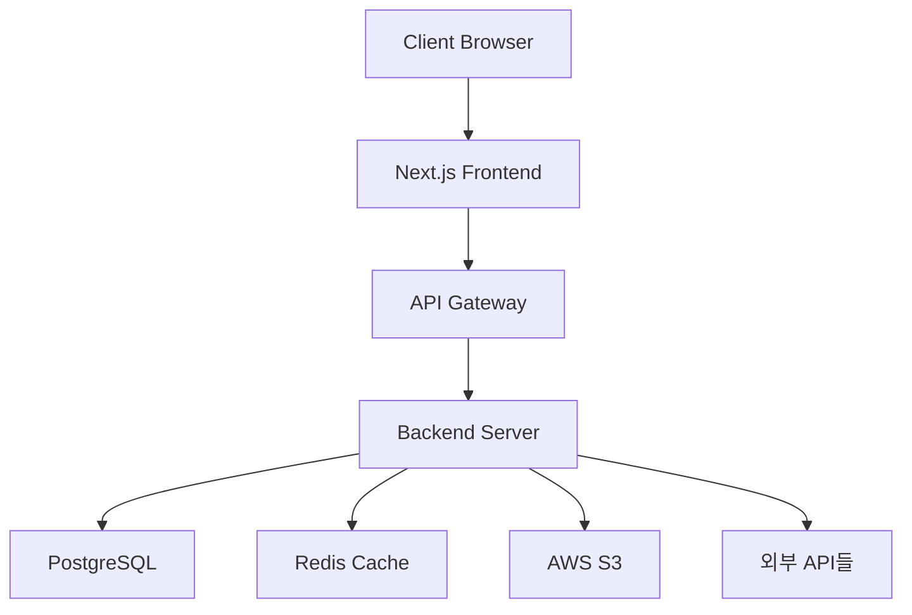

# Tech Spec Agent 상세 기획서

## 📋 목차
1. [개요](#1-개요)
2. [시스템 아키텍처](#2-시스템-아키텍처)
3. [Tech Spec Agent의 역할과 위치](#3-tech-spec-agent의-역할과-위치)
4. [LangGraph 상태 머신 설계](#4-langgraph-상태-머신-설계)
5. [핵심 기능 상세](#5-핵심-기능-상세)
6. [데이터베이스 스키마 설계](#6-데이터베이스-스키마-설계)
7. [오픈소스 기술 추천 시스템](#7-오픈소스-기술-추천-시스템)
8. [Google AI Studio 코드 통합](#8-google-ai-studio-코드-통합)
9. [ANYON 플랫폼 통합](#9-anyon-플랫폼-통합)
10. [구현 로드맵](#10-구현-로드맵)

---

## 1. 개요

### 1.1 Tech Spec Agent의 목적

Tech Spec Agent는 ANYON 개발 워크플로우에서 **기획/디자인 → 기술 스펙 → 백로그** 사이에 위치하는 핵심 브리지 에이전트입니다.

**입력**:
- 후-기획 Agent가 생성한 PRD (Product Requirements Document)
- 디자인 Agent가 생성한 5개 디자인 문서
- Google AI Studio에서 생성된 디자인 코드 (ZIP)

**출력**:
- 완벽하게 상세화된 TRD (Technical Requirements Document)
- 기술 스택 선정 문서 (장단점 비교 포함)
- API 명세서 (상세 엔드포인트 정의)
- 데이터베이스 스키마 설계
- 아키텍처 다이어그램

### 1.2 핵심 차별점

기존 AI 도구들과 달리 Tech Spec Agent는:

1. **기획-디자인 완전 반영**: PRD와 디자인 문서를 100% 반영하여 누락 없이 기술 스펙 작성
2. **오픈소스 기술 적극 탐색**: 구현에 필요한 기술이 불명확할 때 웹 검색으로 오픈소스 라이브러리/프레임워크를 자동 조사
3. **선택지 제공**: 여러 기술 옵션을 장단점과 함께 제시하여 사용자가 최종 선택
4. **Google AI Studio 코드 분석**: 디자인 코드의 컴포넌트 구조를 파싱하고 기술 스펙에 반영
5. **대화형 보완**: 미비한 부분을 자동 감지하고 사용자에게 질문하여 보완

### 1.3 사용자 경험 시나리오

**비개발자 사용자의 입장**:
```
[디자인 Agent 완료]
→ Tech Spec Agent 시작
→ "PRD와 디자인을 분석했습니다. 인증 시스템으로 3가지 옵션이 있습니다"
   1. Firebase Auth (장점: 빠른 구현, 단점: 비용)
   2. NextAuth.js (장점: 무료, 커스터마이징, 단점: 초기 설정 복잡)
   3. Auth0 (장점: 엔터프라이즈급, 단점: 높은 비용)
→ 사용자: "2번 선택"
→ "좋습니다. 파일 업로드는 어떻게 하시겠습니까?"
   1. AWS S3 (장점: 확장성, 단점: 복잡도)
   2. Cloudinary (장점: 이미지 최적화, 단점: 제한된 무료 용량)
→ ... (계속)
→ "TRD 작성 완료! 백로그 생성을 시작합니다"
```

---

## 2. 시스템 아키텍처

### 2.1 ANYON 전체 워크플로우 내 위치

```
선-기획 Agent (아이디어 명확화)
↓
후-기획 Agent (PRD/초기 TRD 생성)
↓
디자인 Agent (디자인 문서 5종 + Google AI Studio 코드)
↓
┌─────────────────────────────────┐
│   Tech Spec Agent (본 기획)    │  ← 여기!
│  - PRD/디자인 완벽 반영         │
│  - 기술 스택 선정               │
│  - 상세 TRD 작성                │
│  - Google AI Studio 코드 분석   │
└─────────────────────────────────┘
↓
백로그 Agent (Epic/Story 생성)
↓
계획 Agent (티켓별 실행 계획)
↓
개발 Agent → 점검 Agent → 리뷰 Agent
↓
머지 Agent → 충돌 Agent
↓
아키텍처 Agent → 퀄리티 Agent
```

### 2.2 데이터 흐름 다이어그램

```
┌──────────────┐
│ PostgreSQL   │
│ ANYON DB     │
└──────┬───────┘
       │
       ↓ (읽기/쓰기)
┌──────────────────────────────┐
│   Tech Spec Agent            │
│                              │
│  ┌────────────────────────┐ │
│  │ Input Processor        │ │ ← PRD, 디자인 문서
│  └──────┬─────────────────┘ │
│         ↓                    │
│  ┌────────────────────────┐ │
│  │ Analysis Engine        │ │
│  │ - 기획 완전성 검증     │ │
│  │ - 기술 gap 탐지        │ │
│  └──────┬─────────────────┘ │
│         ↓                    │
│  ┌────────────────────────┐ │
│  │ Web Search Module      │ │ ← web_search 도구
│  │ - 오픈소스 기술 조사   │ │
│  │ - 최신 라이브러리 검색 │ │
│  └──────┬─────────────────┘ │
│         ↓                    │
│  ┌────────────────────────┐ │
│  │ Decision Support       │ │
│  │ - 기술 선택지 생성     │ │
│  │ - 장단점 비교 표 생성  │ │
│  └──────┬─────────────────┘ │
│         ↓                    │
│  ┌────────────────────────┐ │
│  │ TRD Generator          │ │
│  │ - 상세 API 명세        │ │
│  │ - DB 스키마 설계       │ │
│  │ - 아키텍처 다이어그램  │ │
│  └──────┬─────────────────┘ │
└─────────┼──────────────────┘
          ↓
   ┌──────────────┐
   │ 최종 TRD     │
   │ + 기술 문서   │
   └──────────────┘
```

---

## 3. Tech Spec Agent의 역할과 위치

### 3.1 핵심 책임

| 책임 영역 | 상세 설명 |
|----------|----------|
| **기획 검증** | PRD와 디자인 문서 간 일치성 확인, 누락 사항 탐지 |
| **기술 스택 결정** | 프로젝트에 필요한 모든 기술 요소 식별 및 선택 |
| **TRD 상세화** | 후-기획의 초기 TRD를 개발 가능한 수준으로 구체화 |
| **오픈소스 조사** | 필요한 기능에 대한 최적 라이브러리/프레임워크 탐색 |
| **사용자 의사결정 지원** | 기술 선택지를 비개발자가 이해 가능한 형태로 제시 |

### 3.2 다른 Agent와의 인터페이스

**← 입력 (From)**:
- 후-기획 Agent: PRD, 초기 TRD
- 디자인 Agent: 5종 디자인 문서, Google AI Studio ZIP

**→ 출력 (To)**:
- 백로그 Agent: 완성된 TRD, 기술 스택 문서
- PostgreSQL DB: 모든 대화 기록, 결정 사항, 생성 문서

### 3.3 작동 시점

1. 사용자가 디자인 Agent 완료 후 칸반보드에서 "Tech Spec" 단계로 이동
2. ANYON 시스템이 자동으로 Tech Spec Agent 인스턴스 생성
3. DB에서 해당 프로젝트의 PRD/디자인 문서 로드
4. Agent 시작 → 대화형 프로세스 진행 → TRD 생성 완료
5. 완료 시 자동으로 백로그 Agent로 전환

---

## 4. LangGraph 상태 머신 설계

### 4.1 전체 상태 그래프

```python
from typing import TypedDict, List, Dict, Annotated
from langgraph.graph import StateGraph, END
import operator

class TechSpecState(TypedDict):
    # 입력 데이터
    project_id: str
    prd_content: str  # PRD 전문
    design_docs: Dict[str, str]  # 5종 디자인 문서
    google_ai_studio_code: str  # 디자인 코드 (파싱된 형태)
    initial_trd: str  # 후-기획에서 생성한 초기 TRD
    
    # 분석 결과
    completeness_score: float  # 기획 완전성 점수 (0-100)
    missing_elements: List[str]  # 누락된 요소들
    ambiguous_elements: List[str]  # 모호한 요소들
    technical_gaps: List[Dict]  # 기술적으로 미정인 부분들
    
    # 기술 조사 결과
    tech_research_results: Annotated[List[Dict], operator.add]
    selected_technologies: Dict[str, str]  # 사용자가 선택한 기술들
    
    # 대화 상태
    current_question: str  # 현재 사용자에게 묻는 질문
    conversation_history: Annotated[List[Dict], operator.add]
    pending_decisions: List[Dict]  # 아직 결정되지 않은 기술 선택들
    
    # 출력 문서
    final_trd: str
    api_specification: str
    database_schema: str
    architecture_diagram: str
    tech_stack_document: str
    
    # 메타 정보
    current_stage: str  # 현재 진행 단계
    iteration_count: int
    completion_percentage: float
```

### 4.2 LangGraph 노드 정의

```python
from langgraph.graph import StateGraph

def create_tech_spec_graph():
    workflow = StateGraph(TechSpecState)
    
    # 노드 추가
    workflow.add_node("load_inputs", load_inputs_node)
    workflow.add_node("analyze_completeness", analyze_completeness_node)
    workflow.add_node("identify_tech_gaps", identify_tech_gaps_node)
    workflow.add_node("research_technologies", research_technologies_node)
    workflow.add_node("present_options", present_options_node)
    workflow.add_node("wait_user_decision", wait_user_decision_node)
    workflow.add_node("generate_trd", generate_trd_node)
    workflow.add_node("validate_trd", validate_trd_node)
    workflow.add_node("generate_api_spec", generate_api_spec_node)
    workflow.add_node("generate_db_schema", generate_db_schema_node)
    workflow.add_node("generate_architecture", generate_architecture_node)
    workflow.add_node("save_to_db", save_to_db_node)
    
    # 엣지 정의 (조건부 분기 포함)
    workflow.set_entry_point("load_inputs")
    
    workflow.add_edge("load_inputs", "analyze_completeness")
    
    workflow.add_conditional_edges(
        "analyze_completeness",
        should_ask_user,  # 완전성 점수가 낮으면 사용자에게 질문
        {
            "ask_user": "identify_tech_gaps",
            "proceed": "research_technologies"
        }
    )
    
    workflow.add_edge("identify_tech_gaps", "research_technologies")
    workflow.add_edge("research_technologies", "present_options")
    workflow.add_edge("present_options", "wait_user_decision")
    
    workflow.add_conditional_edges(
        "wait_user_decision",
        check_pending_decisions,
        {
            "more_decisions": "research_technologies",  # 아직 결정할 게 남음
            "all_decided": "generate_trd"
        }
    )
    
    workflow.add_edge("generate_trd", "validate_trd")
    
    workflow.add_conditional_edges(
        "validate_trd",
        trd_validation_check,
        {
            "invalid": "generate_trd",  # 재생성
            "valid": "generate_api_spec"
        }
    )
    
    workflow.add_edge("generate_api_spec", "generate_db_schema")
    workflow.add_edge("generate_db_schema", "generate_architecture")
    workflow.add_edge("generate_architecture", "save_to_db")
    workflow.add_edge("save_to_db", END)
    
    return workflow.compile()
```

### 4.3 주요 노드 구현 상세

#### 4.3.1 `analyze_completeness_node`

```python
async def analyze_completeness_node(state: TechSpecState) -> TechSpecState:
    """
    PRD와 디자인 문서를 분석하여 완전성 평가
    
    체크 항목:
    - 모든 화면에 대한 API가 정의되었는가?
    - 데이터 모델이 명확한가?
    - 인증/권한 처리가 명시되었는가?
    - 파일 업로드/다운로드 처리가 명시되었는가?
    - 실시간 통신이 필요한가? (명시되었는가?)
    - 결제/외부 API 연동이 명시되었는가?
    """
    
    prd = state["prd_content"]
    design_docs = state["design_docs"]
    
    # Claude에게 분석 요청
    analysis_prompt = f"""
    다음 PRD와 디자인 문서를 분석하여 기술 명세를 작성하기 위한 완전성을 평가하세요.
    
    PRD:
    {prd}
    
    디자인 문서:
    {design_docs}
    
    다음 항목들에 대해 체크하고 점수를 매기세요:
    1. 인증 시스템 명세 (0-10점)
    2. API 엔드포인트 정의 (0-20점)
    3. 데이터 모델 명확성 (0-20점)
    4. 파일 처리 명세 (0-10점)
    5. 실시간 기능 명세 (0-10점)
    6. 외부 연동 명세 (0-10점)
    7. 에러 처리 정책 (0-10점)
    8. 보안 요구사항 (0-10점)
    9. 성능 요구사항 (0-5점)
    10. 배포 환경 명세 (0-5점)
    
    총점: 0-100점
    누락된 요소: [리스트]
    모호한 요소: [리스트]
    
    JSON 형식으로 답변하세요.
    """
    
    result = await call_claude(analysis_prompt)
    
    state["completeness_score"] = result["total_score"]
    state["missing_elements"] = result["missing"]
    state["ambiguous_elements"] = result["ambiguous"]
    
    return state
```

#### 4.3.2 `research_technologies_node`

```python
async def research_technologies_node(state: TechSpecState) -> TechSpecState:
    """
    필요한 기술에 대해 오픈소스 조사 수행
    web_search 도구 적극 활용
    """
    
    technical_gaps = state["technical_gaps"]
    research_results = []
    
    for gap in technical_gaps:
        # 예: {"category": "authentication", "description": "사용자 인증 시스템"}
        
        # 1. 웹 검색으로 최신 오픈소스 라이브러리 조사
        search_query = f"{gap['description']} open source library 2024 comparison"
        search_results = await web_search(search_query)
        
        # 2. 상위 결과에서 정보 추출
        top_libraries = await extract_libraries(search_results)
        
        # 3. 각 라이브러리에 대해 상세 정보 수집
        options = []
        for lib in top_libraries[:3]:  # 상위 3개만
            detail_query = f"{lib['name']} pros cons use cases"
            details = await web_search(detail_query)
            
            options.append({
                "name": lib["name"],
                "description": lib["description"],
                "pros": await extract_pros(details),
                "cons": await extract_cons(details),
                "popularity": lib.get("github_stars", "N/A"),
                "documentation": lib.get("docs_url", ""),
                "learning_curve": await estimate_learning_curve(details)
            })
        
        research_results.append({
            "gap": gap,
            "options": options
        })
    
    state["tech_research_results"] = research_results
    return state
```

#### 4.3.3 `present_options_node`

```python
async def present_options_node(state: TechSpecState) -> TechSpecState:
    """
    사용자에게 기술 선택지를 이해하기 쉽게 제시
    """
    
    research_results = state["tech_research_results"]
    
    if not research_results:
        return state
    
    # 아직 결정되지 않은 첫 번째 항목 가져오기
    pending = [r for r in research_results if r["gap"]["id"] not in state["selected_technologies"]]
    
    if not pending:
        state["current_question"] = None
        return state
    
    current_gap = pending[0]
    options = current_gap["options"]
    
    # 사용자 친화적인 질문 생성
    question = f"""
    {current_gap["gap"]["description"]}에 대한 기술을 선택해주세요.
    
    조사 결과 다음 3가지 옵션이 있습니다:
    """
    
    for i, opt in enumerate(options, 1):
        question += f"""
        
        {i}. **{opt["name"]}**
           설명: {opt["description"]}
           
           장점:
           {format_list(opt["pros"])}
           
           단점:
           {format_list(opt["cons"])}
           
           인기도: {opt["popularity"]}
           학습 난이도: {opt["learning_curve"]}
           문서: {opt["documentation"]}
        """
    
    question += """
    
    어떤 옵션을 선택하시겠습니까? (1, 2, 또는 3을 입력하세요)
    다른 기술을 원하시면 '검색: <기술명>'을 입력하세요.
    """
    
    state["current_question"] = question
    state["pending_decisions"].append(current_gap)
    
    return state
```

---

## 5. 핵심 기능 상세

### 5.1 기획-디자인 완전 반영

**목표**: PRD와 디자인 문서에 명시된 모든 기능이 TRD에 빠짐없이 반영되도록 보장

**구현 방법**:

1. **체크리스트 기반 검증**
   ```python
   CHECKLIST = [
       "모든 화면에 대한 API 엔드포인트",
       "각 화면의 데이터 모델",
       "사용자 인증/권한 체계",
       "파일 업로드/다운로드 처리",
       "실시간 통신 (필요 시)",
       "외부 API 연동 (필요 시)",
       "에러 처리 정책",
       "보안 요구사항"
   ]
   ```

2. **교차 검증 (Cross-validation)**
   - PRD의 기능 목록 ↔ 디자인 문서의 화면
   - 디자인 문서의 화면 ↔ TRD의 API 엔드포인트
   - 누락 발견 시 자동으로 사용자에게 질문

3. **Google AI Studio 코드 파싱**
   ```python
   def parse_ai_studio_code(zip_file):
       """
       Google AI Studio 코드에서 컴포넌트 구조 추출
       """
       components = extract_react_components(zip_file)
       
       for comp in components:
           # 컴포넌트가 사용하는 데이터 구조 파악
           data_props = analyze_props(comp)
           
           # 필요한 API 엔드포인트 추론
           inferred_apis = infer_api_from_component(comp, data_props)
           
           # TRD에 반영
           add_to_trd(inferred_apis)
   ```

### 5.2 오픈소스 기술 적극 탐색

**시나리오 예시**:

PRD에 "사용자는 프로필 사진을 업로드할 수 있다"라고만 적혀있고, 구체적인 구현 방법이 없을 때:

1. **자동 탐지**: "파일 업로드 기술 미정" 감지
2. **웹 검색**: "file upload library Node.js 2024 comparison"
3. **정보 수집**:
   - Multer
   - Formidable
   - Busboy
   - AWS S3 SDK
   - Cloudinary SDK
4. **장단점 분석**: 각 라이브러리의 pros/cons 자동 요약
5. **사용자 제시**: 3가지 옵션을 표 형식으로 제공
6. **결정 저장**: 사용자 선택을 DB에 기록

**구현 코드**:

```python
async def search_tech_solution(problem_description: str) -> List[Dict]:
    """
    특정 기술 문제에 대한 오픈소스 솔루션 검색
    """
    # 1단계: 넓은 검색
    search_query = f"{problem_description} open source solution 2024"
    results = await web_search(search_query)
    
    # 2단계: 후보 추출
    candidates = await extract_top_libraries(results, top_n=5)
    
    # 3단계: 각 후보에 대한 상세 조사
    detailed_options = []
    for candidate in candidates:
        # GitHub stars, npm downloads 등 메트릭 수집
        metrics = await fetch_library_metrics(candidate["name"])
        
        # 실제 사용 사례 검색
        use_cases = await web_search(f"{candidate['name']} use case example")
        
        # 장단점 검색
        pros_cons = await web_search(f"{candidate['name']} pros cons")
        
        detailed_options.append({
            "name": candidate["name"],
            "description": candidate["description"],
            "metrics": metrics,
            "pros": extract_pros_from_search(pros_cons),
            "cons": extract_cons_from_search(pros_cons),
            "use_cases": use_cases[:3],  # 상위 3개
            "documentation_url": candidate.get("docs"),
            "github_url": candidate.get("github"),
            "estimated_setup_time": estimate_setup_complexity(candidate)
        })
    
    return detailed_options[:3]  # 상위 3개 반환
```

### 5.3 사용자 선택지 제공

**UI/UX 고려사항**:

- 비개발자도 이해 가능한 언어 사용
- 각 옵션의 장단점을 명확히 구분
- 학습 난이도, 비용, 유지보수 난이도 등 실질적 기준 제공
- "잘 모르겠어요" 옵션 → AI가 추천

**예시 프롬프트 (사용자에게 보여지는)**:

```
파일 업로드 기능을 구현하기 위한 기술을 선택해주세요.

📦 옵션 1: AWS S3 + Multer
   설명: 파일을 Amazon 클라우드에 저장하고, Multer로 업로드 처리
   
   ✅ 장점:
   - 거의 무제한 저장 공간
   - 매우 높은 안정성
   - 글로벌 CDN으로 빠른 다운로드
   
   ❌ 단점:
   - 초기 설정이 복잡함 (AWS 계정 필요)
   - 비용 발생 (무료 한도: 월 5GB)
   - 권한 설정 학습 필요
   
   💰 비용: 무료 → 월 $0.023/GB (초과 시)
   📚 학습 난이도: 중상 (3-5시간)
   🔧 설정 시간: 1-2시간

📦 옵션 2: Cloudinary
   설명: 이미지 전문 클라우드 서비스
   
   ✅ 장점:
   - 자동 이미지 최적화 (압축, 리사이징)
   - 설정이 매우 간단함
   - 이미지 변환 기능 내장
   
   ❌ 단점:
   - 무료 용량이 작음 (25 크레딧/월)
   - 이미지/동영상 외 파일은 비효율적
   
   💰 비용: 무료 → 월 $99 (초과 시)
   📚 학습 난이도: 하 (30분-1시간)
   🔧 설정 시간: 10-20분

📦 옵션 3: 로컬 저장소 + Multer
   설명: 서버의 디스크에 직접 저장
   
   ✅ 장점:
   - 완전 무료
   - 설정이 가장 간단함
   - 외부 의존성 없음
   
   ❌ 단점:
   - 서버 용량 제한
   - 서버 재시작 시 파일 손실 위험
   - 확장성 낮음 (사용자 많아지면 문제)
   
   💰 비용: 무료
   📚 학습 난이도: 하 (30분)
   🔧 설정 시간: 10분

어떤 옵션을 선택하시겠습니까? (1, 2, 또는 3)
잘 모르겠다면 'AI 추천'을 입력하세요.
```

### 5.4 Google AI Studio 코드 통합

**처리 흐름**:

```
Google AI Studio ZIP 파일
↓
압축 해제
↓
React 컴포넌트 파싱
↓
각 컴포넌트 분석:
  - Props 타입
  - State 구조
  - API 호출 코드
  - 이벤트 핸들러
↓
TRD에 반영:
  - 컴포넌트 → 페이지 매핑
  - Props → API 응답 데이터 구조
  - 이벤트 → API 엔드포인트
```

**구현 예시**:

```python
def analyze_ai_studio_code(zip_path: str) -> Dict:
    """
    Google AI Studio 코드 분석
    """
    extracted_path = unzip_file(zip_path)
    
    # 모든 .tsx, .jsx 파일 찾기
    component_files = find_files(extracted_path, ["*.tsx", "*.jsx"])
    
    components_data = []
    for file in component_files:
        # AST 파싱
        ast = parse_typescript(file)
        
        # 컴포넌트 정보 추출
        comp_info = {
            "name": extract_component_name(ast),
            "props": extract_props_interface(ast),
            "state": extract_state_variables(ast),
            "api_calls": extract_api_calls(ast),
            "events": extract_event_handlers(ast)
        }
        
        # API 엔드포인트 추론
        for api_call in comp_info["api_calls"]:
            inferred_endpoint = {
                "method": api_call["method"],
                "path": api_call["url"],
                "request_body": infer_request_from_call(api_call),
                "response_type": comp_info["props"]  # Props가 응답 데이터 구조
            }
            comp_info["inferred_endpoints"].append(inferred_endpoint)
        
        components_data.append(comp_info)
    
    return {
        "components": components_data,
        "inferred_api_spec": generate_api_spec_from_components(components_data),
        "data_models": infer_data_models(components_data)
    }
```

---

## 6. 데이터베이스 스키마 설계

### 6.1 PostgreSQL 테이블 구조

#### 6.1.1 `tech_spec_sessions` 테이블

```sql
CREATE TABLE tech_spec_sessions (
    id UUID PRIMARY KEY DEFAULT gen_random_uuid(),
    project_id UUID NOT NULL REFERENCES projects(id),
    user_id UUID NOT NULL REFERENCES users(id),
    
    -- 입력 데이터 참조
    prd_id UUID REFERENCES documents(id),
    design_docs_ids UUID[] NOT NULL,  -- 5개 디자인 문서 ID 배열
    google_ai_studio_code_path TEXT,  -- S3/스토리지 경로
    
    -- 분석 결과
    completeness_score DECIMAL(5,2),
    missing_elements JSONB,  -- {category: [items]}
    ambiguous_elements JSONB,
    
    -- 상태
    current_stage VARCHAR(50),  -- 'analyzing', 'researching', 'presenting', 'generating', 'completed'
    completion_percentage DECIMAL(5,2),
    
    -- 타임스탬프
    started_at TIMESTAMP DEFAULT NOW(),
    completed_at TIMESTAMP,
    
    -- 메타데이터
    metadata JSONB
);

CREATE INDEX idx_tech_spec_project ON tech_spec_sessions(project_id);
CREATE INDEX idx_tech_spec_status ON tech_spec_sessions(current_stage);
```

#### 6.1.2 `tech_research` 테이블

```sql
CREATE TABLE tech_research (
    id UUID PRIMARY KEY DEFAULT gen_random_uuid(),
    session_id UUID NOT NULL REFERENCES tech_spec_sessions(id),
    
    -- 조사 대상
    gap_category VARCHAR(100),  -- 'authentication', 'file_upload', 'payment', etc.
    gap_description TEXT,
    
    -- 조사 결과 (각 옵션)
    options JSONB NOT NULL,  
    -- [{
    --   name: "NextAuth.js",
    --   description: "...",
    --   pros: [...],
    --   cons: [...],
    --   metrics: {...},
    --   documentation_url: "...",
    --   github_url: "..."
    -- }]
    
    -- 사용자 선택
    selected_option VARCHAR(200),  -- 선택된 기술 이름
    selection_reason TEXT,  -- 선택 이유 (사용자가 입력한 경우)
    
    -- 검색 메타데이터
    search_queries TEXT[],  -- 실제 사용한 검색어들
    search_timestamp TIMESTAMP DEFAULT NOW(),
    
    created_at TIMESTAMP DEFAULT NOW()
);

CREATE INDEX idx_tech_research_session ON tech_research(session_id);
CREATE INDEX idx_tech_research_category ON tech_research(gap_category);
```

#### 6.1.3 `tech_conversations` 테이블

```sql
CREATE TABLE tech_conversations (
    id UUID PRIMARY KEY DEFAULT gen_random_uuid(),
    session_id UUID NOT NULL REFERENCES tech_spec_sessions(id),
    
    -- 대화 내용
    role VARCHAR(20) NOT NULL,  -- 'agent', 'user'
    message TEXT NOT NULL,
    
    -- 컨텍스트
    message_type VARCHAR(50),  -- 'question', 'answer', 'option_presentation', 'validation'
    related_research_id UUID REFERENCES tech_research(id),
    
    -- 메타데이터
    token_count INT,
    created_at TIMESTAMP DEFAULT NOW()
);

CREATE INDEX idx_tech_conv_session ON tech_conversations(session_id);
CREATE INDEX idx_tech_conv_timestamp ON tech_conversations(created_at);
```

#### 6.1.4 `generated_trd_documents` 테이블

```sql
CREATE TABLE generated_trd_documents (
    id UUID PRIMARY KEY DEFAULT gen_random_uuid(),
    session_id UUID NOT NULL REFERENCES tech_spec_sessions(id),
    
    -- 문서 타입
    document_type VARCHAR(50) NOT NULL,  
    -- 'final_trd', 'api_spec', 'db_schema', 'architecture_diagram', 'tech_stack_doc'
    
    -- 내용
    content TEXT NOT NULL,
    content_format VARCHAR(20),  -- 'markdown', 'json', 'yaml', 'mermaid'
    
    -- 버전 관리
    version INT DEFAULT 1,
    is_latest BOOLEAN DEFAULT TRUE,
    
    -- S3 경로 (다이어그램 이미지 등)
    file_url TEXT,
    
    -- 검증 정보
    validated BOOLEAN DEFAULT FALSE,
    validation_score DECIMAL(5,2),
    validation_feedback JSONB,
    
    created_at TIMESTAMP DEFAULT NOW(),
    updated_at TIMESTAMP DEFAULT NOW()
);

CREATE INDEX idx_trd_docs_session ON generated_trd_documents(session_id);
CREATE INDEX idx_trd_docs_type ON generated_trd_documents(document_type);
CREATE INDEX idx_trd_docs_latest ON generated_trd_documents(is_latest) WHERE is_latest = TRUE;
```

### 6.2 ANYON 메인 DB와의 연동

**ANYON의 기존 테이블 구조 (예상)**:

```sql
-- ANYON 메인 DB
CREATE TABLE projects (
    id UUID PRIMARY KEY,
    name VARCHAR(255),
    created_by UUID,
    kanban_stage VARCHAR(50),  -- 현재 어느 단계인지
    ...
);

CREATE TABLE documents (
    id UUID PRIMARY KEY,
    project_id UUID REFERENCES projects(id),
    document_type VARCHAR(50),  -- 'prd', 'trd', 'design_system', etc.
    content TEXT,
    ...
);
```

**연동 방식**:

1. **Tech Spec Agent 시작 시**:
   ```sql
   -- 1. 프로젝트의 PRD 가져오기
   SELECT content FROM documents 
   WHERE project_id = $1 AND document_type = 'prd';
   
   -- 2. 디자인 문서들 가져오기
   SELECT id, content FROM documents
   WHERE project_id = $1 AND document_type LIKE 'design_%';
   
   -- 3. Tech Spec 세션 생성
   INSERT INTO tech_spec_sessions (project_id, prd_id, design_docs_ids)
   VALUES ($1, $2, $3);
   ```

2. **대화 진행 중**:
   ```sql
   -- 모든 대화를 tech_conversations 테이블에 저장
   INSERT INTO tech_conversations (session_id, role, message, message_type)
   VALUES ($1, 'agent', $2, 'question');
   ```

3. **TRD 생성 완료 시**:
   ```sql
   -- 1. 생성된 문서들을 generated_trd_documents에 저장
   INSERT INTO generated_trd_documents (session_id, document_type, content)
   VALUES ($1, 'final_trd', $2);
   
   -- 2. ANYON 메인 documents 테이블에도 복사
   INSERT INTO documents (project_id, document_type, content)
   VALUES ($1, 'trd', $2);
   
   -- 3. 프로젝트 상태 업데이트
   UPDATE projects 
   SET kanban_stage = 'backlog'
   WHERE id = $1;
   ```

### 6.3 대화 히스토리 보존 전략

**목적**: 
- 사용자가 나중에 "왜 이 기술을 선택했는지" 확인 가능
- 에이전트 개선을 위한 학습 데이터
- 백로그 에이전트가 컨텍스트로 활용

**구현**:

```python
async def save_conversation(session_id, role, message, extra_data=None):
    """
    모든 대화를 DB에 저장
    """
    await db.execute("""
        INSERT INTO tech_conversations 
        (session_id, role, message, message_type, metadata)
        VALUES ($1, $2, $3, $4, $5)
    """, session_id, role, message, extra_data.get("type"), extra_data)

async def get_conversation_history(session_id):
    """
    세션의 전체 대화 기록 조회
    """
    return await db.fetch("""
        SELECT role, message, message_type, created_at
        FROM tech_conversations
        WHERE session_id = $1
        ORDER BY created_at ASC
    """, session_id)
```

---

## 7. 오픈소스 기술 추천 시스템

### 7.1 추천 로직

```python
class TechRecommendationEngine:
    """
    오픈소스 기술 추천 엔진
    """
    
    def __init__(self):
        self.category_keywords = {
            "authentication": ["auth", "login", "oauth", "jwt", "session"],
            "file_upload": ["upload", "storage", "s3", "cloudinary"],
            "payment": ["payment", "stripe", "paypal", "checkout"],
            "realtime": ["websocket", "socket.io", "realtime", "sse"],
            "database": ["database", "orm", "prisma", "sequelize"],
            # ... 더 많은 카테고리
        }
    
    async def identify_tech_gaps(self, prd: str, design_docs: Dict) -> List[Dict]:
        """
        PRD와 디자인에서 필요하지만 명시되지 않은 기술 식별
        """
        gaps = []
        
        # PRD에서 키워드 기반 필요 기술 추출
        for category, keywords in self.category_keywords.items():
            if any(keyword in prd.lower() for keyword in keywords):
                # 이미 TRD에 명시되어 있는지 확인
                if not self.is_tech_specified(category, prd):
                    gaps.append({
                        "category": category,
                        "description": self.get_category_description(category),
                        "urgency": self.calculate_urgency(category, prd)
                    })
        
        # 디자인 문서에서 필요 기술 추출
        for screen_name, screen_design in design_docs.items():
            required_techs = self.analyze_design_requirements(screen_design)
            for tech in required_techs:
                if tech not in [g["category"] for g in gaps]:
                    gaps.append(tech)
        
        return sorted(gaps, key=lambda x: x["urgency"], reverse=True)
    
    async def search_options(self, gap: Dict) -> List[Dict]:
        """
        특정 gap에 대한 기술 옵션 검색
        """
        category = gap["category"]
        
        # 1단계: 메인 검색어로 검색
        main_query = f"{category} library framework 2024"
        main_results = await web_search(main_query)
        
        # 2단계: 후보 추출
        candidates = await self.extract_candidates(main_results, top_n=5)
        
        # 3단계: 각 후보에 대한 상세 조사
        options = []
        for candidate in candidates:
            option = await self.research_candidate(candidate)
            options.append(option)
        
        # 4단계: 프로젝트 특성에 맞춰 필터링 및 정렬
        filtered_options = self.filter_by_project_context(options, gap)
        
        return filtered_options[:3]  # 상위 3개
    
    async def research_candidate(self, candidate: Dict) -> Dict:
        """
        특정 라이브러리/프레임워크에 대한 상세 조사
        """
        name = candidate["name"]
        
        # GitHub stats
        github_stats = await fetch_github_stats(candidate.get("github_url"))
        
        # npm stats (Node.js 패키지인 경우)
        npm_stats = await fetch_npm_stats(name)
        
        # 장단점 검색
        pros_cons_query = f"{name} advantages disadvantages"
        pros_cons_results = await web_search(pros_cons_query)
        pros_cons = await extract_pros_cons(pros_cons_results)
        
        # 사용 사례 검색
        use_case_query = f"{name} real world example use case"
        use_cases = await web_search(use_case_query)
        
        # 학습 자료 검색
        learning_query = f"{name} tutorial guide documentation"
        learning_resources = await web_search(learning_query)
        
        return {
            "name": name,
            "description": candidate["description"],
            "category": candidate["category"],
            "metrics": {
                "github_stars": github_stats.get("stars"),
                "github_forks": github_stats.get("forks"),
                "npm_downloads": npm_stats.get("downloads_last_month"),
                "last_update": github_stats.get("last_commit"),
                "open_issues": github_stats.get("open_issues")
            },
            "pros": pros_cons["pros"],
            "cons": pros_cons["cons"],
            "use_cases": use_cases[:3],
            "learning_resources": learning_resources[:3],
            "documentation_url": candidate.get("docs_url"),
            "estimated_learning_time": self.estimate_learning_time(candidate),
            "setup_complexity": self.estimate_setup_complexity(candidate)
        }
    
    def filter_by_project_context(self, options: List[Dict], gap: Dict) -> List[Dict]:
        """
        프로젝트 특성에 맞춰 옵션 필터링
        
        고려사항:
        - 프로젝트 규모 (소규모 vs 대규모)
        - 개발자 경험 수준 (초보 vs 숙련)
        - 예산 (무료 vs 유료)
        - 런칭 일정 (빠른 출시 vs 장기 프로젝트)
        """
        scored_options = []
        
        for option in options:
            score = 0
            
            # 학습 난이도 점수 (비개발자는 쉬운 것 선호)
            if option["setup_complexity"] == "low":
                score += 30
            elif option["setup_complexity"] == "medium":
                score += 15
            
            # 인기도 점수 (안정성 지표)
            if option["metrics"]["github_stars"] > 10000:
                score += 20
            elif option["metrics"]["github_stars"] > 1000:
                score += 10
            
            # 최신성 점수
            last_update = option["metrics"]["last_update"]
            if self.is_recently_updated(last_update, months=3):
                score += 15
            
            # 문서화 점수
            if option["documentation_url"]:
                score += 10
            
            # 무료 여부
            if self.is_free(option):
                score += 15
            
            scored_options.append((option, score))
        
        # 점수 순 정렬
        scored_options.sort(key=lambda x: x[1], reverse=True)
        
        return [opt for opt, score in scored_options]
```

### 7.2 검색 쿼리 최적화

**효과적인 검색을 위한 쿼리 패턴**:

```python
QUERY_TEMPLATES = {
    "discovery": "{category} {language} library comparison 2024",
    "pros_cons": "{library_name} advantages disadvantages real experience",
    "use_case": "{library_name} production use case example",
    "vs": "{library_a} vs {library_b} comparison",
    "setup": "{library_name} getting started tutorial",
    "best_practices": "{library_name} best practices tips",
    "problems": "{library_name} common issues problems stackoverflow"
}
```

---

## 8. Google AI Studio 코드 통합

### 8.1 코드 파싱 파이프라인

```python
from typing import Dict, List
import re
import ast as python_ast

class AIStudioCodeParser:
    """
    Google AI Studio 생성 코드 파서
    """
    
    def __init__(self, zip_path: str):
        self.zip_path = zip_path
        self.extracted_path = self.extract_zip()
        self.components = []
        self.inferred_api_spec = {}
        self.data_models = {}
    
    def parse_all(self) -> Dict:
        """
        전체 파싱 프로세스 실행
        """
        # 1. 모든 컴포넌트 파일 찾기
        component_files = self.find_component_files()
        
        # 2. 각 컴포넌트 분석
        for file_path in component_files:
            comp_data = self.parse_component(file_path)
            self.components.append(comp_data)
        
        # 3. API 명세 추론
        self.inferred_api_spec = self.infer_api_specification()
        
        # 4. 데이터 모델 추론
        self.data_models = self.infer_data_models()
        
        return {
            "components": self.components,
            "api_spec": self.inferred_api_spec,
            "data_models": self.data_models
        }
    
    def parse_component(self, file_path: str) -> Dict:
        """
        단일 React 컴포넌트 파싱
        """
        with open(file_path, 'r') as f:
            code = f.read()
        
        # TypeScript AST 파싱 (ts-morph 또는 esprima 사용)
        ast = self.parse_typescript_ast(code)
        
        component_data = {
            "file_path": file_path,
            "name": self.extract_component_name(ast),
            "props_interface": self.extract_props_interface(ast),
            "state_variables": self.extract_state(ast),
            "api_calls": self.extract_api_calls(code),
            "event_handlers": self.extract_event_handlers(ast),
            "child_components": self.extract_child_components(ast)
        }
        
        return component_data
    
    def extract_api_calls(self, code: str) -> List[Dict]:
        """
        코드에서 API 호출 추출
        
        패턴:
        - fetch(url, {method, body})
        - axios.get/post/put/delete
        - api.someMethod()
        """
        api_calls = []
        
        # fetch 패턴
        fetch_pattern = r"fetch\(['\"]([^'\"]+)['\"]\s*,\s*\{([^}]+)\}"
        matches = re.findall(fetch_pattern, code)
        
        for url, options in matches:
            method_match = re.search(r"method:\s*['\"](\w+)['\"]", options)
            method = method_match.group(1) if method_match else "GET"
            
            body_match = re.search(r"body:\s*JSON\.stringify\(([^)]+)\)", options)
            body_var = body_match.group(1) if body_match else None
            
            api_calls.append({
                "type": "fetch",
                "url": url,
                "method": method,
                "body_variable": body_var
            })
        
        # axios 패턴
        axios_pattern = r"axios\.(\w+)\(['\"]([^'\"]+)['\"]"
        matches = re.findall(axios_pattern, code)
        
        for method, url in matches:
            api_calls.append({
                "type": "axios",
                "url": url,
                "method": method.upper()
            })
        
        return api_calls
    
    def infer_api_specification(self) -> Dict:
        """
        컴포넌트들로부터 API 명세 추론
        """
        api_spec = {
            "endpoints": []
        }
        
        for comp in self.components:
            for api_call in comp["api_calls"]:
                endpoint = {
                    "path": api_call["url"],
                    "method": api_call["method"],
                    "description": f"API for {comp['name']} component",
                    "request_body": self.infer_request_body(comp, api_call),
                    "response_type": self.infer_response_type(comp, api_call)
                }
                
                api_spec["endpoints"].append(endpoint)
        
        return api_spec
    
    def infer_request_body(self, component: Dict, api_call: Dict) -> Dict:
        """
        API 요청 바디 추론
        
        body_variable을 추적하여 어떤 데이터가 전송되는지 파악
        """
        if not api_call.get("body_variable"):
            return {}
        
        # state 변수나 form 데이터 추적
        body_var_name = api_call["body_variable"]
        
        # 해당 변수가 어디서 정의되었는지 찾기
        for state_var in component["state_variables"]:
            if state_var["name"] == body_var_name:
                return state_var.get("type_annotation", {})
        
        return {}
    
    def infer_response_type(self, component: Dict, api_call: Dict) -> Dict:
        """
        API 응답 타입 추론
        
        Props 인터페이스나 state 업데이트 로직에서 추론
        """
        # Props가 서버 데이터를 나타내는 경우가 많음
        props_interface = component["props_interface"]
        
        # API 호출 후 state 업데이트 패턴 찾기
        # 예: setData(response) -> data의 타입이 응답 타입
        
        return props_interface
```

### 8.2 디자인 코드 → TRD 매핑

**예시**:

Google AI Studio 코드:
```typescript
// UserProfileCard.tsx
interface UserProfileCardProps {
  userId: string;
  name: string;
  email: string;
  profileImageUrl: string;
  bio: string;
}

export function UserProfileCard({ userId, name, email, profileImageUrl, bio }: UserProfileCardProps) {
  const [isFollowing, setIsFollowing] = useState(false);
  
  const handleFollow = async () => {
    const response = await fetch(`/api/users/${userId}/follow`, {
      method: 'POST',
      headers: { 'Content-Type': 'application/json' }
    });
    
    if (response.ok) {
      setIsFollowing(true);
    }
  };
  
  return (
    <div className="profile-card">
      
      <h2>{name}</h2>
      <p>{email}</p>
      <p>{bio}</p>
      <button onClick={handleFollow}>
        {isFollowing ? 'Following' : 'Follow'}
      </button>
    </div>
  );
}
```

**Tech Spec Agent가 자동 생성하는 TRD 섹션**:

```markdown
## API Specification

### GET /api/users/:userId
사용자 프로필 정보 조회

**Request Parameters:**
- `userId` (path parameter, string, required): 사용자 고유 ID

**Response (200 OK):**
```json
{
  "userId": "string",
  "name": "string",
  "email": "string",
  "profileImageUrl": "string",
  "bio": "string"
}
```

### POST /api/users/:userId/follow
사용자 팔로우

**Request Parameters:**
- `userId` (path parameter, string, required): 팔로우할 사용자 ID

**Request Body:**
없음

**Response (200 OK):**
```json
{
  "success": true
}
```

**Response (401 Unauthorized):**
인증되지 않은 사용자

**Response (404 Not Found):**
존재하지 않는 사용자
```

---

## 9. ANYON 플랫폼 통합

### 9.1 칸반보드 통합

**워크플로우**:

```
[디자인 완료] 
→ 사용자가 "Tech Spec" 칸반으로 드래그
→ ANYON 백엔드가 Tech Spec Agent 인스턴스 생성
→ Agent가 PRD/디자인 로드
→ 대화형 프로세스 시작 (프론트엔드 채팅 UI)
→ TRD 생성 완료
→ 자동으로 "Backlog" 칸반으로 이동
→ 백로그 Agent 트리거
```

**API 엔드포인트**:

```typescript
// ANYON 백엔드 API

POST /api/projects/:projectId/start-tech-spec
// Tech Spec Agent 세션 시작
{
  "prdId": "uuid",
  "designDocIds": ["uuid1", "uuid2", ...],
  "googleAIStudioCodePath": "s3://..."
}

Response:
{
  "sessionId": "uuid",
  "websocketUrl": "wss://.../:sessionId"
}

// WebSocket 연결로 실시간 대화
```

### 9.2 실시간 대화 인터페이스

**WebSocket 프로토콜**:

```typescript
// 클라이언트 → 서버
{
  "type": "user_message",
  "sessionId": "uuid",
  "message": "2번 선택합니다",
  "context": {
    "currentQuestion": "인증 시스템 선택"
  }
}

// 서버 → 클라이언트
{
  "type": "agent_message",
  "sessionId": "uuid",
  "message": "NextAuth.js를 선택하셨습니다. 이제 파일 업로드 기술을 선택해주세요...",
  "data": {
    "progress": 45,  // 진행률 %
    "currentStage": "researching",
    "pendingDecisions": 3  // 남은 결정 개수
  }
}

// 서버 → 클라이언트 (진행 상황 업데이트)
{
  "type": "progress_update",
  "sessionId": "uuid",
  "progress": 60,
  "message": "API 명세 생성 중..."
}

// 서버 → 클라이언트 (완료)
{
  "type": "completion",
  "sessionId": "uuid",
  "trdDocumentId": "uuid",
  "message": "TRD 생성이 완료되었습니다!"
}
```

### 9.3 프론트엔드 컴포넌트

```typescript
// TechSpecChat.tsx
import React, { useEffect, useState } from 'react';
import { useWebSocket } from '@/hooks/useWebSocket';

export function TechSpecChat({ projectId, sessionId }) {
  const [messages, setMessages] = useState([]);
  const [inputValue, setInputValue] = useState('');
  const [progress, setProgress] = useState(0);
  const { sendMessage, lastMessage, readyState } = useWebSocket(
    `wss://api.anyon.com/tech-spec/${sessionId}`
  );

  useEffect(() => {
    if (lastMessage) {
      const data = JSON.parse(lastMessage.data);
      
      if (data.type === 'agent_message') {
        setMessages(prev => [...prev, {
          role: 'agent',
          content: data.message
        }]);
        setProgress(data.data.progress);
      } else if (data.type === 'progress_update') {
        setProgress(data.progress);
      } else if (data.type === 'completion') {
        // TRD 완료 처리
        onTRDComplete(data.trdDocumentId);
      }
    }
  }, [lastMessage]);

  const handleSend = () => {
    if (!inputValue.trim()) return;
    
    const userMessage = {
      type: 'user_message',
      sessionId,
      message: inputValue
    };
    
    sendMessage(JSON.stringify(userMessage));
    
    setMessages(prev => [...prev, {
      role: 'user',
      content: inputValue
    }]);
    
    setInputValue('');
  };

  return (
    <div className="tech-spec-chat">
      <div className="progress-bar">
        <div className="progress-fill" style={{ width: `${progress}%` }} />
        <span>{progress}% 완료</span>
      </div>
      
      <div className="messages">
        {messages.map((msg, idx) => (
          <div key={idx} className={`message ${msg.role}`}>
            <div className="message-content">{msg.content}</div>
          </div>
        ))}
      </div>
      
      <div className="input-area">
        <input
          value={inputValue}
          onChange={e => setInputValue(e.target.value)}
          onKeyPress={e => e.key === 'Enter' && handleSend()}
          placeholder="답변을 입력하세요..."
        />
        <button onClick={handleSend}>전송</button>
      </div>
    </div>
  );
}
```

---

## 10. 구현 로드맵

### Phase 1: 기초 인프라 (2주)

**목표**: 기본 LangGraph 구조 및 DB 스키마 구축

**작업 항목**:
- [ ] PostgreSQL 테이블 생성 (4개 테이블)
- [ ] LangGraph 상태 머신 기본 구조 구현
- [ ] Tech Spec Agent의 노드 스켈레톤 구현
- [ ] ANYON 메인 DB 연동 API 개발
- [ ] WebSocket 서버 기본 구조

**완료 기준**:
- DB에 세션 생성 및 조회 가능
- LangGraph가 단순 상태 전환 가능
- WebSocket 메시지 송수신 가능

### Phase 2: 핵심 기능 개발 (3주)

**목표**: PRD/디자인 분석 및 기술 조사 기능 구현

**작업 항목**:
- [ ] PRD/디자인 문서 파싱 및 분석 로직
- [ ] 기획 완전성 평가 알고리즘
- [ ] 기술 gap 탐지 로직
- [ ] web_search 도구 연동
- [ ] 오픈소스 기술 조사 파이프라인
- [ ] 장단점 추출 알고리즘
- [ ] 사용자 선택지 생성 로직

**완료 기준**:
- PRD에서 누락 요소 자동 탐지
- 웹 검색으로 기술 옵션 3개 추출
- 장단점 비교 표 자동 생성

### Phase 3: Google AI Studio 통합 (2주)

**목표**: 디자인 코드 파싱 및 API 명세 추론

**작업 항목**:
- [ ] ZIP 파일 처리 및 압축 해제
- [ ] React/TypeScript 코드 AST 파서
- [ ] Props 인터페이스 추출
- [ ] API 호출 코드 탐지
- [ ] API 명세 자동 생성
- [ ] 데이터 모델 추론

**완료 기준**:
- Google AI Studio ZIP 업로드 가능
- 컴포넌트별 API 엔드포인트 자동 추론
- API 명세서 초안 생성

### Phase 4: TRD 생성 엔진 (2주)

**목표**: 완성된 TRD 문서 자동 생성

**작업 항목**:
- [ ] TRD 템플릿 설계
- [ ] 섹션별 생성 로직 (API 명세, DB 스키마, 아키텍처)
- [ ] Markdown/YAML 포맷터
- [ ] Mermaid 다이어그램 생성 (아키텍처)
- [ ] 문서 검증 로직
- [ ] 버전 관리 시스템

**완료 기준**:
- 5가지 문서 자동 생성 (TRD, API Spec, DB Schema, Architecture, Tech Stack)
- 문서 품질 점수 90점 이상
- 버전 관리 가능

### Phase 5: 대화형 UI 및 통합 (2주)

**목표**: 프론트엔드 채팅 UI 및 ANYON 플랫폼 완전 통합

**작업 항목**:
- [ ] React 채팅 컴포넌트 개발
- [ ] WebSocket 실시간 통신
- [ ] 진행률 표시 UI
- [ ] 기술 선택지 시각화 (카드 UI)
- [ ] 칸반보드 통합 (드래그 앤 드롭)
- [ ] 백로그 Agent로 데이터 전달

**완료 기준**:
- 비개발자가 직관적으로 사용 가능
- 실시간 진행 상황 표시
- 칸반 단계 자동 전환

### Phase 6: 테스트 및 최적화 (1주)

**목표**: 안정성 및 성능 최적화

**작업 항목**:
- [ ] 단위 테스트 (핵심 로직)
- [ ] 통합 테스트 (전체 워크플로우)
- [ ] 대화 히스토리 저장 검증
- [ ] 에러 핸들링 강화
- [ ] 성능 최적화 (API 호출 최소화)
- [ ] 문서 생성 속도 개선

**완료 기준**:
- 테스트 커버리지 80% 이상
- 평균 응답 시간 < 2초
- 에러 복구 메커니즘 작동

### Phase 7: 베타 테스트 (2주)

**목표**: 실제 사용자 피드백 수집 및 개선

**작업 항목**:
- [ ] 내부 베타 테스트 (ANYON 팀)
- [ ] 외부 베타 테스터 모집 (10명)
- [ ] 사용자 피드백 수집
- [ ] 개선 사항 적용
- [ ] 문서 업데이트

**완료 기준**:
- 사용자 만족도 80% 이상
- 크리티컬 버그 0건
- 문서 완성도 95% 이상

---

## 11. 기술 스택

### 11.1 백엔드

- **언어**: TypeScript (Node.js)
- **프레임워크**: NestJS
- **AI 오케스트레이션**: LangGraph
- **LLM**: Claude Sonnet 4 (Anthropic API)
- **데이터베이스**: PostgreSQL 14+
- **ORM**: Prisma
- **실시간 통신**: Socket.io (WebSocket)
- **웹 검색**: Custom web_search 도구 (Claude에 내장)

### 11.2 프론트엔드

- **프레임워크**: Next.js 14 (App Router)
- **UI 라이브러리**: React 18
- **스타일링**: Tailwind CSS
- **상태 관리**: Zustand
- **WebSocket 클라이언트**: socket.io-client
- **Markdown 렌더링**: react-markdown

### 11.3 인프라

- **컨테이너**: Docker
- **오케스트레이션**: Docker Compose (개발), Kubernetes (프로덕션)
- **스토리지**: AWS S3 (디자인 코드 ZIP 파일)
- **모니터링**: Sentry (에러 추적), Grafana (메트릭)

---

## 12. 예상 시나리오 & 엣지 케이스 처리

### 12.1 사용자가 "잘 모르겠어요" 선택

```python
async def handle_dont_know(state: TechSpecState) -> TechSpecState:
    """
    사용자가 기술 선택을 어려워할 때
    """
    current_decision = state["pending_decisions"][0]
    options = current_decision["options"]
    
    # AI가 프로젝트 특성을 고려하여 추천
    recommendation = await claude_recommend(
        project_context=state["prd_content"],
        options=options,
        criteria=[
            "ease_of_use",  # 비개발자 친화성
            "cost",  # 무료 우선
            "documentation_quality"  # 학습 자료 풍부
        ]
    )
    
    message = f"""
    프로젝트 특성을 고려했을 때 **{recommendation["name"]}**을 추천드립니다.
    
    추천 이유:
    {recommendation["reasoning"]}
    
    이 기술로 진행하시겠습니까? (예/아니오)
    """
    
    state["current_question"] = message
    return state
```

### 12.2 기술 선택 충돌

예: 사용자가 MongoDB를 선택했지만, PRD에는 복잡한 관계형 쿼리 요구사항이 있는 경우

```python
async def validate_tech_decision(state: TechSpecState) -> TechSpecState:
    """
    기술 선택이 요구사항과 충돌하지 않는지 검증
    """
    selected_tech = state["selected_technologies"]["database"]
    prd_requirements = extract_database_requirements(state["prd_content"])
    
    conflicts = check_conflicts(selected_tech, prd_requirements)
    
    if conflicts:
        warning_message = f"""
        ⚠️ 경고: {selected_tech}를 선택하셨지만, 다음 요구사항과 충돌 가능성이 있습니다:
        
        {format_list(conflicts)}
        
        계속 진행하시겠습니까? 
        - "예" (선택 유지)
        - "다시 선택" (다른 기술 선택)
        - "설명" (충돌 상세 설명)
        """
        
        state["current_question"] = warning_message
        state["warnings"] = conflicts
    
    return state
```

### 12.3 Google AI Studio 코드가 없는 경우

```python
async def handle_no_ai_studio_code(state: TechSpecState) -> TechSpecState:
    """
    Google AI Studio 코드가 없을 때
    """
    if not state.get("google_ai_studio_code"):
        # 디자인 문서만으로 API 명세 추론
        api_spec = await infer_api_from_design_docs(state["design_docs"])
        
        message = """
        Google AI Studio 코드가 없어 디자인 문서만으로 API 명세를 추론했습니다.
        일부 세부사항이 누락될 수 있으니 검토 후 수정해주세요.
        
        계속 진행하시겠습니까?
        """
        
        state["current_question"] = message
        state["inferred_api_spec"] = api_spec
    
    return state
```

---

## 13. 성공 지표 (KPIs)

### 13.1 정량적 지표

| 지표 | 목표 | 측정 방법 |
|-----|-----|---------|
| **TRD 생성 완료율** | 95% | 시작한 세션 중 완료된 비율 |
| **평균 대화 시간** | 15-25분 | 시작부터 완료까지 평균 시간 |
| **사용자 만족도** | 4.5/5.0 | 완료 후 만족도 설문 |
| **문서 품질 점수** | 90/100 | 자동 검증 + 인간 평가 |
| **기술 선택 정확도** | 85% | 선택한 기술이 실제 개발에서 유지된 비율 |
| **에러 발생률** | < 2% | 전체 세션 중 치명적 에러 비율 |

### 13.2 정성적 지표

- 사용자가 "기술을 잘 이해하고 선택했다"고 느끼는가?
- 생성된 TRD가 백로그 Agent에서 바로 사용 가능한가?
- 개발 Agent가 TRD를 기반으로 코드를 생성할 때 추가 질문이 필요 없는가?

---

## 14. 리스크 및 대응 방안

### 14.1 웹 검색 실패

**리스크**: web_search 도구가 적절한 결과를 반환하지 못할 때

**대응**:
- Fallback: 사전 정의된 기술 스택 템플릿 사용
- 사용자에게 직접 기술명 입력 받기
- 커뮤니티 추천 기술 목록 활용

### 14.2 LangGraph 상태 동기화 문제

**리스크**: 복잡한 분기 로직에서 상태가 꼬일 수 있음

**대응**:
- 철저한 상태 검증 로직
- 각 노드 진입/퇴출 시 로깅
- 상태 롤백 메커니즘
- 단위 테스트로 모든 경로 검증

### 14.3 사용자가 중간에 이탈

**리스크**: 긴 대화 과정에서 사용자가 세션을 떠날 수 있음

**대응**:
- 자동 저장: 모든 대화와 결정 사항을 DB에 즉시 저장
- 재개 기능: 나중에 돌아와서 이어서 진행 가능
- 진행률 표시: 사용자가 얼마나 남았는지 알 수 있도록

---

## 15. 다음 단계

### 15.1 개발 우선순위

1. **Week 1-2**: DB 스키마 및 LangGraph 기본 구조
2. **Week 3-5**: 핵심 분석 로직 및 웹 검색 통합
3. **Week 6-7**: Google AI Studio 코드 파싱
4. **Week 8-9**: TRD 생성 엔진
5. **Week 10-11**: 프론트엔드 UI 및 통합
6. **Week 12**: 테스트 및 베타

### 15.2 프로토타입 검증 계획

**Phase 0 (개발 전)**:
- 5명의 비개발자와 모의 세션 진행
- 대화 플로우 검증
- 예상되는 질문과 답변 패턴 수집

**Phase 1 (프로토타입 완성 후)**:
- 내부 팀원 3명이 실제 프로젝트로 테스트
- 생성된 TRD의 품질 평가
- 개선 사항 도출

**Phase 2 (베타 테스트)**:
- 외부 베타 테스터 10명 모집
- 다양한 프로젝트 타입으로 테스트
- 피드백 수집 및 반영

---

## 부록 A: 샘플 TRD 구조

```markdown
# Technical Requirements Document (TRD)

## 1. 프로젝트 개요
- **프로젝트명**: [자동 입력]
- **버전**: 1.0
- **작성일**: [자동 입력]
- **작성자**: Tech Spec Agent

## 2. 기술 스택

### 2.1 프론트엔드
- **프레임워크**: Next.js 14
- **UI 라이브러리**: [사용자 선택]
- **상태 관리**: [사용자 선택]
- **스타일링**: [사용자 선택]

### 2.2 백엔드
- **언어/프레임워크**: [사용자 선택]
- **데이터베이스**: [사용자 선택]
- **ORM**: [사용자 선택]
- **인증**: [사용자 선택]

### 2.3 인프라
- **호스팅**: [사용자 선택]
- **CI/CD**: [사용자 선택]
- **모니터링**: [사용자 선택]

### 2.4 외부 서비스
- **파일 스토리지**: [사용자 선택]
- **결제**: [사용자 선택 (해당 시)]
- **이메일**: [사용자 선택 (해당 시)]

## 3. 시스템 아키텍처



## 4. 데이터베이스 스키마

### 4.1 ERD
[자동 생성된 Mermaid ERD]

### 4.2 테이블 정의

#### users 테이블
```sql
CREATE TABLE users (
    id UUID PRIMARY KEY DEFAULT gen_random_uuid(),
    email VARCHAR(255) UNIQUE NOT NULL,
    password_hash VARCHAR(255) NOT NULL,
    name VARCHAR(100) NOT NULL,
    profile_image_url TEXT,
    created_at TIMESTAMP DEFAULT NOW(),
    updated_at TIMESTAMP DEFAULT NOW()
);
```

[모든 테이블 상세 정의...]

## 5. API 명세

### 5.1 인증 API

#### POST /api/auth/register
사용자 회원가입

**Request Body:**
```json
{
  "email": "string",
  "password": "string",
  "name": "string"
}
```

**Response (201 Created):**
```json
{
  "userId": "uuid",
  "token": "jwt_token"
}
```

[모든 엔드포인트 상세 명세...]

## 6. 보안 요구사항
- [PRD 기반 자동 생성]

## 7. 성능 요구사항
- [PRD 기반 자동 생성]

## 8. 배포 및 운영
- [선택된 인프라 기반 자동 생성]
```

---

## 부록 B: LangGraph 노드 전체 목록

| 노드 이름 | 입력 | 출력 | 설명 |
|----------|-----|------|------|
| `load_inputs` | `project_id` | `prd_content`, `design_docs` | DB에서 PRD/디자인 로드 |
| `analyze_completeness` | `prd_content`, `design_docs` | `completeness_score`, `missing_elements` | 기획 완전성 분석 |
| `identify_tech_gaps` | `missing_elements` | `technical_gaps` | 기술적으로 미정인 부분 식별 |
| `research_technologies` | `technical_gaps` | `tech_research_results` | 웹 검색으로 기술 조사 |
| `present_options` | `tech_research_results` | `current_question` | 사용자에게 선택지 제시 |
| `wait_user_decision` | `current_question` | `selected_technologies` | 사용자 입력 대기 |
| `validate_decision` | `selected_technologies` | `warnings` (optional) | 기술 선택 검증 |
| `generate_trd` | `selected_technologies` | `final_trd` | TRD 문서 생성 |
| `validate_trd` | `final_trd` | `validation_result` | TRD 품질 검증 |
| `generate_api_spec` | `final_trd`, `google_ai_studio_code` | `api_specification` | API 명세 생성 |
| `generate_db_schema` | `final_trd`, `api_specification` | `database_schema` | DB 스키마 생성 |
| `generate_architecture` | ALL | `architecture_diagram` | 아키텍처 다이어그램 생성 |
| `save_to_db` | ALL | DB 저장 성공 여부 | 모든 결과물을 DB에 저장 |

---

**문서 버전**: 1.0  
**작성일**: 2025-11-14  
**작성자**: Claude (ANYON Tech Spec Agent Planning)  
**상태**: 초안 완성, 리뷰 필요
