# Tech Spec Agent - Codebase Visual Documentation

This document contains visual diagrams explaining what the Tech Spec Agent codebase does.

## 1. System Architecture Overview

```mermaid
graph TB
    subgraph "👤 User Interface Layer"
        FE[Frontend Application<br/>Next.js 14]
    end

    subgraph "🚀 Tech Spec Agent System"
        API[REST API<br/>FastAPI + JWT Auth]
        WS[WebSocket Server<br/>Real-time Updates]
        WF[LangGraph Workflow Engine<br/>⭐ 19 Nodes | 8 Conditional Branches]
        BG[Background Workers<br/>Async Job Processing]
    end

    subgraph "🤖 AI & External Services"
        CLAUDE[Claude Sonnet 4<br/>Document Generation]
        TAVILY[Tavily API<br/>Technology Research]
        DESIGN[Design Agent<br/>Input Provider]
        BACKLOG[Backlog Agent<br/>Next in Pipeline]
    end

    subgraph "💾 Data & Cache Layer"
        PG[(PostgreSQL<br/>5 Core Tables<br/>Checkpointer)]
        REDIS[(Redis Cache<br/>15min TTL)]
    end

    subgraph "📊 Observability"
        PROM[Prometheus<br/>Metrics]
        GRAF[Grafana<br/>Dashboards]
        LOGS[Structured Logs<br/>Error Tracking]
    end

    FE -->|1️⃣ POST /start-tech-spec| API
    FE -->|2️⃣ POST /decisions| API
    FE -->|3️⃣ GET /trd| API
    FE <-->|⚡ Real-time Progress| WS

    API -->|Trigger Workflow| BG
    BG -->|Execute| WF

    WF <-->|State Persistence| PG
    WF -->|Broadcast Updates| WS
    WF <-->|Cache Research| REDIS

    DESIGN -->|📄 PRD + Design Docs| WF
    WF -->|🔍 Search Technologies| TAVILY
    WF -->|📝 Generate Documents| CLAUDE
    WF -->|✅ Notify Complete| BACKLOG

    WF -->|Emit Metrics| PROM
    PROM -->|Visualize| GRAF
    WF -->|Log Events| LOGS

    style WF fill:#ff99ff,stroke:#333,stroke-width:4px
    style FE fill:#99ccff,stroke:#333,stroke-width:2px
    style CLAUDE fill:#ffbb99,stroke:#333,stroke-width:2px
    style PG fill:#99ffcc,stroke:#333,stroke-width:2px
```

---

## 2. Complete LangGraph Workflow (19 Nodes)

```mermaid
graph TD
    START([🎬 START SESSION<br/>User clicks Start]) --> LOAD[📥 load_inputs<br/>Load PRD + 5 Design Docs<br/>Progress: 5%]

    LOAD --> ANALYZE[🔍 analyze_completeness<br/>Score Document Quality 0-100<br/>Progress: 15%]

    ANALYZE -->|Score < 80<br/>Missing Info| CLARIFY[❓ ask_user_clarification<br/>Request Missing Details<br/>Progress: 20%]
    CLARIFY -->|User Responds| ANALYZE

    ANALYZE -->|Score ≥ 80<br/>Complete| GAPS[🔎 identify_tech_gaps<br/>Find Undecided Technologies<br/>Progress: 25%]

    GAPS -->|No Gaps<br/>Skip Research| CODE
    GAPS -->|5-10 Gaps Found| RESEARCH[🌐 research_technologies<br/>Web Search + AI Analysis<br/>Progress: 30-35%]

    RESEARCH --> PRESENT[📊 present_options<br/>Show 3 Best Options<br/>Pros/Cons/GitHub Stars<br/>Progress: 40-45%]

    PRESENT --> WAIT[⏳ wait_user_decision<br/>User Selects Option 1/2/3<br/>or AI Recommendation<br/>Progress: Paused]

    WAIT -->|User Chooses| VALIDATE[✅ validate_decision<br/>Check for Conflicts<br/>Progress: +5%]

    VALIDATE -->|Conflicts Found| WARN[⚠️ warn_user<br/>Show Conflict Details<br/>Severity Level]
    VALIDATE -->|No Conflicts| CHECK_PENDING

    WARN -->|User: Reselect| PRESENT
    WARN -->|User: Override| CHECK_PENDING

    CHECK_PENDING{All Technology<br/>Gaps Resolved?}
    CHECK_PENDING -->|No, More Gaps| RESEARCH
    CHECK_PENDING -->|Yes, All Done| CODE[💻 parse_ai_studio_code<br/>Parse Google AI Studio ZIP<br/>Optional<br/>Progress: 55%]

    CODE --> INFER[🔌 infer_api_spec<br/>Extract API Endpoints<br/>from Components<br/>Progress: 60%]

    INFER --> GEN_TRD[📝 generate_trd<br/>Create Technical Requirements<br/>Using Claude Sonnet 4<br/>Progress: 70%]

    GEN_TRD --> VAL_TRD[🎯 validate_trd<br/>Quality Check ≥ 90/100<br/>Progress: 75%]

    VAL_TRD -->|Score < 90<br/>Iteration < 3| GEN_TRD
    VAL_TRD -->|Pass or Max Retries| GEN_API[📋 generate_api_spec<br/>Create OpenAPI 3.0 YAML<br/>Progress: 80%]

    GEN_API --> GEN_DB[🗄️ generate_db_schema<br/>SQL DDL + ERD Diagram<br/>Progress: 85%]

    GEN_DB --> GEN_ARCH[🏗️ generate_architecture<br/>Mermaid System Diagrams<br/>Progress: 90%]

    GEN_ARCH --> GEN_TECH[⚙️ generate_tech_stack_doc<br/>Document Selected Tech<br/>Progress: 93%]

    GEN_TECH --> SAVE[💾 save_to_db<br/>Persist All 5 Documents<br/>Version Control<br/>Progress: 96%]

    SAVE --> NOTIFY[📢 notify_next_agent<br/>Trigger Backlog Agent<br/>Progress: 99%]

    NOTIFY --> END([✅ COMPLETE<br/>TRD Ready for Download<br/>Progress: 100%])

    style START fill:#90EE90,stroke:#333,stroke-width:3px
    style END fill:#90EE90,stroke:#333,stroke-width:3px
    style WAIT fill:#FFD700,stroke:#333,stroke-width:2px
    style WARN fill:#FF6B6B,stroke:#333,stroke-width:2px
    style SAVE fill:#87CEEB,stroke:#333,stroke-width:2px
    style GEN_TRD fill:#DDA0DD,stroke:#333,stroke-width:2px
    style CHECK_PENDING fill:#FFA500,stroke:#333,stroke-width:2px
```



---

## 3. Document Transformation Flow

```mermaid
graph LR
    subgraph "📥 INPUT DOCUMENTS"
        PRD[📄 PRD<br/>Product Requirements<br/>From Design Agent]
        DD1[🎨 UI/UX Design Doc]
        DD2[📱 Screen Flow Design]
        DD3[🎭 Component Design]
        DD4[📊 Data Design]
        DD5[🔗 Integration Design]
        CODE[💻 AI Studio Code ZIP<br/>Optional]
    end

    subgraph "🤖 TECH SPEC AGENT"
        WORKFLOW[LangGraph Workflow<br/>+<br/>Claude Sonnet 4<br/>+<br/>Tavily Search]

        subgraph "Processing Steps"
            P1[1. Analyze Completeness]
            P2[2. Identify 5-10 Tech Gaps]
            P3[3. Research Options]
            P4[4. User Decisions]
            P5[5. Parse Code]
            P6[6. Generate Docs]
        end
    end

    subgraph "📤 OUTPUT DOCUMENTS"
        OUT1[📘 Technical Requirements Doc<br/>Markdown, 90+ Quality Score]
        OUT2[📋 API Specification<br/>OpenAPI 3.0 YAML]
        OUT3[🗄️ Database Schema<br/>SQL DDL + ERD]
        OUT4[🏗️ Architecture Diagrams<br/>Mermaid C4 Model]
        OUT5[⚙️ Tech Stack Document<br/>Selected Technologies]
    end

    PRD --> WORKFLOW
    DD1 --> WORKFLOW
    DD2 --> WORKFLOW
    DD3 --> WORKFLOW
    DD4 --> WORKFLOW
    DD5 --> WORKFLOW
    CODE -.Optional.-> WORKFLOW

    WORKFLOW --> OUT1
    WORKFLOW --> OUT2
    WORKFLOW --> OUT3
    WORKFLOW --> OUT4
    WORKFLOW --> OUT5

    P1 --> P2
    P2 --> P3
    P3 --> P4
    P4 --> P5
    P5 --> P6

    style WORKFLOW fill:#FF99FF,stroke:#333,stroke-width:4px
    style OUT1 fill:#90EE90,stroke:#333,stroke-width:2px
    style OUT2 fill:#90EE90,stroke:#333,stroke-width:2px
    style OUT3 fill:#90EE90,stroke:#333,stroke-width:2px
    style OUT4 fill:#90EE90,stroke:#333,stroke-width:2px
    style OUT5 fill:#90EE90,stroke:#333,stroke-width:2px
```



---

## 4. User Interaction Sequence

```mermaid
sequenceDiagram
    actor 👤 User
    participant 🖥️ Frontend
    participant 🚀 REST API
    participant 🤖 LangGraph
    participant ⚡ WebSocket
    participant 💾 Database
    participant 🧠 Claude AI
    participant 🔍 Tavily

    👤 User->>🖥️ Frontend: Click "Generate Tech Spec"
    🖥️ Frontend->>🚀 REST API: POST /start-tech-spec
    🚀 REST API->>💾 Database: Create Session Record
    🚀 REST API->>🤖 LangGraph: Trigger Workflow (Background)
    🚀 REST API-->>🖥️ Frontend: Return WebSocket URL + Session ID

    🖥️ Frontend->>⚡ WebSocket: Connect to Session
    ⚡ WebSocket-->>🖥️ Frontend: ✅ Connected

    rect rgb(220, 240, 255)
        Note over 🤖 LangGraph,💾 Database: Phase 1: Analysis (0-25%)
        🤖 LangGraph->>💾 Database: Load PRD & Design Docs
        🤖 LangGraph->>🧠 Claude AI: Analyze Completeness
        🤖 LangGraph->>⚡ WebSocket: Progress: 15% - Analyzing...
        ⚡ WebSocket-->>🖥️ Frontend: Update Progress Bar

        🤖 LangGraph->>🧠 Claude AI: Identify Tech Gaps
        🤖 LangGraph->>⚡ WebSocket: Progress: 25% - Found 5 Gaps
        ⚡ WebSocket-->>🖥️ Frontend: Show Gap List
    end

    rect rgb(255, 240, 220)
        Note over 🤖 LangGraph,🔍 Tavily: Phase 2: Research Loop (25-50%)
        loop For Each of 5 Technology Gaps
            🤖 LangGraph->>🔍 Tavily: Search "best database for {use_case}"
            🔍 Tavily-->>🤖 LangGraph: Top 10 Results
            🤖 LangGraph->>🧠 Claude AI: Analyze & Rank Options
            🧠 Claude AI-->>🤖 LangGraph: Top 3 with Pros/Cons

            🤖 LangGraph->>⚡ WebSocket: Present Options
            ⚡ WebSocket-->>🖥️ Frontend: Show Choice Dialog
            🖥️ Frontend-->>👤 User: Display 3 Options

            👤 User->>🖥️ Frontend: Select Option #2
            🖥️ Frontend->>🚀 REST API: POST /decisions {choice: 2}
            🚀 REST API->>💾 Database: Save Decision
            🚀 REST API->>🤖 LangGraph: Resume Workflow

            🤖 LangGraph->>⚡ WebSocket: Progress: +5%
            ⚡ WebSocket-->>🖥️ Frontend: Update Progress
        end
    end

    rect rgb(240, 255, 240)
        Note over 🤖 LangGraph,🧠 Claude AI: Phase 3: Code Analysis (50-65%)
        🤖 LangGraph->>🤖 LangGraph: Parse AI Studio ZIP
        🤖 LangGraph->>🧠 Claude AI: Infer API Endpoints
        🤖 LangGraph->>⚡ WebSocket: Progress: 60%
    end

    rect rgb(255, 240, 255)
        Note over 🤖 LangGraph,🧠 Claude AI: Phase 4: Generation (65-100%)
        🤖 LangGraph->>🧠 Claude AI: Generate TRD
        🧠 Claude AI-->>🤖 LangGraph: Draft TRD (Score: 92/100)
        🤖 LangGraph->>⚡ WebSocket: Progress: 70%

        🤖 LangGraph->>🧠 Claude AI: Generate API Spec
        🤖 LangGraph->>⚡ WebSocket: Progress: 80%

        🤖 LangGraph->>🧠 Claude AI: Generate DB Schema
        🤖 LangGraph->>⚡ WebSocket: Progress: 85%

        🤖 LangGraph->>🧠 Claude AI: Generate Architecture
        🤖 LangGraph->>⚡ WebSocket: Progress: 90%

        🤖 LangGraph->>💾 Database: Save All 5 Documents
        🤖 LangGraph->>⚡ WebSocket: Progress: 100% ✅ COMPLETE
        ⚡ WebSocket-->>🖥️ Frontend: Show Success + Download Button
    end

    👤 User->>🖥️ Frontend: Click "Download TRD"
    🖥️ Frontend->>🚀 REST API: GET /sessions/{id}/trd
    🚀 REST API->>💾 Database: Fetch Documents
    💾 Database-->>🚀 REST API: Return 5 Documents
    🚀 REST API-->>🖥️ Frontend: ZIP File
    🖥️ Frontend-->>👤 User: Download Complete 🎉
```



---

## 5. Database Schema with Relationships


---

## 6. Technology Stack Layers


---

## What This System Does (Simple Summary)

### 🎯 Purpose
Automatically generates comprehensive technical documentation for software projects by:
1. Analyzing design documents
2. Researching technology options
3. Guiding users through technology decisions
4. Parsing AI-generated code
5. Producing 5 detailed technical documents

### 📋 Input
- Product Requirements Document (PRD)
- 5 Design Documents (UI/UX, Screen Flow, Components, Data, Integration)
- Google AI Studio Code (optional ZIP file)

### 📤 Output
1. **Technical Requirements Document (TRD)** - Comprehensive spec for developers
2. **API Specification** - OpenAPI 3.0 YAML
3. **Database Schema** - SQL DDL with Entity-Relationship Diagram
4. **Architecture Diagrams** - Mermaid C4 model diagrams
5. **Tech Stack Documentation** - Selected technologies with justifications

### ⚡ Key Features
- ✅ Real-time progress updates via WebSocket
- ✅ Interactive technology selection with AI recommendations
- ✅ Quality validation (TRD must score ≥90/100)
- ✅ Conflict detection for incompatible technology choices
- ✅ Session resumability (can pause and continue later)
- ✅ Production monitoring with Prometheus + Grafana
- ✅ Multi-user support with JWT authentication
- ✅ Caching for faster repeated operations

### 📊 Workflow Timeline
- **Phase 1 (0-25%)**: Analyze inputs, identify gaps
- **Phase 2 (25-50%)**: Research & select technologies (user interaction)
- **Phase 3 (50-65%)**: Parse code and infer APIs
- **Phase 4 (65-100%)**: Generate all 5 documents

### 🔗 Position in ANYON Pipeline
`Design Agent` → **Tech Spec Agent** ← YOU ARE HERE → `Backlog Agent`

---

## How to View These Diagrams

### Option 1: GitHub (Automatic)
Just view this file on GitHub - Mermaid renders automatically!

### Option 2: VS Code
1. Install "Markdown Preview Mermaid Support" extension
2. Open this file
3. Press `Ctrl+Shift+V` (Windows/Linux) or `Cmd+Shift+V` (Mac)

### Option 3: Online
1. Copy any diagram
2. Go to https://mermaid.live
3. Paste and view/export

### Option 4: Export to PNG
```bash
# Install mmdc (mermaid-cli)
npm install -g @mermaid-js/mermaid-cli

# Export diagrams
mmdc -i docs/CODEBASE_OVERVIEW.md -o docs/diagrams/
```
